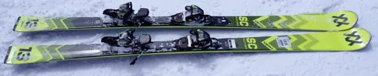
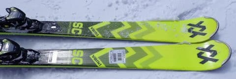
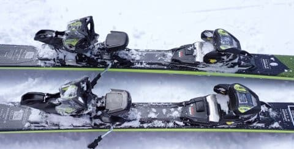
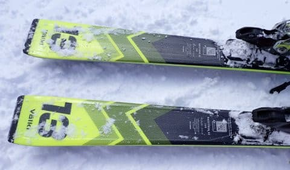
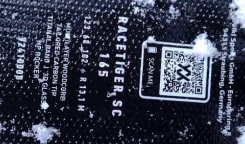

# 2025シーズンモデルのスキー板，試乗レポートその14…VOLKL RACETIGER SC

📅 投稿日時: 2024-06-18 01:56:41

🏷️ カテゴリ: [スキー板試乗](c0bd8048615710cee890e403a36cc9a2b.md)

我がVMG LEVORG君．

そろそろ購入後6年が経ち．

私の車としては，2番目に長く乗った

車になるわけですが…

この週末で14万kmを越えました～！

うーん．

6年弱で14万kmか…

前のBR LEGACY君が5年で16万kｍ，

その前の車が7年で21万km走ったことを

考えると．

まだまだ走行距離が少ないし．

来年の7年目車検でも，16万kmちょいしか

走ってないという，我が車としては

かなり走行距離が少ない車になりますね…

まぁ，コロナがあったのは残念だったけど．

そのおかげで，車の寿命は延びたかな．

最近の車に比べれば燃費は悪いけど．

燃費走行すればリッター17㎞近く走って，

月山までの往復1000㎞も無給油で行けるし．

4WDの安定度は高いし…

VMG LEVORG君にはもう少し走ってもらわ

ないと！

ってなことで，本題へ．

本日は2025シーズンモデルのスキー板の

試乗レポート．

今回はフォルクル編です！

〇VOLKL RACETIGER SC 165cm

基礎小回り

基礎用RACETIGERの小回り板としては，

上から

RACETIGER MASTER SL

RACETIGER SL

RACETIGER SC

とあって．

上から3番目となる廉価モデルになりますが…

まぁ，RACETIGER SLより劣る中級者向け

っぽい，優しいモデルなんだろうな…

という先入観を持って履いたのですが．

やはり履いた感じはすごく軽く，

メタルのどっしり感を感じない，軽快な

優しい板だなぁ…

と思って，スピードを上げていったところ．

うむ？

軽いけど，意外と張りもトーションも強いぞ！？？

どうせスピードを出してくと，トップとテールの

グリップが少し抜け気味になるだろう…

という予想は完全に裏切られ．

かなりのスピードでも，トップとテールの

エッジががっつり効いて，しっかり

深く回り込んでいくのですが！？？

フレックス自体は柔らかめなので，

特に脚力やそこまでのスピードがなくても

板が楽にたわみ．

楽にたわむのに，グリップがしっかり

強めなので，たわみに乗って丸くカービング

していってくれる，そんな板．

スピードを結構出していっても板が

負ける感じがなく．

大きくたわむけど，その中でガッツリ

グリップして，深いカービング小回りが

できます．

たわみは大きく出るけど，返りは優しめ

なので，RACETIGER SLのように

ターンごとに反対側に板が吹っ飛んでいく

反復横跳びマシンにはならないですね…

単純に，たわみに乗った深回りができます．

で．

板が軽いので，荒れた斜面での安定感が

足りないんじゃないかと思ったら，

そんなこともなく．

荒れた雪の中でもみょーーーんとたわんで，

たわみに乗ってガッツリカービングして

行けます．

安定感はFISCHERのSC Racetrack

（PROじゃないやつ）より高い感じ！

そのうえ，板が軽いので，

グリップが強めの板ですが，板を動かし

やすいし．

板を動かさなくても，傾き量を変えるだけで

オートマチックにカービングの弧を

深くしたり浅くしたりできるので．

きわめてコントロール性は高いですね…

ゲレンデ一本，あまり力を入れることなく，

そして板を全くずらすことなく，気持ちよく

楽にカービングの小回り~中回りで

リフト1本分降りてこれる，

そんな感じの板ですね～…

板の軽さ，フレックスの柔らかさもあり，

コブ斜面とかでも問題なく行けそうだし．

この日の試乗バーンの，圧雪の上に

荒れた新雪がまだらに乗ったような

比較的難しめのバーンでも，怖さもなく

楽にフルカービングで降りてこれたし．

雪質の適応範囲も広そう…

RACETIGER SLより一つ下のグレードだし…

と，舐めてかからずに．

雪質やバーンを問わず，どんなところでも，

結構なハイスピードでも，楽に小回り

ベースのカービングでひたすら滑り降りて

来れるという．

小回りベースでこれ一本でどこでも

行きたいという，普通のゲレンデ板を

選びたいなら．

これはかなり良い板なのでは…？

と思った，予想外に良い板でした．
