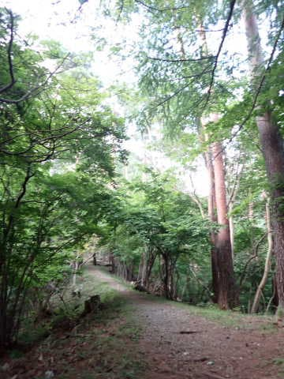

# 蛭ヶ岳まで全力で往復してみた，その1…3週連続丹沢山系！

📅 投稿日時: 2022-09-14 01:45:51

🏷️ カテゴリ: [登山・旅行](c1d637a11a25b457ac978d197adbdafc5.md)

えー．

本日朝，新幹線で某所から某所へ移動し．

結局夜10時近くまで長々と打合せをやって．

ついさっき，2泊3日の出張から戻って

きました…

日付が変わる前に帰って来たかった…

そして出張続きで長らく職場を不在に

したため，明日からはびっしり

打合せが…（激涙）

明日も最後の打合せが終わる予定は夜10時で，

私の時間が取れないから，昼休みにまで

会議が突っ込まれているんだけど…

これ，自分の書き物とかの仕事は

いつやれというのかな…？？（泣）

とりあえず．

今週末も大量の宿題を抱えることに

なりそうです（涙）

ってなことで，本題へ．

今日は時間も元気もないので，

ちょいと短めで．

えー．

仕事がそこそこ忙しかったものの，

まだ精神的余裕があった7月．

「せめて…せめて土日のうちどちらか

半日は，山に行って体を動かさないと死ぬ…！！」

と思っていたわけだけど…

でも，車で移動時間がかかる遠い山だと

昼までに帰宅するのは難しい．

だもんで，

丹沢山，

二の塔～三の塔経由塔の岳

と，2週連続で家からそれほど時間が

かからない丹沢山系へ行っていたわけですが．

…この週も，山に行ってられるのは

せいぜい半日．

となると…また，丹沢山系か？？

だとすると．

次は，

我がK奈川県最高峰．蛭ヶ岳

に行ってみたいな…

と．

蛭ヶ岳の計画をヤマレコで入れてみると…

なに？？

蛭ヶ岳って，コースタイム，9時間50分もかかかるの？？

うーん．

これは…

さすがに標準コースタイム10時間近くとなると…

午前中に家まで帰ってくるのは無理かなぁ？？

と思ったけど．

まぁ，標準コースタイム8時間34分の丹沢山は

4時間半で下山できて，9:40には車に戻って

昼前にはちゃんと帰宅できてたし．

これより1時間20分ほどコースタイムは長いけど，

前回の塔の岳から，VAAM効果が加わって．

後半戦のスタミナ持続力も上がって，

最後までコースタイム半分ペースは

維持できるはず！（なんだか強気だな…）

だもんで，丹沢山より80分長いコースなら，

丹沢山の時間＋40分くらいで行けるはず！！

5時スタートで，10時半までに下山できれば，

昼には家に帰れるはずだ！！

…と，

かなり楽観的な計画で，蛭ヶ岳登山に

向かったのでした…

青根の林道ゲート前の駐車スペースに，

まだ薄暗い朝4:40くらいに到着しましたが…

もう結構車が止まってますね．

ってなことで．

4:45に，この駐車スペースすぐ横の

林道入り口から登山スタート！

しばらくは舗装された林道を歩きますが…

10分くらい歩いたところに，林道わきの

こんなところに分かりにくい看板があって…

ここから，アスファルトの林道を離れ，

右手に分岐するのが「八丁坂分岐」に

向かう最短ルートです！

あ，ちなみに今回の登山ルートは

こんな感じで．

八丁坂分岐→姫次→地蔵平→蛭ヶ岳

というルートになります．

さぁ．

ここから本格的登山道になりますよ…！

（続く）

## 💬 コメント一覧

### 💬 コメント by (かず)
**タイトル**: Unknown
**投稿日**: 2022-09-14 12:19:29

ヨコハマスタッドレス1年前製造が届きました…ギリセーフといい方に考えてます  笑  自分も数年前から渓流釣り始めたのですが  猟師に遭遇したり  でかい猪に遭遇してだいぶテンション下ってしまいました  気をつけて下さい！

### 💬 コメント by (Skier_S)
**タイトル**: ＞かずさま
**投稿日**: 2022-09-15 03:57:39

ヨコハマのスタッドレス，iG5Plusならそんなにすぐ硬くならないので，

まぁまぁ長持ちしましたよ…！

そして猪に遭遇！？？

熊には至近距離で会ったことがありますが，猪にはまだ出くわしたことがないです…

### 💬 コメント by (みきみき)
**タイトル**: Unknown
**投稿日**: 2022-09-15 11:46:21

私も9月14日､まったく同じコースで蛭ヶ岳ヘ行きました､｡コースタイムよりずっと早い方が羨ましいです｡

### 💬 コメント by (Skier_S)
**タイトル**: ＞みきみきさま
**投稿日**: 2022-09-16 01:51:39

ようこそ，マニアックなブログへ．

コメントありがとうございます～！

あ，9月14日，同じルートで登ってらしたのですね．

天気は良かったですか？

私も膝を痛めて，コースタイムより遅い時間でしか登れない日々を過ごしましたが，

膝サポーターとトレッキングポール2本もちにして，歩き方を変えたら

かなりのハイペースで飛ばせるようになりました…

あと，長時間のコースを歩くなら，バテ防止にVAAMもおススメです．

