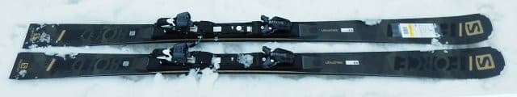
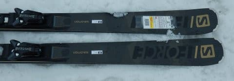
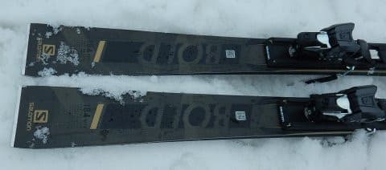
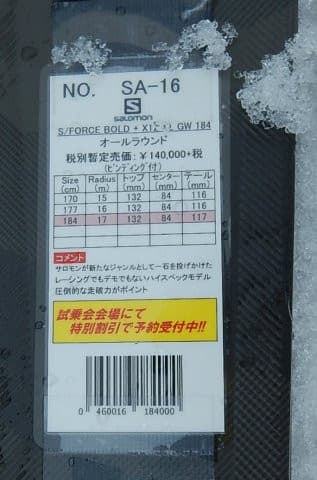

# 2020シーズンモデルのスキー板，試乗レポート…SALOMON編その3

📅 投稿日時: 2019-06-12 03:36:18

えー．

ホントは，今日は月山レポート後半のはずですが．

ちょっと仕事がご無体時間で（涙）．

レポートを書いている暇がない…

というか．

日帰り月山以来寝不足気味で，死ぬほど眠いので（泣）

本日は書きためておいた，2020シーズンモデルの

スキー試乗レポートです…

本日はサロモン編です．．

月山レポート後半は明日に！

では，どうぞ～！

○SALOMON S/FORCE BOLD 184cm

オールラウンド

長さが184cmと長く．

センター幅も84cmとかなり広いので．

どちらかというと，オールラウンドというより，

オールマウンテンと言った方が近い感じの，

オフピステっぽいところまで行ける，

新雪やら荒れ雪でも行けるような板なのかと…

長さ184cm，サイドカーブは17mなので．

小回りをするような板ではなく．

長さ的にも，気軽に振り回せる感じではないですが．

履いた感じも，かなり重く．

どっしり感が強くて．

荒れた春雪でも，荒れた雪を蹴散らしながら

重量級戦車のようにまっすぐ落ちていけます．

ちょっとやそっとの荒れ具合では，

板が叩かれてふらふらすることは無いです．

そして．

R=17と，GS板よりは小さめのサイドカーブなので．

そこそこの旋回性はあるのかな…と思ったら．

かなりまっすぐ行きます．

超大回りスペシャル．

サイドカーブに乗っていくだけだと，

どっしりした重さに乗って，かなりまっすぐ目の

ラインで落ちていく感じになります．

板がたわんで，エッジがガッツリ食いついていく

感じではないので．

ずらそうと思えばずらしていけて，

ずらしの小回りは作れるけど．

スイングウエイトがかなり重いし．

小回りができなくはないけど，

あんまりやりたくない感じ．

ひたすらこの板の重さにすべてを任せて，

安定感を満喫しつつ落下していく…

というのがこの板のお勧めの使い方でしょうか．

重さと安定感はハンパなく，かなりの

スピードが出ても怖くないです．

…スピードが出た中，ひたすら板に任せて

大回りで縦に縦に落として超ハイスピード

クルーズをするのが，おそらくこの板の

正しい使い方．

ただ，ズラシに入れようと思えば簡単に

入れられるので．

急斜面でずらしてスピードコントロール…

っていうのは簡単にできます．

でも，「簡単にできる」というだけで，

ずらして楽しいかというと．

うーん．

ちょっと違うかな．

とりあえず．

板任せのハイスピード大回りでひたすら

長距離をロングクルーズする…

という使い方には向きますが．

一般的な日本のゲレンデと日本人の

嗜好に合うか？

と聞かれると．

うーーーーん…

と考えてしまう板でした．
