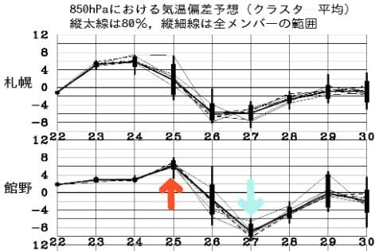
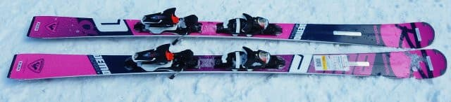
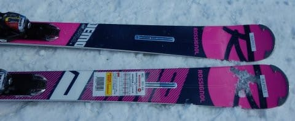
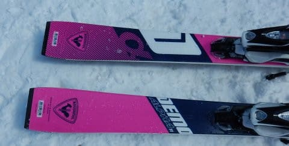
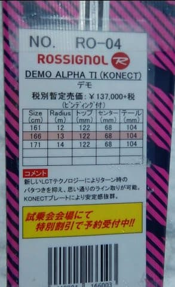
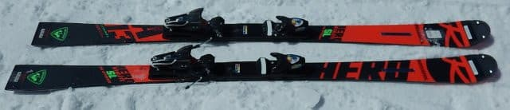
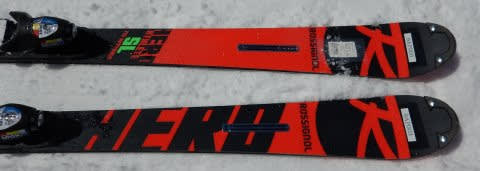
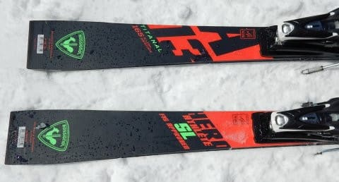
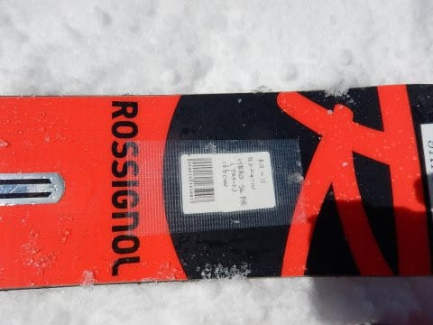

# 2020シーズンモデルのスキー板，試乗レポート…ROSSIGNOL編その1

📅 投稿日時: 2019-04-24 02:06:43

そろそろGWのスキー場の天気が気になってくる

ところですが．

850hpa気温遷移図を見てみると．

赤色で示したGW直前の25日は，平年比+6℃．

水色で示したGW初日の27日は，平年比-8℃と．

なんだかすごい極端なんですが！？？？

2日間で，気温が14度くらい

下がりそうなんですが…！？？？

これは…

27日朝は，凍った下地の上にうっすら積雪

となる可能性が高いです…

27日に志賀高原に行く方は．

スタッドレスを履いて行った方がよさそう…

積雪が無くても，27日の土曜は．

昼間まで氷点下をキープして，

路面は凍結しますよ～！！！

で．28日は基本的に晴れそうですが．

平年並みの気温に戻る，29，30日と…

2日間，降水域が本州全域を覆い続けて

ますね（涙）

まだ，時間が多少前後する可能性は

ありますが．

29日夜～30日にかけて．

雨になりそうな予感…（泣）．

まぁ．

明日，またGW前半の天気の詳細予報をやるとして．

本日の本題は，スキー試乗レポート．

2020モデルの，ロシニョール．

2機種のレポートです．

では，どうぞ～！

○ROSSIGNOL DEMO ALPHA TI 166cm

基礎小回り．

DEMO ALPHAは来シーズンも3モデルあって．

強いR22プレートが付いたTI Ltdと，

優し目konetビンディングが着いたTIと，

TIを幅広にした，TI Plusとの3機種があり．

これはkonectビンディングが着いた

TIです．

滑ってみると…

結構コントローラビリティが高い板．

谷回りから積極的に板を動かしていけて，

山回りではしっかりグリップ．

エッジに乗って，板なりにくるっと回って

来るのですが．

山回りでも，板を動かそうと思えば

動かしていけて．

板なりじゃなく，好きなように弧を作れる

自由度があります．

動かせる，と言ってもグリップが弱くてズレズレ…

というわけでは無く．

ある程度のスピードの中，

スピードを出して傾いた低いポジションから，

さらに弧をコントロールするために積極的に

動かしていけるという，自由度の高さ．

しっかりした張りとグリップがあるのに，

板の軽さもあり，好きなように板を

コントロールできる動かしやすさを感じます．

板が動かしやすいので．

谷回りからエイや！と傾きを

作っていけます．

板も良くたわんで，カービングの

弧も作りやすいし．

普通にゲレンデで滑るスピード域で，

ちょうど気持ちよくコントロールできる，

いい板だな…と思いました．

○ROSSIGNOL HERO SL FIS 165cm

SL競技用．

この板は，他の板にはついている説明書きが

無かったのですが．

ガチのSL用のトップモデルです．

滑ってみたところ…

なんじゃ？こりゃ？？

エッジのチューンが甘くないか？？

硬い斜面でズルズルずれて，グリップして

くれないんですが…！？？

SL競技用だけあって，板自体のフレックスが

かなり強いので．

エッジがグリップしないと，まったくたわませ

られません（涙）

だもんで．板をたわますことは全くできず．

硬い板がズレズレでずれていくだけだったので，

ちょっとこの板は，正常な評価ができない

状況でした…

うーむ．

せっかくの硬い締まったバーンでの試乗

だったので，今度はエッジの仕上げが

まともな状況で履いてみたかったです…
