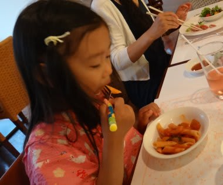
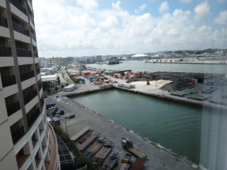

# 2012年7月　子連れ座間味ダイビング旅行記ファイナル　帰宅

📅 投稿日時: 2012-08-15 00:12:19

というわけで．

本来なら慶良間でラストダイブをしているであろう時間に．

リゾートホテルのプールで過ごしたわけですが．

プールだと．ダイビング終了で港に戻る…とか言う区切りがないわけで．

いつまでたっても上がろうとしない娘…

「ご飯食べないの～？」

「いらないーっ！まだ泳ぐーっ！」

…お前は．

1歳のころから変わらんのー．

いつまでもひたすら泳ぎたがる娘を強引にプールから引き上げ．

それからホテルのバイキングの夕食を食べて…

バイキングスタイルの夕食だと，デザートがいっぱいあるので，

娘はデザートばっかり食べてしまうなぁ…

って感じで．夕食終了後はしばらく遊んで

おやすみなさい．

…そして．

次の日．

本来ならこの日の午前中に慶良間から移動する予定だったので，

那覇からの帰りの飛行機は午後発です．

ってことで．

最終日はダイビングもないし，飛行機も遅いので，ゆっくり遅めに起床．

…

…

したんですが．

…

なんだか．

ちょっと，晴天ベタなぎなんですけどっ！

話と違うんですけどっ！

台風は何処へ行ったんですかっ！

台風はっ！

慶良間からの高速船も，予定通り運航しているみたいなんですけどっ！

…

これまで沖縄では，

台風で何度もひどい目にあってるけど．

なんだかここまで肩透かしってのも始めてかも…

って失意の中．

のそのそ朝食をとって…

チェックアウトの11時にのんびりホテルを出て，

空港へ．

帰りの飛行機でも，娘はぐっすり…

ホントに長距離移動に何の心配もない娘だわ…

という感じで．

無事帰宅．

とりあえず．

予期せぬ台風に，いろいろとやられちゃったものの．

わが娘．

飛行機や船の長距離移動にも，もう完全に心配はなくなったし．

ゲームとかTVより，海で泳ぐのが大好きで．

海に行く，って言えば船の上で一日すごしても大喜びだし．

もう，子連れダイビングが楽になってきましたね～．
