# 5月11日(日)のかぐらスキー場＆熊の湯特派員レポートと，5月10日(土)の熊の湯の写真追加！

📅 投稿日時: 2025-05-12 02:08:24

🏷️ カテゴリ: [日記](cc4b5682fb7b8b144980957a978653fb0.md)

ということで．

今日はスキーに行かずに家で用事をして

過ごしていた，Skier_Sです．

この週末で，熊の湯とARAIが営業終了してしまい．

今シーズン，まだ生き残っているスキー場は

・月山

・天元台

・ネコマ

・かぐら

・渋・横手

の5か所となりました…

寂しい…

で．

本日のかぐらの写真が，特派員より送られて

来ました～！！

本日のかぐらですが，結構気温が低く，

朝のうちはガスが出たりしたようですが…

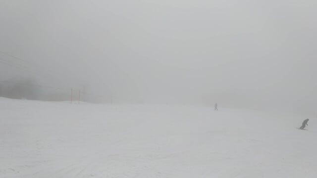

基本的には終日曇り空の一日．

まだ雪はたっぷりあり，メインバーンは

問題なく幅いっぱい滑れますし…

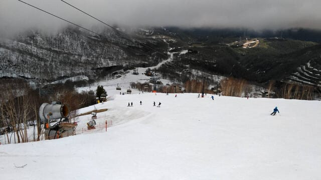

それだけじゃなく，パノラマも…

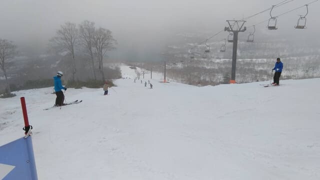

テクニカルもジャイアントも，幅いっぱい

滑れて，

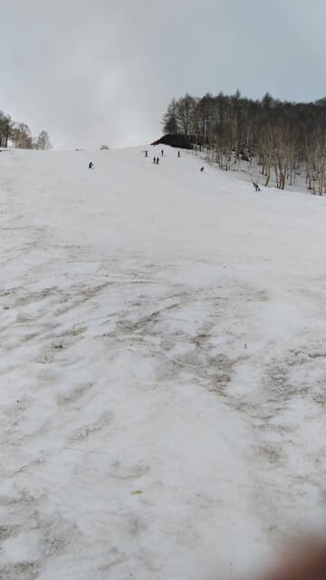

コブ溝に土が出ているところはまだ

無いようです…！！！

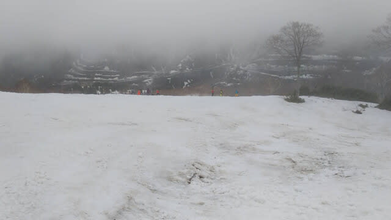

…ただ，コンディションが良いだけあって，

人が多くて…

クワッドリフトは午前中は10分弱の待ち時間に

なっていたようですし…

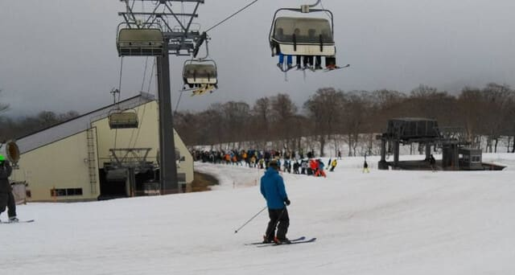

ペアリフトも，結構な列ですね…

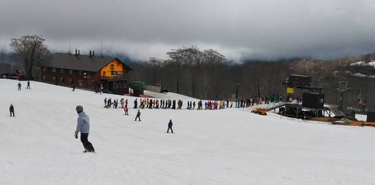

ただ，リフトがここまで混んだのは午前中

のみで．午後にはリフト待ちは減り，

クワッドはほぼ待ち無しで乗れるようになった

ようですし．

板の滑りも終日結構よかったみたいですが…

でも，ゲレンデの人口密度はすごかった

ようです！！

うーん．熊の湯のガラガラっぷりと

いい対照をなしてますね…

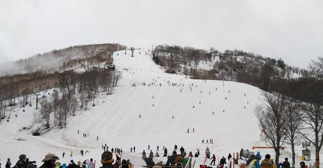

でも…メインバーンの最後の斜面も，

まだ幅いっぱい滑れるようで，

今シーズンは雪が多い！！

ただ，みつまたの雪解けはかなり進み，

今日からみつまたは下山連絡専用に

なったようです．

そして，おこみん特派員ですが．

今日は営業最終日の熊の湯に，早朝から

参加していたようで…

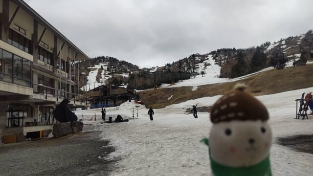

まぁ，昨日からほぼ変わらず．

下半分はほぼコース前面に雪が着いてるし…

今日もちゃんと馬の背がオープンしていて，

山頂から滑れたようで．

営業ラストまで馬の背が滑れた珍しい

シーズンになりました～！

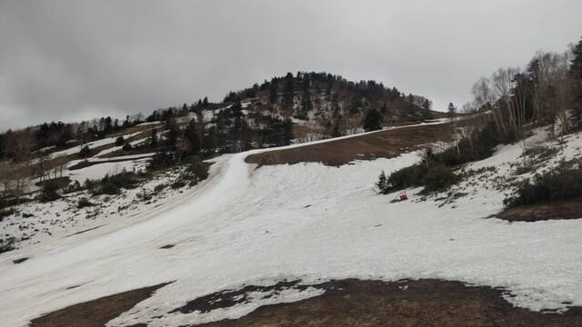

うーん．

でも，今日の写真を見ると．

週末の前は土曜が暴風雨で天気が激烈に

悪い予報だったので，

なんで日曜に用事があるんだ～！

用事が土曜なら，日曜に滑りに行けるのに！！

と思っていたけど．

うん．

日曜のかぐらがここまで混んで．

熊の湯も，あんまり土曜と日曜で差が無いよう

だったので．

結果的に，土曜に熊の湯ってのが意外と悪く

なかったのかも…

ってなことで．

昨日の熊の湯．

昨日は速報モードと言いながら，

かなりの写真を載せていたので，

今日はもう追加で詳細レポートを

書く必要はなさそうだな…

と思いながらも．

一応，昨日載せられなかった写真を追加で

のっけておきます～！！

まず…

万座から渋峠に抜ける道の間の雪の壁，

例年より高い気がしますね…

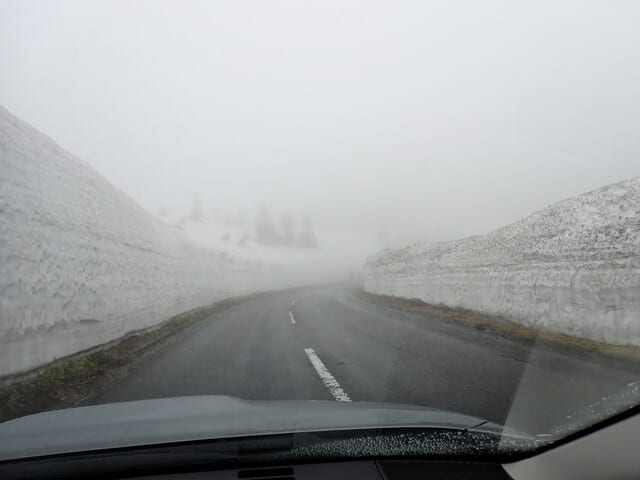

そして，熊の湯ですが．

第3緩斜面は，見ての通りまだまだ雪が

たっぷりあって．

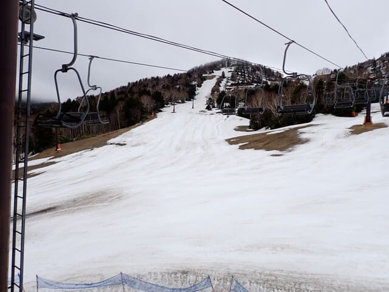

第2緩斜面も第3緩斜面もまだまだいけそう

なのに，これで営業終了とはもったいなさ

過ぎる…！

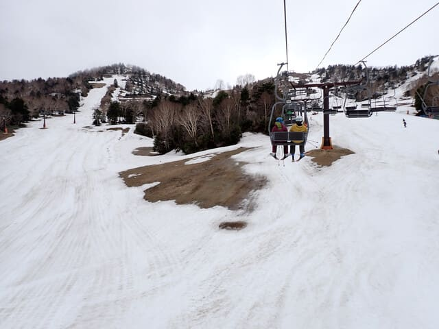

馬の背ももう少しはもちそうな感じでしたね…

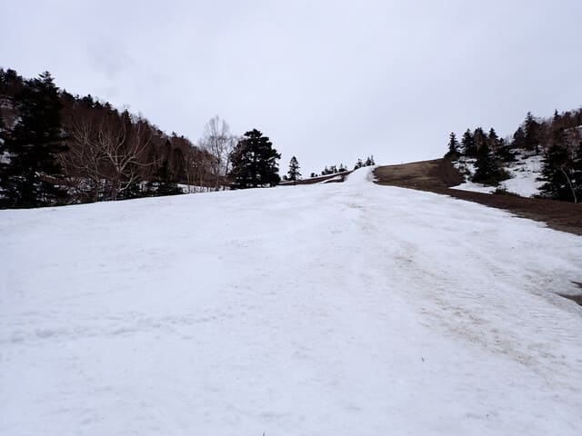

第2リフトの山頂から，第2Aや

第4イベントへつながるコースも

まだ大丈夫そうで．

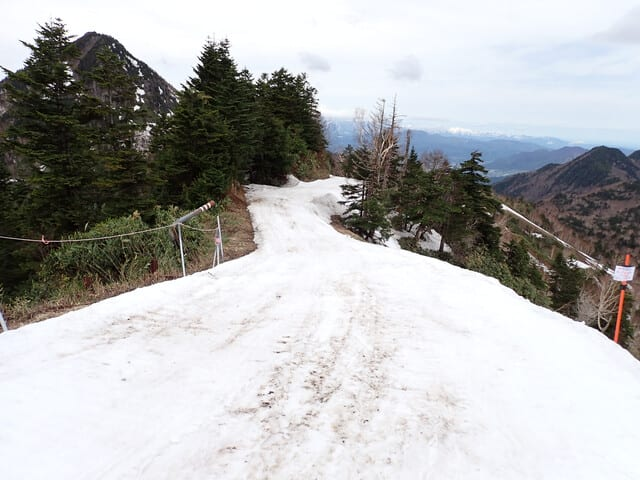

第2Aは，コース途中からじゃなく，

上部のここからエントリーできたので，

この時期としては上出来かな？

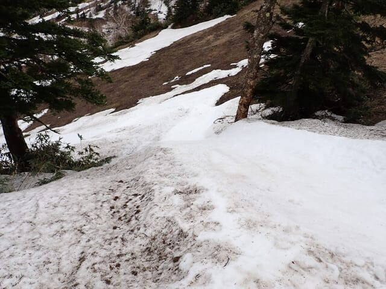

ちなみに，第2Aの中間点に行く道も

まだ滑れましたよ～！！

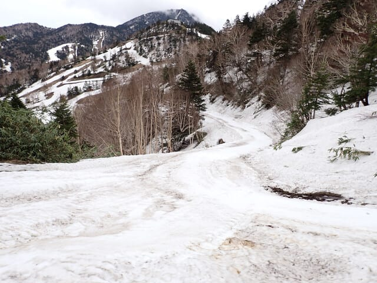

そして，第4イベントのてっぺんに来ますが．

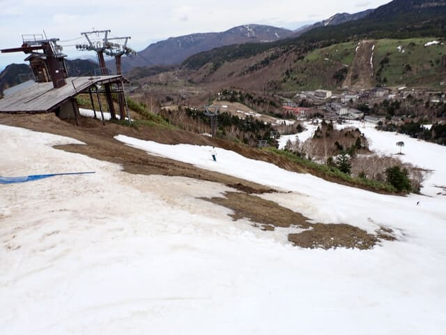

うーん．

イベントコースへの入り口の

この部分がちょっと細い…

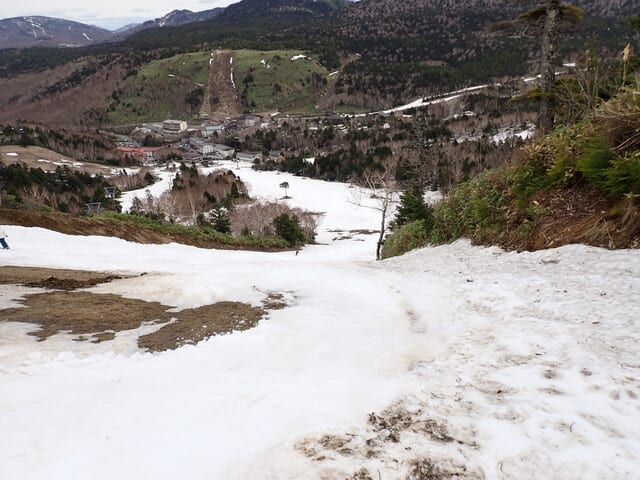

でも，この部分をクリアすると，

下はまだ行けそうな感じにみえますが…

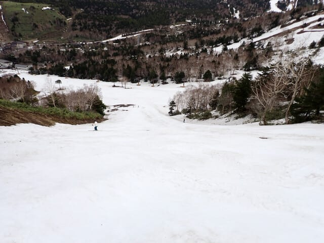

けれども実際は，コブ溝に土が出始めてた

ので，イベントコースはもってあと1-2日だった

かな，というレベル．

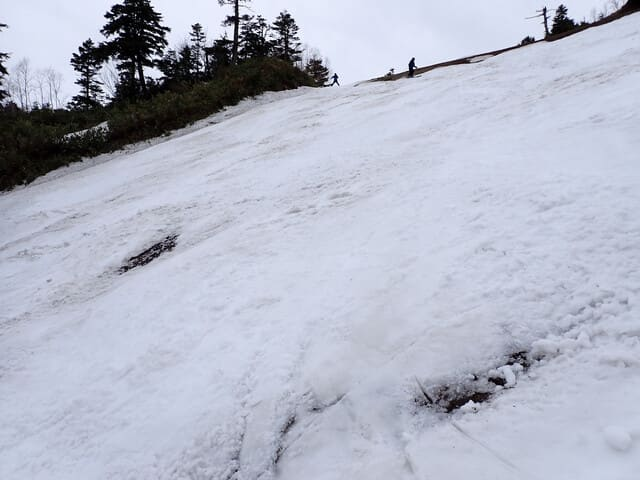

そして．

午後になると，北アルプスが見えるほど

晴れてきたのに…

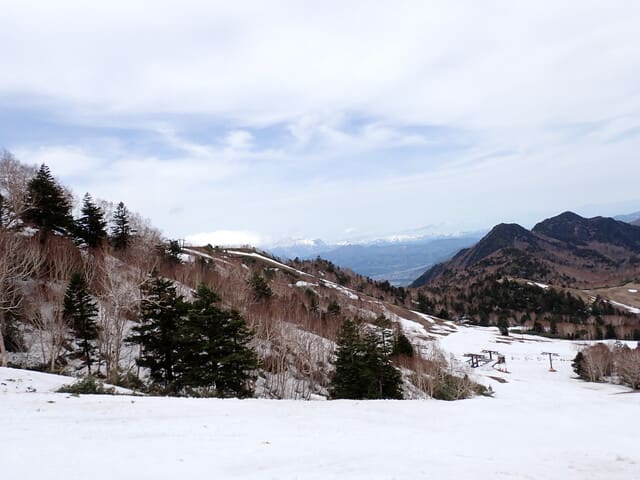

リフトは完全にスカスカ飛び乗り

でした～！！

…かぐらとえらい違い…

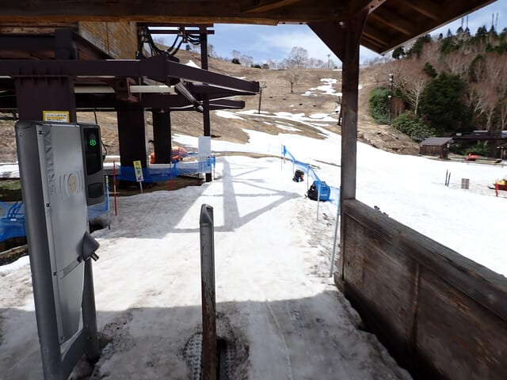

ただ，リフト乗り場前の部分．

最後はかなり土が出ていて…

最後はかなりヤバい感じだったし．

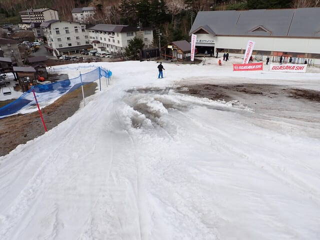

馬の背も，営業終了のころはちょっと

地面が見え始めてきた感じのところも

出てきたし．

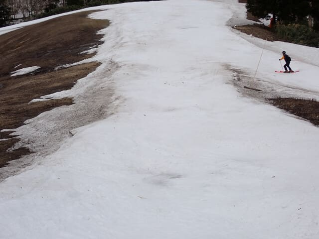

第2緩斜面も，わずかに1-2か所，

ちょっとだけ雪が薄くなった

ところもあったし…

まぁ，しっかり雪出しをせずに

営業するのは，確かにこの週末が

最後くらいだったのかな…

でも，最後まで熊の像の前にこれだけ

雪があったから，やっぱり今シーズンは

雪が多かったんだなぁ…と思った，

今週末の熊の湯だったのでした…

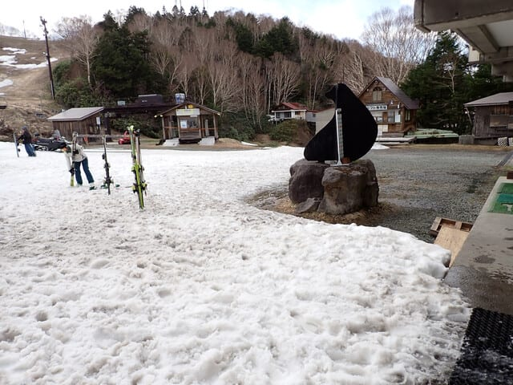

うーん．

次の週末はかぐらファイナル．

営業延長はなさそうだし．

そのあとは渋峠が次の25日で終了．

まだ雪が残りそうなゲレンデが次々

終わっているのが寂しい…

かぐらなんて，例年と同じレベルの

雪出しをすれば，問題なく25日まで，

上手くいけば6月1日の週まで営業

できそうなのに…

25日まで営業延長してくれないかな…
