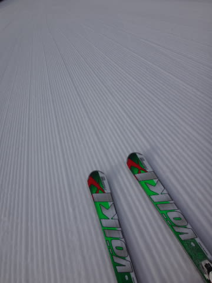
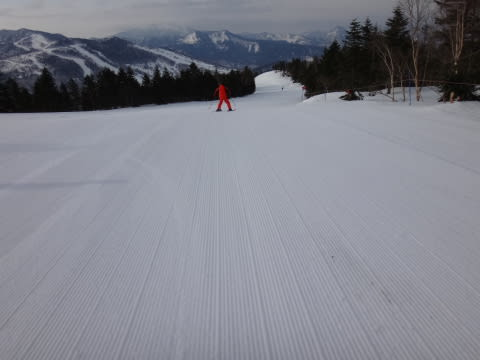
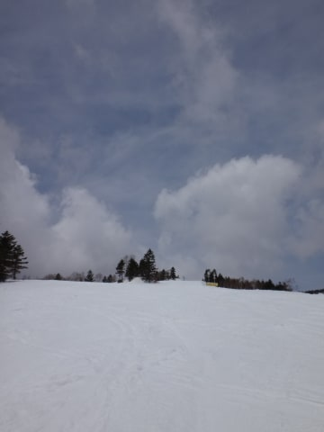
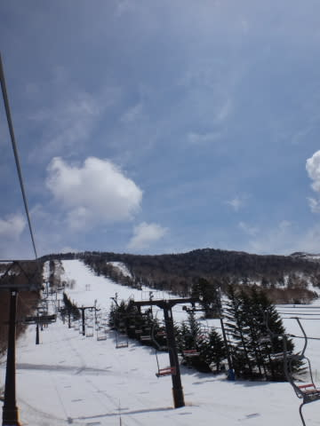
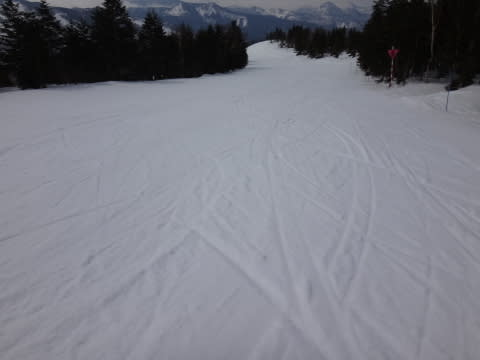

# 4月20日の志賀高原速報モード…まだまだ雪たっぷり！

📅 投稿日時: 2014-04-21 01:09:58

🏷️ カテゴリ: [2014スキー滑走日記](c992167609b6415052179ee69ea1ea7d8.md)

えー．

本日も．

帰宅が遅かったので．

定番の速報モードってことで…

今日も，朝はしっかり硬いシマシマバーンで．

んで．

[私の祈り](e135f0524982e6345f61732b463016ee9.md)が通じたらしく．

終日，雨は降りませんでした．

…繰り返します．

私の祈りが通じたらしく，

雨は降りませんでした．

それどころか，ときどきうっすら日が射し．

わずかに太陽が射す時もあったりして．

予想よりいい天気でしたね～

雪質はクリーミーな感じになってしまったものの，

真っ白なきれいな雪で．

で，まったく人がいないがらがらの

ゲレンデだったので．

夕方まで，結構フラットなまま！

いやー．

やはり，私の日ごろの行いが良いので．

ここしばらくのゲレンデ状況は

結構恵まれてますね～！

また，明日詳細レポートします…
