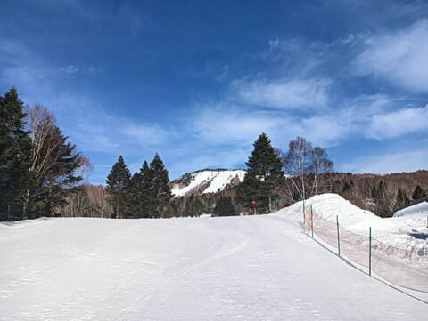
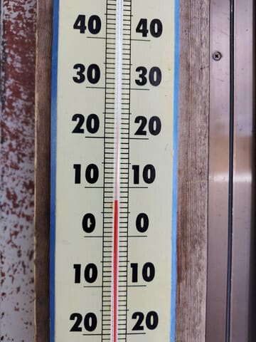
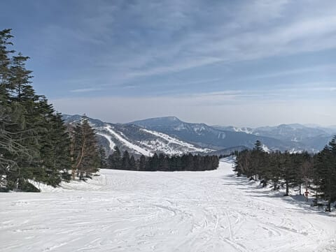
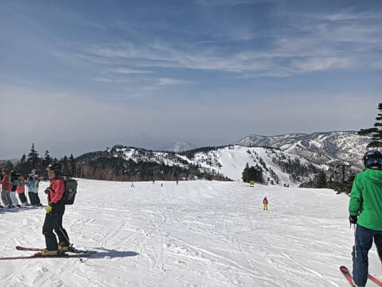
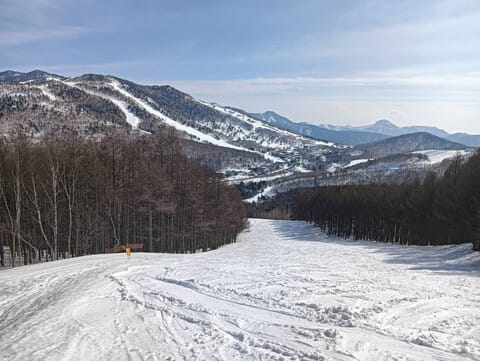
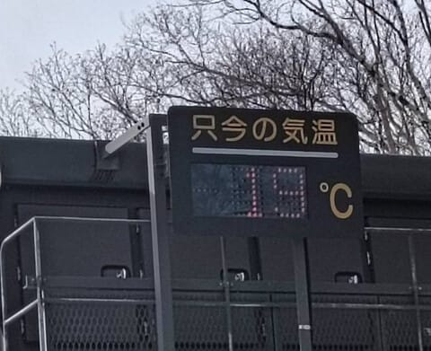
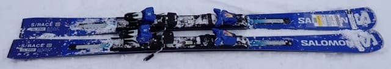
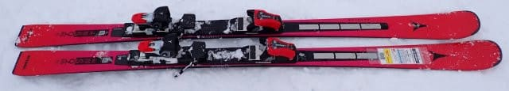
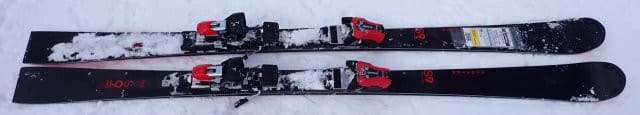

# 2026シーズンモデルのスキー板，試乗レポート速報版！その1…ATOMIC，SALOMON編

📅 投稿日時: 2025-03-28 00:38:43

本日も，なぜか仕事をサボって(？)

志賀高原で滑っていた特派員が数名

いたようで，特派員からの写真が

送られてきましたが…

今日も終日晴天高温の志賀高原だった

ようです…！！

…ただ．

やはり今日も朝から気温は高く．

3月の志賀高原の朝9時前の山頂で，

気温が+7℃ってどういうことよ？？

GWより気温が高いよ…？？

だもんで，朝から雪はかなり緩かった

ようですが…

唐松・白樺は午前10時ごろまでは緩み気味

ながらも比較的よかったようで．

昼間は緩斜面ではストップ雪になったものの，

人が少なくてバーンは荒れず，緩斜面

を除けば意外と悪くなかったみたいです…！

しかし，標高が高い寺小屋が意外と

ストップ雪だったのが予想外だった

みたいですが…

東館山やブナの方が板は滑ったとのこと．

そして，午後になって日が傾くと，

焼額の唐松コースは，板が走って

最高だった…との報告でした…

それにしても．

帰り道，丸池の温度計が19度だったようで…

これ，春じゃなくもう夏の気温なんです

けど！？？

…ということで．

高温で今日も結構雪がやられたと思いますが．

明日も気温は下がらず．

さらに今晩から明日の朝にかけて，

強風でそこそこ強い雨になり，

雪にとって激烈に厳しい天気で…

明日の金曜日の昼間も，雨が降ったり

やんだりの天気になりそう…

うーん．

土日は冷えて，土曜の朝は数㎝雪が積もって

くれそうだけど…

それだけでゲレンデ状況が改善して

くれるかな…？？

ってなことで，本題へ．

3月8日に来シーズンモデルのスキー板を

試乗してきたわけですが．

試乗会に間に合うようにレポートしてほしい…

というリクエストもあったので．

何とか急ぎ，人気の高い板のクイックレポートを

しておきたいと思います…

しっかり試乗レポートは，シーズン終了ごろから

また書きますので，今回は簡単なレポートです！

〇SALOMON S/RACE SL PRO 165cm + ICON12 TL

基礎小回り．

ICONビンディングが着いたSL PROです．

基本的に今シーズンからのキャリーオーバー

ですが，相変わらずいい板ですね～…！

ガッツリグリップ感があるのに，ズレと

キレの出し入れが自由で，板なりに滑らせ

られるのではなく，乗り手のコントロール度が

かなり高い感じ．

ズレのコントロール性が高いのに，

かなりのハイスピードまでガッツリグリップ

して，どれだけスピードを上げても板が

負けてたわみ切ることなく余裕をもって

ガッツリカービングしていく，不思議な板．

返りも早すぎないので，小回り強制

マシーンにもならず，ロング目も行ける．

ロング～ショート，ハイスピードカービングから

ズレまで行ける，何でも来いの板．

〇ATOMIC REDSTER S9 RS Revoshock 165cm

基礎小回り．

S9iとS9Proの間にあたるモデルらしいけど，

カルバウッドコアではない普通のウッドコアで，

S9Proと同じICONビンディングとプレートが

ついてますね…

こいつも結構いい感じ…！

小回りベースだけど，サイドカーブで曲がる

感じではなく，たわみがきれいに出て

たわみに沿って曲がる感じがする板．

さらにフレックスがそこそこ強めなので，

小回り強制マシンにはならず，

あまり踏まなければ大回り，

しっかり踏んで傾けていけばしっかりと

カービング小回りができるという，

弧の自由度が高いです．

テールの張りがそこまで強くないので，

返りのバネ感はそれほど強く感じず，

小回りマシンというよりオールラウンド

性能を感じる板．

それでいて，ターン前半にトップを抑える

量で回転弧を自由に作れるので…

板をしっかり踏めるそこそこの上級者なら，

かなりコントロール性は高いと思うんじゃない

かな．

うん．

私が結構好きな感じの板です…

〇ATOMIC REDSTER S9i PRO 165cm

うーん．

SALOMONとATOMICの上級板，軒並み

MARKERのビンディングICONビンディングに

なりましたね…

この板，かなり硬くて強い板です．

RSを出したから，こっちは一般向けではなく

思い切って選手向けに振ってきたのか？

という感じ．

硬いブーツでガッツリ抑えればたわませる

ことができて，強烈グリップのカービングで

回っていきます．

求めるスピード域は高め．体力も高め．

今回はフレックス150のブーツで滑ったけど，

かなり硬めのブーツを履いてないと，

履きこなせない（というかブーツが負ける）

と思います…

しっかり重さも感じるので，ズラして滑る

時の軽快さはなく，ずらして滑る板じゃ

ないです．

柔らかい雪でもたわみにくくて辛いだろうなぁ…

とりあえず，体力と硬いブーツをもつ人が，

コンディションが良いバーンをかなりの

ハイスピードで攻めるための板．

限りなく選手用の板で，普通の人が

ゲレンデ用として履こうと思わないほうが

良さそうな感じ…
