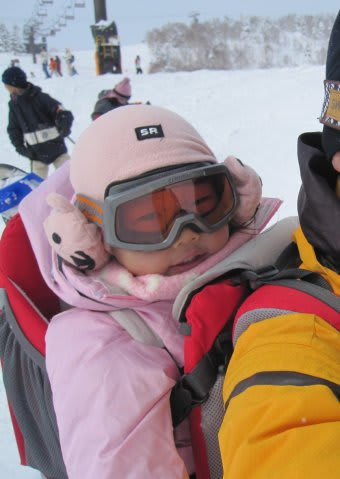
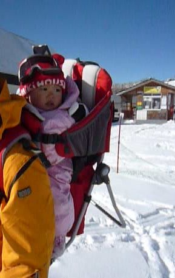
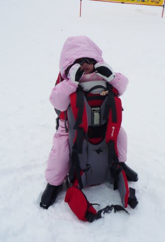
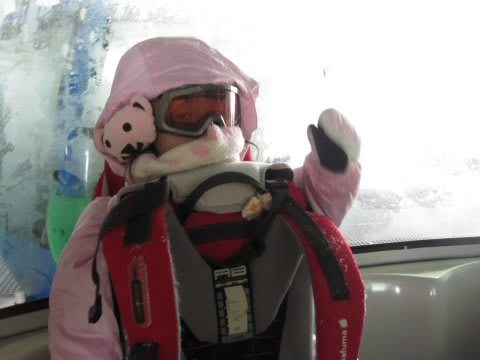
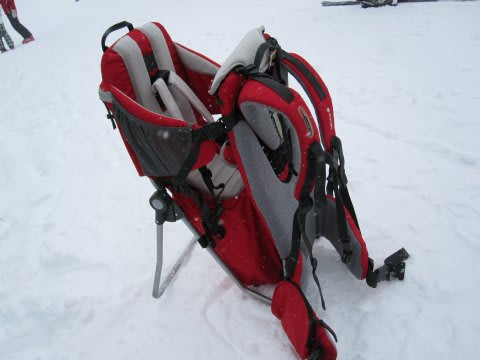

# さらば，ベビーキャリー

📅 投稿日時: 2011-04-28 01:00:43

というわけで．

[かつて紹介したベビーキャリー](ee06aac468465c028bc5fcfb0f34c91ce.md)ですが．

娘が[あっという間に滑れるように](ef37cc7d9e89a9024b6505cba0aa5ff82.md)なってしまい．

つい一ヶ月ちょい前まで，自分で滑ることができずに

背負われてばっかりいたというのが信じられないことに．

いまでは，勝手気ままにゲレンデを滑りまくってます．

一の瀬ファミリーなら，天狗・パノラマ・メインコース下半分はOK.

タンネの森は全面OK.

一の瀬のパノラマコースなら，リフト1本分，ほとんど止まることなく

滑りきってしまうという．

そんな感じですから．

もう，ゲレンデに出てもベビーキャリーに乗ろうとはしません．

というわけで．

3シーズンお世話になったベビーキャリーですが．

先日，1歳の息子を初めてスキー場につれてきた

友人に譲ることとなり．

お別れをしてきました…

つい先月までは，

ゲレンデで子供を背負って滑るのは当たり前だったのに．

よもや，こんなすぐに滑れるようになるとは思わず．

よもや，こんなあっさりベビーキャリーを卒業するとは思わず．

自分で滑ってくれるようになって嬉しい反面，

もう，今後一生，娘を背負って滑ることがないのかと思うと．

ちょっと寂しくあります．

いつも背中で「止まらないで！滑って～っ！レッツゴー！」

と言っていた娘の声が．

もう，これからは，聞けないんですね…

一番最初に娘が背負われたのは，1歳2ヶ月のころ．

そのころは，まだこんなに小さかったのに…

最後のほうには，かなりベビーキャリーが窮屈そうな感じに

なっちゃってましたね．

これまで，「子供背負って滑ってたら，それは多分私です…」

と言ってましたが．

娘はあっさりと，我が背中を卒業していきました．

（最後にベビーキャリーに乗った時の写真．よもやこれが最後になろうとは…）

しかし．

まだまだきれいだったベビーキャリー．

友人の子供が，卒業していった娘の代わりに．

自分で滑れるようになる前から，大きな雪山を

楽しむために使ってくれれば．

それはそれで．

喜ばしいことなんだと思う．

