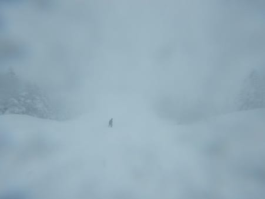
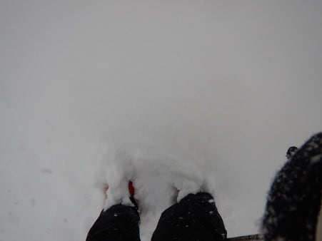

# 2018/12/29(土)の志賀高原スキー場は…ものすごい雪降り．激寒！結構積もって，ゲレンデはもう大丈夫かな！

📅 投稿日時: 2018-12-29 23:13:39

🏷️ カテゴリ: [2019スキー滑走日記](c3e4496fc0fb7f9c17ff21214a35b1ace.md)

ということで．

本日から，年末年始の志賀高原長期滞在へ

やってきてるわけですが．

いや．

しかし．

降りました．

降ってます．

まだ降ります．

そして，そのおかげで．

志賀高原．

めちゃくちゃ雪が積もりました．

なんてたって，昨晩から駐車場に停めていた

車はこんな感じで，前衛芸術のオブジェと

化してましたし（この中に車がある）

今日の朝に停めたばかりの車が，

夕方にはもうこんな感じで…

埋まってますね（涙）．

今日の昼間だけで，こんなに積もったんですね．

…そして．

今もすごい勢いで積もり続けてます…

こんな志賀高原にやってくるのに．

昨晩から，坂城から先がチェーン規制でしたが…

今朝の段階では，坂城では車を停止させての

タイヤチェックはなく．

信州中野で完全停止のタイヤチェックを入れてました．

実際，今朝の段階では．

坂城から信州中野まで，路面積雪は

ほとんどなかったです…

で．

中野の街中から完全積雪路になり…

志賀高原の登りは，当然，本気真冬

モードの雪道でした…

ってな感じで．

いつもの焼額にやってきたわけですが．

本気雪道で，かなり車の流れがゆっくり

だったため．

焼額駐車場到着が，ゴンドラ営業開始の

8時30分をわずかにすぎるという大失態！（激涙）

うーーーーむ．

悔しい．

本気で悔しい…

ちなみに，本日は第2ゴンドラが故障で

運転開始が1時間ほど遅れたようです．

ってな感じで．

営業開始より10分近く遅れて，第1ゴンドラで山頂へ

向かいますが…

天気はかなり激しい雪降りですね…

そして，山頂温度計は－13℃と，

予想した気温の－15℃のよりちょっと高め

ではあったものの．

でも，激冷え！

コースは，圧雪の上に5cm程度の

軽い新雪が乗った，トップシーズンの

雪です！

いや～．

今シーズン始まって以来，すでに2か月以上．

ようやく初めて柔らかい雪で滑ることができたよ…

雪ってこんなに柔らかかったんだ～…！！

と，感動…（感激の涙）

で．

本日からオープンのオリンピックコースに

行ってみますが．

コース自体は圧雪がかかり，ブーツパフですが…

コース脇は，脛パフ！

パウダーだ！

久しぶりのパウダー！

…と，喜んだのもつかの間．

すごい雪降りで，前が良く見えず．

そして，積もった雪はすぐに蹴散らされて

凸凹になり．

オリンピックコースは，良く見えない

ステルス凸凹がいっぱいある，

危険斜面と化していきました…（ちょい涙）

本日オープンコース，もう一発．

スーパージャイアントスラロームコースも，

非圧雪でオープンして．

踏まれてないところは膝パフでしたが．

朝遅めだと，もう新雪が荒らされて

荒れ荒れこぶ斜面状態でした…

そして．

昼近くになると．

激しい雪降りでバーンコンディションが

見えなくなっていくだけでなく．

風も強まっていき…

風のせいで，12時過ぎに奥志賀は第1ペア以外

すべて運休(涙）

まぁ，強風で一日運休の予想だったので．

昼間でもっただけでも，頑張ったのかも…

昼間の最高気温も‐11℃という激冷えの上，

強風で体感温度はさらに寒く．

さらに視界が悪く，雪はもさもさの

ステルス凸凹状態…

これまで雪不足のゲレンデに，恵みの

雪なんだけど…

だけど．

これって．

もしかすると，かなりスキーをするのは

ツラいコンディションなのでは…？？？

まぁ，そのせいで．

本日は終日，ゴンドラはガラガラだし．

風が強くなってきた午後は，コースの人も

かなり少なく，貸し切り状態に近いし．

そのおかげで．

ガンガン降り積もる雪が誰にも蹴散らされず．

夕方になると，コース上もプチ新雪状態…

とても圧雪コース上と思えない…！

とりあえず．

寒いし見えないしコースは荒れてるけど．

ブッシュや浮石はほとんどなくなって．

コースもほぼ全面オープンしたから，

許してやるか…

と．

いつもの上から目線で．

コース上から誰もいなくなるゴンドラ

ストップまで，

しっかり滑った，Skier_Sだったのでした…

…が．

でも．

まだ終わらない．

そう．この時期になると．

ナイターが始まります！

焼額は，本日から第3高速リフトでナイターが

始まったため．

今シーズン初の，焼額ナイターへ行って

きました～！

…ってか．

雪が激しく降りすぎて．

ナイターもパウダー状態なんですが！？？

ナイター前に圧雪をかけたばかりなのに．

もうこんなに積もっているとは…っ！！

ってな感じで．

激冷え雪降りパフパフナイターを，

またもやナイターストップまで

楽しんできたのでした…

いやー．

満足．

おなか一杯．

天気が悪かったのは残念だけど．

志賀高原トップシーズンの軽い新雪を

一日中楽しむことができました～！

明日まで天気は悪そうですが．

ゲレンデコンディションは，完全トップシーズンに

なりましたよ～！！

## 💬 コメント一覧

### 💬 コメント by (ほっぽ)
**タイトル**: 12/29志賀高原
**投稿日**: 2018-12-29 23:32:21

Ｓさん

ヤケビで夕方お見かけしましたが、あっという間に抜かれて、ゴンドラ乗り場でショロショロしているうちに搬器２つ遅れ、結局ご挨拶できませんでした。

明日も一の瀬からヤケビに向かいますので、見かけたらお声かけしますね。

しかし今日は寒くてゴンドラから抜け出せませんでした。

ランチはカレーバイキングでしたが、午後もヤケビに戻ってきちゃいました。

### 💬 コメント by (もりや)
**タイトル**: 寒かった
**投稿日**: 2018-12-30 00:28:39

今日は大雪激寒の朝からナイターラストまでお世話になりました！娘もついにオリンピックコース滑走とナイターラストまで滑る体力がついてしまいました(驚)来年には私を追い越してしまうのでは無いかと危機感を感じてます(泣)帰り道ホワイトアウトで前が全く見えず時速20キロまで落とさないと走れないくらいで大変でした(泣)では７時間後お会いしましょう(笑)

### 💬 コメント by (横須賀のウルトラセブン)
**タイトル**: さすがフレフレ踊り！
**投稿日**: 2018-12-30 07:59:51

徒然さんおはようございます、過日ヤケビでご挨拶した日に比べいい雪がたくさん降ってほんと良かったですね！徒然さんがフレフレ踊りを躍り続けた効果抜群！！僕もかねてよりそのフレフレ踊りを踊ってみたいと思っているのですが、どうやって踊っていいかわかりません。これだけ大雪を降らせる踊りですから、門外不出の秘伝の舞いと推察しますが、次回お会いした時にコッソリと教えてくださいね（笑）

### 💬 コメント by (hsysmrkm)
**タイトル**: 力作レポートありがとう
**投稿日**: 2018-12-30 17:31:34

ございます。しかしおもしろいと言うかサービス満点と言うかお上手と言うか感心します。素晴らしい！連日のレポート西の国から楽しみにさしてもらいまーす。

### 💬 コメント by (Skier_S)
**タイトル**: まだまだ積もってるよ！
**投稿日**: 2018-12-30 23:08:21

＞ほっぽさま

あ，昨日から来てらしたんですか…

すみません．全然気づいてませんでした．

今日はちょっと気にして探してみたのですが…

やはりお会いできませんでしたね（涙）

yamaさんやmaeさんとは何度もお会いしたんですが．

志賀にはいつまで滞在でしょうか？

＞もりやさま

昨日も今日もお世話になりました～！

昨日はナイターで夜中帰宅というのに．

今日朝イチからいらっしゃるパワーに感服です．

明日も一日雪降りっぽい感じですが，

またよろしくお願いします！

＞横須賀のウルトラセブンさま

この踊りは，一子相伝のため．

他の人には教えられません…

教えると，命が狙われるので（嘘）．

でも．

今度お会いした時にこっそり教えます(笑)．

＞hsysmrkm

このスキーレポート，かなり時間がかかってますので(笑)．

参考になったならうれしいです．

今後もご愛読ください～！

