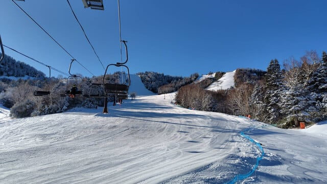
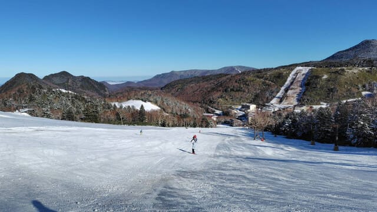
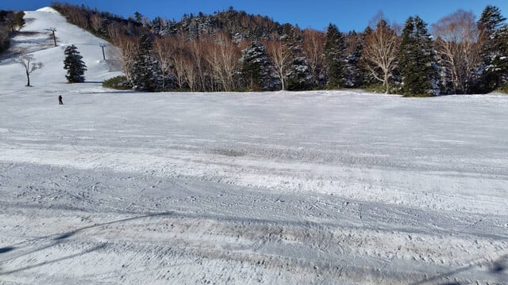
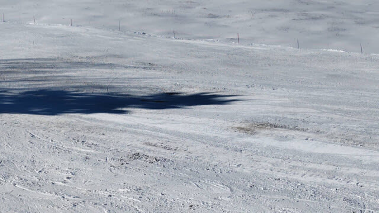
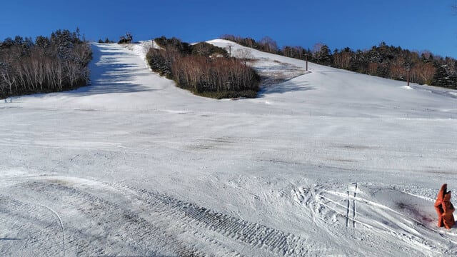
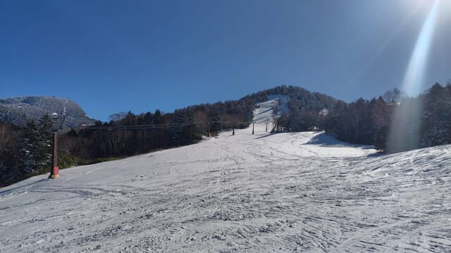
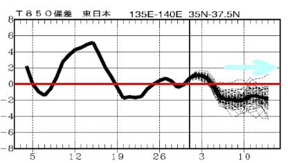
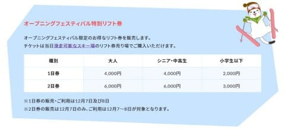

# 12月2日(月)の熊の湯スキー場特派員情報＆今週末は志賀高原スキー場全山リフト券半額！

📅 投稿日時: 2024-12-03 05:19:11

えー．

今日もちょっといろいろバタバタしていて．

気づいたらもう朝5時(泣）

だもんで，今日も短め更新！

ありがたいことに，今日も特派員の方から

熊の湯の情報が来ているので，

今日のメインはこの情報で…

まず．

今日…というか，昨日の2日の志賀高原は，

終日晴れて，天気はいい感じだったようです！

天然雪は降らなかったので，あさイチの

バーンコンディションは結構硬めで，

板が走っていい感じだったようです．

ただ…

昨晩から天然雪は降らず，人工雪頼りなので，

バーンの上半分のブッシュは隠しきれず，

そこかしこにブッシュが残っていたようですが…

でも，日曜の石ころゴロゴロ状態に比べれば

まだマシになったっぽいです．

コース自体はそれほど混まず，

時間が経つと硬めのコースは柔らかくなり

滑りやすくなったようですが…

かなり空いてるように見えますね．

まだオープンしていないコースは，一見

真っ白に見えるものの雪は薄く，

もう一降りないとオープンできなさそう．

…だけど．

予想を見ると，12月5日あたりからやっぱり

結構冷えそうで…

5日を過ぎたら，そのあと10日間くらいは

ずっと平年より冷えそうという，

この3月以降では見たことなかった

平年より気温が低い日が長く続く，

冷え冷え期間に入りそう！！！

ドサドサパウダーとまではいかなさそうだけど，

7，8日も雪がそこそこ降ってくれそうだし．

来週はちょくちょく雪が積もってくれそう

だし…

いい感じの12月になってくれるかな？？？

そして．

志賀高原は今週末，スキー場開き祭です！！

12月7，8日はリフト券が通常窓口価格の

半額です！！

1日券4000円，2日券6000円とお得ですよ～！

…今週末は，まだ滑れるゲレンデは少ない

ですが．

でも，志賀高原全山券がこれだけ安くなる

唯一の機会なので，志賀高原で滑って

みたい方は行ってみてもいいかも…

## 💬 コメント一覧

### 💬 コメント by (レインボー77)
**タイトル**: Unknown
**投稿日**: 2024-12-03 16:49:25

久々のお邪魔虫です。昨日からのスキーですが、ここに書き込むという習性を忘れていました。

昨日は高天(NHKの下のみ)が快適でしたが、今日はファミリー(短いリフトのみ)がオープンなので、歩くのが嫌だったけれど吸い寄せられました。9時15分のスタートだったのですが、硬い凸凹とコロコロで、お世辞にも快適とは言えない状態。朝一から滑っていた友人によると、私らが来る前は日陰になって見にくいうえにもっと硬かったのだとか。

ファミリーは３本でやめて高天へ移動。やっぱり気持ちいい。今日から来た福岡の高校生が拍手してくれる。

明日はどうしましょう？

ファミリーは楽しくないし、高天は団体さんが、、、熊の湯は日に日に雪が薄くなってるみたいだし。今の時点では思いきって遠足覚悟で熊の湯かなあ？

### 💬 コメント by (Skier_S)
**タイトル**: ＞レインボー77さま
**投稿日**: 2024-12-04 08:20:28

コメント回答遅れました~！すみません．

コメントお待ちしてました！今シーズンもゲレンデ情報をリアルタイムに

コメントいただけるのを楽しみにしています．

おそらくレインボーさんのコメントを待っているこのBlog読者も多いはず…

今シーズンもよろしくお願いします！！

