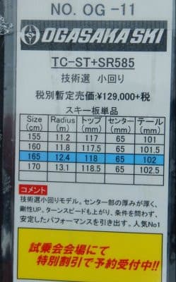

# 2022シーズンモデルのスキー板，試乗レポートその13…OGASAKA TC-ST SR585プレート

📅 投稿日時: 2021-06-30 02:59:31

🏷️ カテゴリ: [スキー板試乗](c0bd8048615710cee890e403a36cc9a2b.md)

ということで．

そろそろ梅雨も明けて，夏がやって

きますが．

昨年に引き続きこの夏も，ダイビング旅行の

予約はとってません…

早くコロナが収まって，モアルボアルに

再訪したいんだけどなぁ…

昨年・今年と潜らないと．

来年は娘が高校受験でダイビングに

行けなくなるし．

娘，せっかく小学5年生でCカード

取らせたのに，中学校は1本も潜らずに

終わりそう…（涙）

あぁ，コロナが憎い…

ってなことで．

そろそろ夏というのに，

今日も2022シーズンのスキー板の

試乗レポートです．

今回はオガサカ編です．

では，どうぞ～！

○OGASAKA TC-ST SR585 165cm 

基礎小回り

技術選向けのTCシリーズですが．

今シーズンの小回り用はTC-S”T”という名前に

なるようです…

そして，この板はプレートが

強めのSR585

弱めのFM585

プレート無し

の3種類から選べるようですが．

今回の試乗板は，一番強いSRプレートが

着いたモデルです…

ってなことで滑ってみますが…

強い．

強いよ，この板…

SL競技用よりよっぽど強い．

そして，重い．

かなりどっしりとした重さと張りの

強さがあり，私にとっては結構手ごわい

板でした…

ただ，圧倒的な安定感があり，

スピードをどこまで上げていっても

荒れた斜面で板が叩かれることは無く．

そして，グリップさせて滑ることも，

板を動かして小回りさせることも

できます．

トーションがガチガチに強くて

エッジグリップしてエッジの方向に

行かされてしまう…というより．

板の張りの強さとトーションのバランスで，

ずっしりと雪面を捉えながら板を動かして

行ける感じ．

板を動かすにはものすごい脚力を

必要としますが，

ハイスピードで小回りをしている中で，

雪面を捉えながら板を動かしていけて，

攻めたズレを使えます．

簡単にずれるわけでないですが，

ハイスピードの中で力を使って板を

動かして行くと，すごいきれいな

ドリフトで小回りの弧が作られていく

感じ．

オートマチックに板が動いて，

気楽に板がたわんでエッジなりに

カービング小回りが気楽に決まる

板ではありません．

カービングで板をたわませるには，

かなりのスピードが必要です…

縦に縦に落としてスピードを載せて

行かないと，板がたわまずカービング

での小回りに入りません．

ただ，逆に言えば．

ものすごいスピードに乗せていけば，

「普通ならロングで急斜面を落ちてく

スピードでしょ？」

みたいな領域で，かなりの落差をとった

小回りが安定してできるという，

恐ろしい板です…

返りは抑えめなので，このスピード域

でもリスクは低め．

そして，このスピード域に入っても，

ずらしを入れて行き，板のテールを動かして

弧を小さめに仕上げていく動きが

かっちりとできます．

とりあえず，体力とスピード耐性がある人なら，

すごいスピードでも安定感とズラシを使える

自由度があり，

「まだまだスピードに余裕がありますが？」

みたいな，恐ろしい板です．

楽しく板がクルンクルン回ってくるとか，

気持ちよく切れていくというより．

玄人が使うプロの道具っぽい感じ…

自分の体力・技術レベルを超えた板だな．

私には，この板を一日履く体力はないな…

と感じた，かなり本格的な板でした．

## 💬 コメント一覧

### 💬 コメント by (AK)
**タイトル**: Unknown
**投稿日**: 2021-06-30 12:33:22

SRプレート付きはS様のレベルでも手強いですか…

私のSRプレート付きに乗った印象はしならない木の棒(笑)でしたやさしめのFMだとかなりイメージ変わりましたが私の技量では気を抜くと山回りロケット発射でしたね！乗れるとメチャクチャ気持ち良かったですが。

結局FMプレートのTC-MTにしましたが乗りこなせるか不安になってきました(汗)

### 💬 コメント by (Northfox)
**タイトル**: Unknown
**投稿日**: 2021-06-30 12:45:58

SRプレートのTC-ST、一の瀬の緩斜面で試乗の機会がありましたが、自分にはとても扱えず直ぐギブアップしました。（TC-SSはもっと乗り易い印象だったのですが...）

ダイビング旅行が今年も中止とは苦渋ですね。

私もまた沖縄に行きたいのですが。

....しかし、S様のその旅行資金はどこに行くのでしょう。長岡か神田のような気が（^^;

### 💬 コメント by (Skier_S)
**タイトル**: TC-STは手ごわかった…
**投稿日**: 2021-07-01 03:01:21

＞AKさま

いや，SRプレート付きは，私が履いていい板じゃなかったです！

…しかし，TCシリーズ．

SL用板とは全く違う方向に発展しだしましたね…

＞Northfoxさま

SRプレート付き，やっぱり手ごわいですよね…

次回はプレート無しのTC-STの試乗レポートですよ！

…でも，ダイビング費用がまた長岡に消えたらすごい…

### 💬 コメント by (ikkun)
**タイトル**: Unknown
**投稿日**: 2021-07-01 20:25:16

(^-^ゞ  野沢にて乗りましたが……印象残りませんでした…ま準指落ちた奴ですからね(笑) 数年前のｹｵｽﾞLSは乗りやすいですが……ランクが違いますね(笑)

