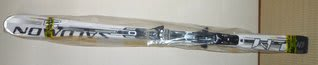

# 今シーズンのマテリアル

📅 投稿日時: 2010-11-19 01:30:59

🏷️ カテゴリ: [スキー雑談](c1f9d2cb7478308da16419928ea3945e9.md)

さて．

本格シーズン前の今，まだ雪面デビューは飾っていませんが．

今シーズン，私と共にすごす相棒は，こいつです．

SALOMON 24hours LM．

私の人生にとって，10セット目のサロモンの板になりますね…

昨年のSL用のSALOMON Equipe 3Vを試乗して，

重い．

硬い．

自分には向かない板だ．

と思った経験があり．

このLMって，その3Vからトップシートを替えてフレックスを多少弱めた

だけの板だよなぁ…

自分には合わないだろうなぁ…

と，思っていたところ．

意外と評判が良いし．

こんな経験

[1](http://blog.goo.ne.jp/skier_nobu/e/5d407a91dffe64358270e3b66b4a3c94)

[2](http://blog.goo.ne.jp/skier_nobu/e/253007d8539a22f726f9c2170c8f6db3)

[3](http://blog.goo.ne.jp/skier_nobu/e/3aca6b5cd4f756845a1bc6af038d7444)

[4](http://blog.goo.ne.jp/skier_nobu/e/739c99f122390b651443d3488470166e)

をしてきた私ですので，

これまで2シーズン履いたX3が，3シーズン目の今シーズン，無事乗り切れる保障はなく，

今シーズンはショートターン用の板が必要だったということもあり．

また，これまで，'00 Series 3V, '06 Demo10 3V, '09 X3と，サロモンの基礎用小回り板は

外したことがなかったので，

とりあえず，こいつを選んでみました．

＃試乗してから買えよ，という声が聞こえる…

さて．吉と出るか，凶とでるか．

雪上デビューが楽しみ．
