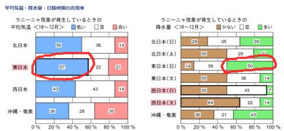
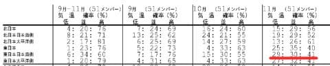

# 来るスキーシーズン，11月には冷えるのか…？3か月予想天気図を見てみた

📅 投稿日時: 2020-08-30 23:38:00

ということで．

今週は日・月と2日更新しなかったうえに．

昨日は夜9時に寝てしまったために，

更新できなかったという…

そして．

今日起きたのは午後2時．

なんと．17時間寝てしまいました．

おかげでBlog更新できず…すみません(涙）

…しかし．

人間って，こんなに寝られるんだなぁ…

よっぽど疲れてたのか…

疲れていると人間は17時間眠れる

ということを学んだ，Skier_Sでした．

いや．

スキーシーズンの方がもっと肉体は酷使

している気がするんだけどなぁ…

精神的な疲労かな？

そろそろどこかに遊びに行かないと

ヤバいかも…

ってことで．

気を取り直して本題へ．

えー．

8月25日に，気象庁から[3か月長期予報が
発表](https://www.sunny-spot.net/chart/FCXX93.pdf)されましたが．

(気象庁配信，専門天気図 FCCX93…[Sunny spot.net等](https://www.sunny-spot.net/chart/senmon.html?area=0)から公表)

スキーヤーとしては，

今シーズンは無事スキー場が予定通り

オープンできるか？

去年のような激烈雪不足にならないか？

あるいはドサドサ雪のハッピーシーズン

スタートになるのか…？

…というあたりが，夜も寝られないくらいに

気になるところ．

なので．

この発表(FCCX93)を読み込むわけですが…

うむ．

11月,

東日本日本海側は平年と同様に曇りや雨の日が多いでしょう

というのが，気象庁の予想のようです．

って，これ，ほとんど情報量0ですね…（涙）

だもんで，確率予報の表を見てみますが…

東日本の11月の気温．

平年より低くなる確率が30%，

平年並みになる確率が40%，

平年より高くなる確率が30%，

ってことは…まぁ，気温は平年並みってこと？

…ただ，運が悪い30%に行けば，

気温が高くなる可能性もあるって

ことですね…

そして．11月の降水量は…

これも，東日本の日本海側は，

平年より少ない確率30%

平年並みになる確率40%

平年並みになる確率30%

と…これも平年並みっぽいですね．

ということで．

11月の気温は平年並みのようです～！！

いつも通りのシーズンインになりそうですね～！！

…

…

…で，終わらない．

天気図解析がウリになっている，徒然スキーヤー日記．

ここで終らないのだ．

ここで終わっては，天気図読み込みマニアの

名がすたる！！←何に向かって勝負を挑んでいるんだ…？

ってなことで．

詳細解析を見てみますが…

まず，FCCX93の後半，予報資料の解釈部分を読み込んでみると…

ふむ？

平常の可能性も40％あるけど…ラニーニャが発生する可能性が

60%！！

さらに読み込んでいくと．

200hpa速度ポテンシャルを見ると，海洋大陸(オーストラリアのことすね…）から

東南アジアで対流活動が活発，太平洋赤道側で滞留不活発…

と書かれてますね．

これの原本を当たってみましょう．

[QXVX44って天気図](https://www.sunny-spot.net/chart/QXVX44.pdf)になります．

これの200hpa速度ポテンシャルの11月のところを

拡大してみると…

おっと．確かに，青く印したインドネシア．

オーストラリア近辺の太平洋西側は

網掛けの発散傾向…

…つまり，太平洋近辺では活発な上昇流が

発生していて，上空で10000m付近で空気が

四方八方に発散している，ということです．

それに対し，赤く示した太平洋中央部より

東側，赤道近辺は白抜きの収束傾向．

どちらかというと下降流の高圧性である

ことを示してます．

これがどういう事かというと…

エルニーニョの時は，太平洋赤道付近の

東風が弱く，暖かい海水域が太平洋に

広がるので，太平洋真ん中付近で

対流活動が活発化しますが…

ラニーニャの時は，東風が強く，

インドネシア付近の対流活動が

活発化します…

（以上2枚，[気象庁各種データ・資料「エルニーニョ・ラニーニャ現象とは」のページ](https://www.data.jma.go.jp/gmd/cpd/data/elnino/learning/faq/whatiselnino.html)より引用）

ってなことで．

この200hpaの速度ポテンシャル図，

太平洋赤道付近を見ると．

水色のインドネシア付近が見事に網掛けに

なってるので，ラニーニャが起こってるな…

と分かります．

で．

ラニーニャが起こると，日本の気象がどうなるか…

ってのも，気象庁のページに統計が載って

いるんですね～．

気象庁のページをさすらうと，面白いんですよ…

([気象庁，各種データ・資料，エルニーニョ/ラニーニャ現象等発生時の天候の特徴（詳細版）ページ](https://www.data.jma.go.jp/gmd/cpd/data/elnino/learning/tenkou/nihon_month.html?phenom=2)より引用，以下2枚同じく)

ラニーニャ発生時の10，11，12月3か月は…

東日本では気温が低い確率が57％！

日本海側で降水量が多い確率が50％！

…これは，ラニーニャが起これば，

半分以上の確率で11月は冷えて雪が降りやすい…

と，統計が語ってくれてますね！！

…でも．

ラニーニャ発生時の1，2，3月の3か月は…

気温が低い確率は44％と，気温は低いけど．

降水量が少ない確率が50％と，

「冷えるけど降らない・積もらない」冬になるという…

ということで．

この冬は，ラニーニャがやってくる可能性が高い

ということは分かりましたが．

ラニーニャ，よろこんでいいのか微妙です…

さらに，詳細解析を読み込むと…

850hpa高度は，平年より高いだと！？？

これは…スキー場や山の気温が，全体的に

高くなることを意味するんですが…？？

ってなことで．

3か月予報の北半球予想図，[QXVX47](https://www.sunny-spot.net/chart/QXVX47.pdf)を見てみると…

赤く囲った850hpa図，一番右が11月1日～11月30日までの

一か月平均850hpa図なんですが．

この図面，平年より低いことを表す

網掛け部分が全くありません(涙)

…これは，11月は，平年より気温が

高いってことなんですが…

ラニーニャの予想とは，ちょっと

不整合だなぁ…？？

というところを不思議に思いつつ，

詳細説明の11月のところを読んでみると…

赤線を引いた部分．

偏西風が日本の東で蛇行し，寒気の影響を受けやすいから，

850hpa気温が高くても差し引き平年並み気温…

と，気象庁では読み取ってるみたいですね．

この，偏西風が日本の東で南へ蛇行している

根拠が，この部分に書かれてます…

分からない人には呪文にしか聞こえないでしょうが．

200hpa流線関数の図は，こいつです．

こいつもQXVX44に載ってます…

この図，読み取り方の説明が

難しいですが…

白抜き部分が北半球では高圧性になる

右回りベクトル，網掛け部分が北半球では

低圧性になる左回りベクトルの

風向きを意味します．

まぁ，概ねこの白抜き部分と網掛け部分の

間が，シアーで強風が発生している部分．

大体のジェット軸を表していると言って

いいかも…

で．

本文中，「インドシナ半島の北で高圧性循環偏差が明瞭」

というのが，下の図に赤色で円く書いた部分．

このせいで，日本付近で網掛け部分と白抜き部分の境目が，

赤矢印で描いたように，ちょっと東下がり傾向になっていて…

これが，「偏西風は日本の東で南に蛇行する」という

意味です．

これ，日本の東に低気圧があるという．

西高東低の気圧になることを意味するので．

気温も下がり気味，日本海側で雨や

雪が降りやすい…という，

ラニーニャ時の傾向を示しています．

ってことで．

実は，単なる数値予報だと，

11月は気温が高くなる傾向が，

[QXVX49](https://www.sunny-spot.net/chart/QXVX49.pdf)にも…

[QXVX50](https://www.sunny-spot.net/chart/QXVX50.pdf)の…

拡大したこの部分を見てみても，

気温が高い可能性が41％となっており．

数値データをそのまま見ると，11月は

平年より気温が高くなりそう…という予想

っぽいのですが．

ベース気温は平年より上がりそうだけど，

ラニーニャになるだろうからそれだけ分

気温が下がりそう…と，

気象庁の人が補正をかけて，

あえて平年並みになる…と予想して．

平年並み40％と発表しているっぽい

ですね…（推測）

ということなので．

ラニーニャが起きるから，この11月は

冷えるのでは…？

と期待したいところですが．

どうやら，

この11月，ベースの気温が上がりそうなところ，

ラニーニャの影響で日本付近は差し引きゼロになる

ということのようです．

で．気温は平年並みだけど…

2月，ラニーニャで降水量が減って雪が降らない

という恐ろしいことが起きないよう，

祈るばかり…

とりあえず，11月に30％と予想されている，

気温が低い方になるように，

今から踊り始めましょうか…

## 💬 コメント一覧

### 💬 コメント by (naoちゃんねる)
**タイトル**: Unknown
**投稿日**: 2020-08-31 11:37:26

17時間睡眠！！

Sさんの睡眠時間は極端ですね(驚)

無駄に冷えたけど全然降らず 4月には厳しくなってしまった3シーズン前の様にはなって欲しく無いものです…

冷え冷え、降れ降れ踊りの準備を開始致します！

### 💬 コメント by (Skier_S)
**タイトル**: ＞naoちゃんねるさま
**投稿日**: 2020-09-01 00:48:19

ホントに極端すぎます…

まさか17時間も寝るとは…！

とりあえず，今シーズンは冷え冷えスタートってのも願いたいですが，

何よりコロナ騒ぎが落ち着かないと…

冬になったまたぶり返して…という最悪シナリオが怖いです（恐）

### 💬 コメント by (西舘)
**タイトル**: Unknown
**投稿日**: 2020-09-01 05:50:03

この記事で来シーズンの降雪を確信し、我が家最速でゲレンデに立てる12月第1週〜3月末までのお宿予約を昨夜しました♪

1月末迄はGoTo対象で、直接予約でもできるようになったしで、予約できました。

来シーズンは年間パスポート導入するし、年間滑走50日超えしそうです。

### 💬 コメント by (Skier_S)
**タイトル**: ＞西舘さま
**投稿日**: 2020-09-02 01:38:49

とりあえず，この冬は平年並みには収まりそうです…

来シーズンは普通にスキー場がオープンして，GWまで営業

できることを祈るばかりです…

