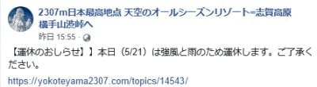
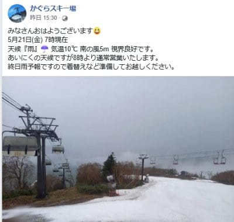
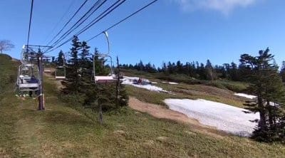
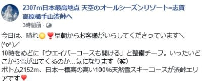
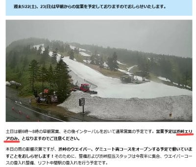
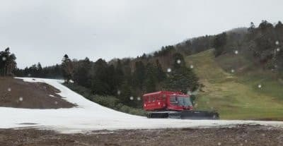

# 2021/5/21(金)は渋峠は荒天のため営業中止(涙)，かぐらは動いたみたいだけど…

📅 投稿日時: 2021-05-22 11:12:41

🏷️ カテゴリ: [日記](cc4b5682fb7b8b144980957a978653fb0.md)

ってなことで．

昨日も夜は倒れたように寝てしまい．

…そして今日はスキーに出かけていないので．

今日はちょっと遅れて，朝更新！

（ってか，もう昼だけど…)

で．

昨日の金曜は，天気が悪く．

強風と雨のため，渋峠は終日運休だった

ようですね…

([横手山Facebook](https://ja-jp.facebook.com/yokoteyama2305/)より）

ただ，かぐらは営業したみたいですが，

やっぱり終日雨の天気だったみたいで．

コンディションは悪かったのかな…

（[かぐらスキー場Facebook](https://www.facebook.com/snowkagura/)より）

ただ，今日土曜の渋峠は，朝から晴れ！

で，早朝は間に合わなかったけど，

下から見て右側のウェーバーコースも

コースを繋げるようです！

([横手山Facebook](https://ja-jp.facebook.com/yokoteyama2305/)より）

でも…

週の初めに「オープンするかも？」と言っていた

海和ゲレンデは，やっぱり営業できなかったようで．

今週末オープンしたのは渋峠のみ．

([横手山ホームページ](https://yokoteyama2307.com/news/14546/)より）

まぁ，金曜に特派員から送られてきた

海和ゲレンデ．

こんな状態だから，オープンしなかったのも

無理からぬこと…

ってな感じで．

今週末はまだ渋峠とかぐらが元気に

営業中なわけですが．

かぐらは明日がファイナルデー．

渋峠も果たしていつまでもつことやら…

あぁ…今シーズンも終わっていく…(涙)

うーん．

私も明日，かぐらファイナルに行こうかと

思ってるけど．

今シーズンは全然パウダー滑ってないん

ですよね…

パウダー滑らずにシーズンが終わっていく

のは寂しいので，今晩激冷えに冷えて，

明日朝までにかぐらメインゲレンデ，

1m位パウダー積もってくれない

かな…←だからそれはかなりヤバい異常気象だから
