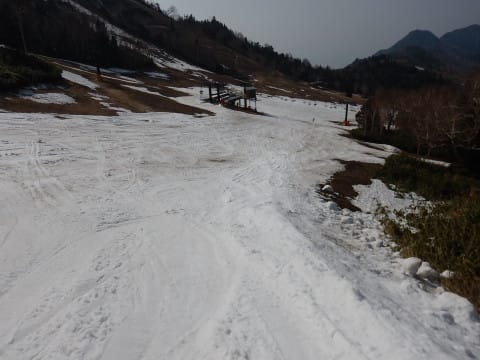

# 5月1日（火）GW谷間の志賀高原…営業している全スキー場のゲレンデ状況＆積雪をレポート！その2・熊の湯

📅 投稿日時: 2018-05-02 00:50:02

🏷️ カテゴリ: [2018スキー滑走日記](c11b88dc181f34079ab41db74a3587646.md)

ってことで．

本日の記事を二つめ！！

5月1日の志賀高原，営業している全ゲレンデレポート．

[その1（奥志賀，横手＆渋）](e39605a02b4ed681703174ea975f655a1.md)に続いて．

熊の湯のレポートです…！

ってな感じで．

熊の湯へやってきたわけですが．

熊の湯で滑れるのは，第2ペアリフトの

馬の背→第2緩斜面の1本のみ．

第3ゲレンデや…

イベントコース，

第2Aコースは終わってます．

第2緩斜面は，まだ雪があるように見えますね…

でも，第2緩斜面も．

この辺りはちょっと雪が薄いかも…

そして，馬の背と第2緩斜面をつなぐ，

この部分．

ところどころ薄くなってはいるものの．

まだ雪は残ってますね…

ただ，馬の背から降りる，この部分．

この細い通路部分が，かなりデンジャラスなんですが！

で．

リフト降り場近辺も…

もう，頑張って雪をつけている苦労に

あふれている感が半端ないです．

リフト降り場から馬の背にかけては，

廊下状態でコースをキープしてますが．

うーーーーむ．

ところどころやばい感じ…

そして，馬の背の上部ですが．

幅3mほどに雪を寄せて厚みをキープ

してますね…

幅を犠牲にしてでも，コースをキープし続けようという

努力がにじんでいます…

馬の背下部は，そこそこの幅がありますね．

で，

さっきの写真でヤバくなっていた，

細い通路に向かって曲がっていきますが…

うはーー！

ヤバいっ！

ヤバいよ，これ…！

でも．

そのあとは，部分的に薄くなってるところはありますが．

最後の第2緩斜面．

まだ雪があるように見えます…

でも．

第2緩斜面の上の部分は，

かなり雪が薄い部分もあって…

水たまりになってるところも…

うむ．

この○で囲った辺り，2か所．

そろそろ雪寄せしないとヤバいのでは？？

でも．

あとはリフト乗り場近辺も雪は十分

残ってるし．

馬の背は雪寄せしてコース維持

してるし．

かなり頑張っているなぁ…

あとは．

この部分が切れたら馬の背も終わりなので．

3日の雨で，馬の背が終わっちゃう可能性は高いかと…

（営業終了直前の状態）

ここが切れたら，滑れるのは

中間駅から下半分，緩斜面だけになりますね…

ってな感じで．

夕方には誰もいなくなってしまった

熊の湯スキー場．

結局，今日もリフト営業終了の4:30まで

滑り続けたのでした…

うーむ．

しかし．

今日も営業が終わった夕方に．

車の温度計がまだ16℃を指してるくらいに

気温が高かったので．

かなり雪が解けました（涙）

そして．

3日の雨でトドメが刺されそう…

これらのゲレンデで．

4日以降も生き残るのは，どこだ！？？

## 💬 コメント一覧

### 💬 コメント by (もりや)
**タイトル**: ここまでとは・・・
**投稿日**: 2018-05-02 01:26:01

熊の湯もヤバイですね。3日は雨強風になりそうなので、リフトの運行等も考えれば、熊の湯かなぁ〜と。写真参考になりました。ありがとうございます。

### 💬 コメント by (カンタロス)
**タイトル**: ご参考までに
**投稿日**: 2018-05-02 20:57:57

本日、かぐら行ってまいりました。なんと、かぐらメインゲレンデど真ん中に穴開きました❗️笑うしかないですね。追伸。いつも楽しく拝見させていただいてます。

### 💬 コメント by (Skier_S)
**タイトル**: 残念なGWです…
**投稿日**: 2018-05-02 21:56:45

＞もりやさま

熊の湯も，滑って楽しくはない状況です．

滑れるだけありがたい…

という感じでした（涙）

明日の雨で，馬の背が切れるとかなり

痛いです…

＞カンタロスさま

コメントありがとうございます～！

なんと．

かぐらメインゲレンデも穴が開きましたかっ！！

これ，5月最終週まで営業できるか

微妙ですね…

おととしの雪不足の時でもここまで早く

穴が開かなかった気がするのですが．

今年はダメですね…（泣）

