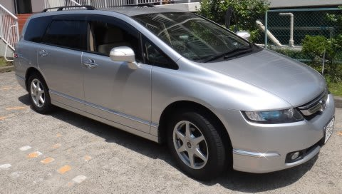
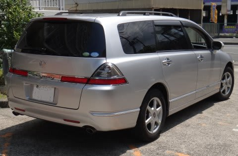
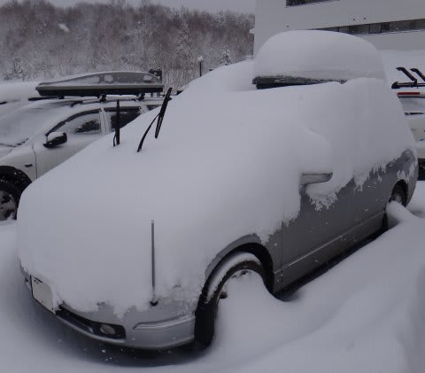
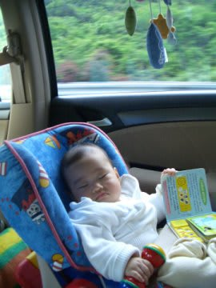
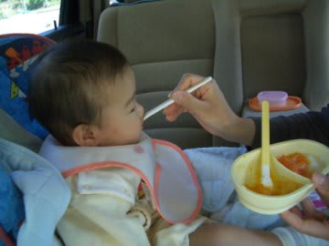
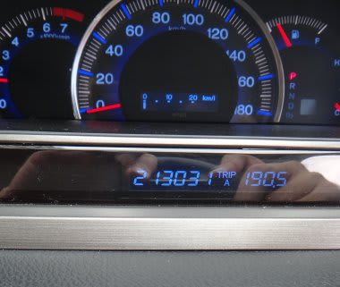
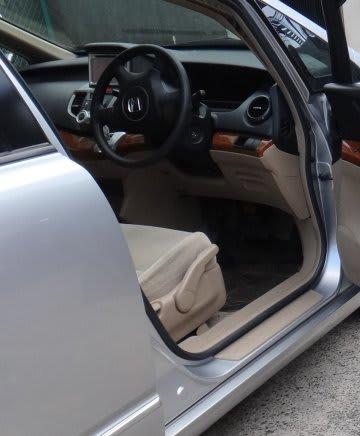
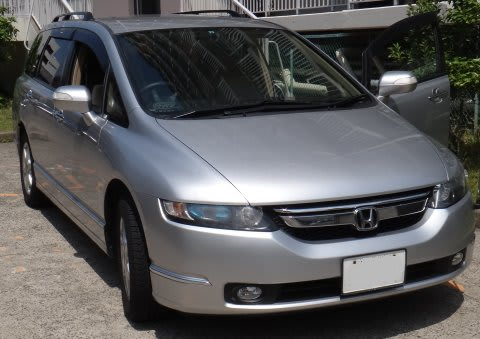

# プロジェクトX第2章…さよなら，21万kmオデッセイ！…そして，ありがとう．

📅 投稿日時: 2013-06-11 01:26:28

🏷️ カテゴリ: [車](cba0e8330b3f2ded7c1addfacc75d4547.md)

えー．

ってことで．

レガシィが昨日納車されたわけですが．

…ということは．

…約7年，21万3000kmの熟成を重ね，深い味わいを醸し出してきた

オデ雄君（仮名）とも，お別れということなんですね．

ということで．

昨日．

オデ雄君（仮名）に，サヨナラをしてきました．

…お別れに撮った一枚ですが．

大切に乗った車なので，

とても今日売られていく，21万km走行済みの車には見えないなぁ…

＃かなり酷使したんですけどね～

…しかし．一体．

こいつに乗って．

何回スキーに行ったことやら…

とてもじゃないけど，思い出せないくらい．

思い出がいっぱい，いっぱい詰まった車です．

…この車を買ったときは．

まだ娘もおらず．

夫婦2人でオデッセイは，

ちょっとでかいかな～，と思ってたけど．

購入後，1年経って，子供が生まれ．

乳飲み子の間は，車の中で目隠しをして授乳したり．

離乳食の食べ初めのころは，離乳食セットとお湯を必ず車に

積み込み，時間が来たら車の中で離乳食を作って…

車の中でオムツも替えて…

ああ，広い車はいいなぁ，と思ったもので．

そして．娘がしゃべれるようになってしばらく．

「うちの車，怒った顔してる」

という名言を残し．

生まれたときからこの車しか知らない娘は．

車といえば，オデ雄君（仮名）だと思い込んでるわけで．

そんな，娘の成長を生まれたときから見続けてきた，オデ雄君（仮名）．

今回，「オデッセイさんにさよなら言いなさい」と言ったら，

さよならを言ってましたけど…

車を買い換えたってこと，ちゃんと分かってるかな～？

しかし．

タフな車でしたね～．

消耗品以外で交換したのは，[ラジエター温度計](d20120301.md)くらい．

あとは，ブレーキパッドやらプラグといった，消耗品以外，

完全メンテナンスフリー．

車の運転に支障が出るような故障は一切なく，21万km以上，

無事走りきってくれました．

最近の電動とは違う，油圧パワステのフィールも良かったし．

ブレーキも7人乗せる重量を想定した，結構がっちりとストッピング

パワーの出るブレーキだったし．

エンジンもかなりスムースに吹け上がり，燃費もそこそこ良かったし．

もう少し乗っても良いかな～，

と思わせる車でした．

最後の走行距離は，21万3031km．

ホントに良く走ったな～．

ディーラーに引き渡すのに．

最後に運転をしたときも．

明日からこの車に乗ることが無い…というのは実感が全く

沸かなかったけど．

最後にこの車から降りて，さよならを言ったときに．

ちょっと悲しかったのは．

やっぱり，この車．

いい車だったからでしょう…

＃最後まで大切にきれいなまま乗りました…

お疲れ様でした．

そして．

ありがとう．

…さようなら．

## 💬 コメント一覧

### 💬 コメント by (いか)
**タイトル**: Unknown
**投稿日**: 2013-06-12 00:34:00

私の実家のオデッセイより型が新しいですね。うちは今年の6月(だったかな？)の車検を通過させたらしく、また、当分オデ蔵くん(仮名)でいくみたいです。もう10年以上とぼくの半生ぐらいの付き合いの車なので、乗り換えるときはさみしいのでしょうね(´・_・`)

それでも、新しい車がくる喜びもひとしおだと思いますが(・ω・)ノ

### 💬 コメント by (Skier_S)
**タイトル**: いかさま
**投稿日**: 2013-06-12 01:29:52

いやー．10年以上ですか！

私はこのオデ雄君（仮名）が新車で初めて買った車で，

それまでは中古車ばかり乗っていたので…

新車から乗りつぶすと，それは愛着が…

やはり，お別れのときは涙がこぼれてしまいます（笑）．

新車は，やっぱりぴかぴかで嬉しくなりますね～．

でも，私はスキー板もそうですが，だんだん使い込んで

その特性が分かってくると愛着が湧いてくるので，

新しいものは「慣れてないな～」という感じがあります…

オデ雄君（仮名）は，何km/hになった瞬間にどうアクセルを

抜けば，一番速く5速ロックアップに入るか…

というのが体に染み付いており，意図したタイミングで

変速させたり，ロックアップを効かせることができたのですが．

新しい車でも，これからどのような加速プロファイルがもっとも

効率的かを探る作業が始まります…

そうやって，だんだん愛着が湧いてくるんですね（＾＾

