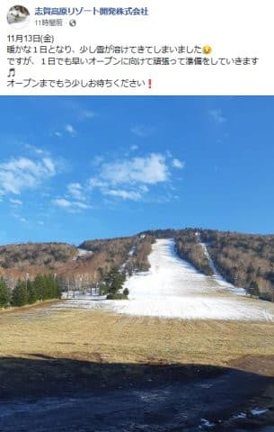
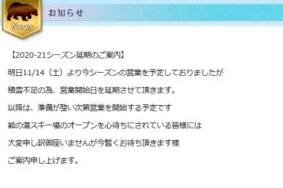
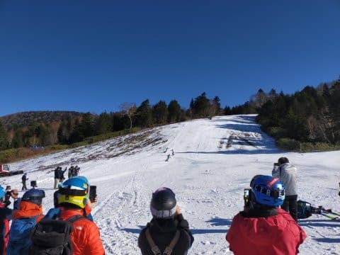
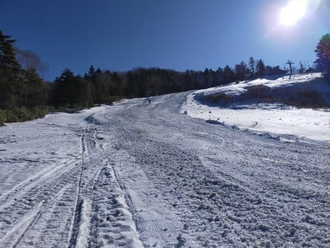
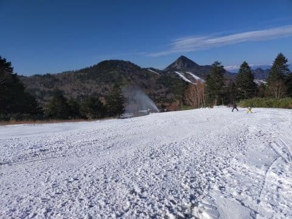
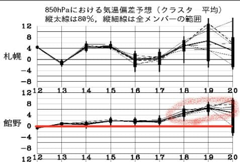
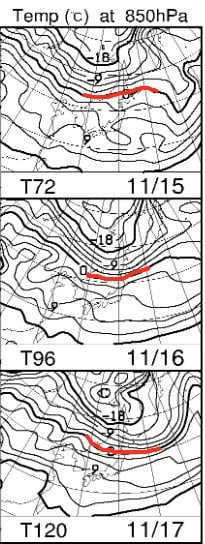
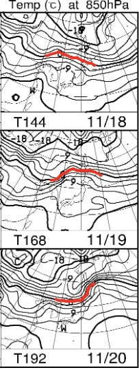
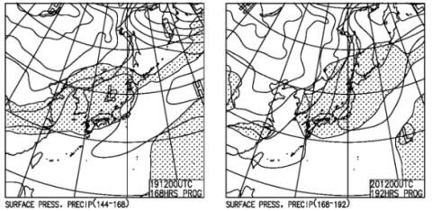

# 本日，志賀高原は横手山スキー場がオープン！…でも，熊の湯はオープンできず．そして，来週3連休はかなりダメっぽい（涙）

📅 投稿日時: 2020-11-14 03:56:52

えー．

やはり，本日は気温が上がり．

予想通り，志賀高原でも人工雪を

打つのが無理だっただけではなく．

昼間気温が上がって雪が融けちゃった

みたいですね…（涙）

（[志賀高原リゾート開発Facebook](https://www.facebook.com/ShigaKogen.Ski/photos/a.530911113691763/3429729740476538/?type=3&theater)より）

おかげで，熊の湯スキー場．

予定していた11月14日のオープンを

諦めたようです（泣）

…残念っ！！！

（[熊の湯スキー場ホームページ](https://www.kumanoyu.co.jp/lift/)より）

…でも．

強力な人工降雪機を大量に導入したらしい

横手山は．

予定通り，本日プレオープンしたようです！

オープン初日の本日は，見事な晴天の

スキー日和！

うーん．でも，

ちょっと雪が薄い感じで…

そして，コロコロだらけに見えますね…

本日滑ってきた特派員曰く．

コロコロだらけで，石ころも

結構出ているので，

捨て板で来た方がいいですよ…

とのことでした．

特派員の方，写真使わせてもらいました～！

ありがとうございました．

…ということで．

熊の湯が開かなかったので，

私は今週末の志賀高原は諦めたのですが．

…来週の3連休までに，ちょっとは

冷えてくれれないかな…と．

850hpa気温傾向を見るわけですが．

なんじゃこりゃ

19日前後の予想，悪化してる…！！（涙）

19日の平年比+6℃って，なに？？

20日の予想はばらつきが大きいけど，

最高平年比+8℃まで上がりそうって，

どういうこと？？？（激涙）

15日から17日の850hpa気温図を見てみると…

赤い0℃線は北海道から東北北部を

漂っている感じなので…

これだと，志賀や長野は人工雪が

打てるほど冷えませんね（泣）

18日から20日の図を見てみても，

赤い0℃線は北海道の北側に居続ける

感じ…

これ，10月よりあたたかいんですが（泣）

そして…地上天気図では，19，20日は

網掛けの降水域が日本を覆っているので．

…これは，雨になりそう…（涙）

この気温だと，

降れば絶対液体です．

間違いなく液体です．

ええ．液体です（激泣）

この天気図で雪が降る確率は，

伊豆でダイビングして

ジンベエザメとマンタがフォークダンス

しているのに遭遇するくらいの確率

だと思います…

これすなわち．

熊の湯を始め，かぐら，アサマ2000，湯の丸，

鹿沢，そして一の瀬など．

11月21日までにオープン予定のスキー場．

21日にオープンは実質厳しい

ということですね（涙）

あぁ…せっかくの3連休なのに．

しかしホントに．

なんで10月に冷えて，11月に気温が上がるのか（泣）

誰だ！！！日ごろの行いが悪いのは！！←だから，それはあなたでしょ

## 💬 コメント一覧

### 💬 コメント by (ikkun)
**タイトル**: Unknown
**投稿日**: 2020-11-22 01:17:34

しかし……あの寒い先月はなんだったのかな(泣) タイヤ代えなくて良かったですね？ま何年か前の12月頭にゲレンデ全面OK はやばすぎますが？  コロナの状況を見ると不安ですね？  昨年のブーツともう少し前のポール(笑)  少し不安ではありますが？ 適度な降雪と願うばかりな雪国者です(笑)

### 💬 コメント by (Skier_S)
**タイトル**: ＞ikkunさま
**投稿日**: 2020-11-22 03:34:52

10月が冷えると，11月が冷えないという噂もあったので

ちょっとヤバいかと思ってましたが…

10月と11月の天気を入れ替えてほしいです(涙）

12月に入ったら冷えると信じてます…

というか，12月の気温を冷やすために踊ります．

踊り続けます．

