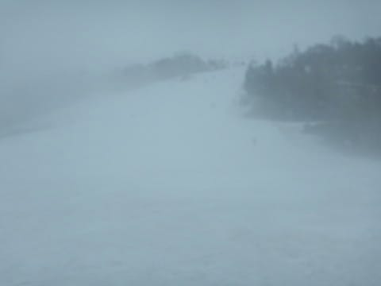

# 5月13日（日）のかぐらスキー場速報…朝9:30から雨がポツポツ降ってきたけど，そのせいかリフト待ちは少なかったよ！

📅 投稿日時: 2018-05-13 23:24:56

🏷️ カテゴリ: [2018スキー滑走日記](c11b88dc181f34079ab41db74a3587646.md)

ということで．

本日，かぐらスキー場へ日帰りで行ってきたのですが．

日曜深夜恒例の速報モードにて…

本日．

悪天候の予想だったからか．

この時期のかぐらにしては，結構空いてましたね～．

朝7:30のロープウェーオープン時に，

せいぜいロープウェー1～2台で乗れる程度しか

並んでませんでした…

で．

みつまたリフトに乗りますが…

…みつまたコース，完全に雪が消えて

ピスラボマットだけになりましたね（涙）

でも．

みつまたからゴンドラに滑り降りるコースは，

まだ雪が残ってましたね～（安堵）

…でも．

これも来週にはピスラボマットになりそう…

ってな感じで．

ゴンドラでかぐらゲレンデに上がりますが…

いや，雪が減りましたね…

テクニカルコースの下半分は，完全に終了です（泣）．

メインバーンのクワッドリフトをくぐる部分も，

下から見て左側部分に，かなり土が出てきましたが…

でも，下から見て右側部分は，まだ幅広く

雪がついてますよ～！

…で．本日．

昼過ぎから雨かと思っていたら．

予想をかなり悪い方向に裏切り，

朝9時過ぎからぽつぽつと雨粒が落ちて

来ちゃったんですけど…（激泣）

でも，午前中はせいぜいポツポツと降ったり

やんだりを繰り返す程度．

だもんで，午前中はゲレンデの人も

結構多かったですね～．

とはいえ．

やっぱり普段のこの時期の週末より人が少なく．

リフト待ちはピークでせいぜいこの程度．

いや…

リフト待ちがこれだけ少ないなら，ポツポツ

降ってくれるのも歓迎だなぁ…

と，思っていたら．

午後2時過ぎからは雨もちょいと強くなり．

パラパラ雨＆ガス…

という天気

ゲレンデが見えない…（涙）

でも，そのせいでコース上も人が

ほとんどいなくなりましたね…

この写真，誰も写ってません（笑）．

当然リフトも午後は飛び乗り！

メインバーンは，まだ意外と雪が残っており，

わずかに一部，雪が薄くなってきたところも

あったものの．

午後になっても，コブ溝に土が出てくるところは

ほとんどなくて，結構ちゃんと滑れましたね～．

ってな感じで．

やっぱりいつも通り，ラストリフトまで滑った本日．

天気は悪かったものの，

午後2時ごろまでは雨もそれほどひどくなく．

それなのに，リフト待ちがかなり少なかったので．

まぁ結果的にはそこそこ楽しめた一日

だったかな～←いや，普通の人は楽しめる天気じゃないから．普通はこんな日に最後まで滑らないから

## 💬 コメント一覧

### 💬 コメント by (もりや)
**タイトル**: かぐら
**投稿日**: 2018-05-14 08:06:17

昨日は1日子供達と一緒に滑って頂きありがとうございました。娘が休憩に入ってからは、息子とSさんと私で滑りましたが、いやーあのコブ斜面を午前中からラストまで、あのスピードで滑るなんて私はついて行けず必死で滑ってました(涙)息子は凄く楽しかったと喜んでいましたよ。またSさんと一日中滑っていたいと・・・私には娘と一緒に滑っているレベルが丁度良いですが(笑)

### 💬 コメント by (新潟のスキーヤー)
**タイトル**: Unknown
**投稿日**: 2018-05-14 21:11:25

速報ありがとうございます！

私も明日、かぐら行って来まーす！(^^)

### 💬 コメント by (しんちゃん)
**タイトル**: 履き替え
**投稿日**: 2018-05-14 23:00:26

遂に私も夏用タイヤに履き替えました。

シーズン完璧に終了です。

かぐらはまだスキーヤーがたくさんいるんですね。スゴイ。

しかも朝からリフトエンドまでコブ斜面を滑ってるなんて、超人－つまり人間を超えていますね(笑)

### 💬 コメント by (yama)
**タイトル**: アライ
**投稿日**: 2018-05-14 23:04:46

アライで２日滑って来ました。かぐらとの比較ですが料金が２日券5600円と安いが高速代とガソリン代を考えると安さもそうは変わらないですね。距離的にも時間でも、志賀高原に行くのと変わらないです｡滑れるコースは２つです。１つはアンコールで朝はポール練習で上部は半分しか滑れません。１０時くらいにはコースは開きます。もう１つはビーフリーでジャンプ台などのパークになっています。こちらは１０時くらいから開きます。担ぎ上げで大毛無山に登ってゲレンデ以外も滑れますが、最後の林道が途切れて車でのビストン輸送でした。ゲレンデは雨が降っていなくても空いていて気持ち良く滑れます。ポール練習していた斜面は硫安が効いていて最後までこぶになりません。もちろんコース下部はコブコブです。リフトは１時間で７～８本くらいですね。休日のリフトの時間は７時15分～１５時４５分までです。リフト１回何分かかるか計ってしまうのがゴールドメンバーのさがでしょうか。先週の横手渋峠よりは快適だと思います。

### 💬 コメント by (Skier_S)
**タイトル**: コメント回答遅れました…すみません
**投稿日**: 2018-05-16 07:02:15

＞もりやさま

日曜はお世話になりました～！

まさかほとんど一日一緒に滑るとは

思っていませんでした．

息子さんの速さにびっくりです．

帰り道は，かなり疲れていたのでは？

また来シーズンは，一緒に焼額を

一日中滑りましょう！

…ナイターまでやったら，20000m行くかもしれません…

＞新潟のスキーヤーさま

ジャイアントはクローズ，

ゴンドラコースも最終日だったかと

思いますが…

楽しめましたか？

どんなだったか，また教えてください～！

＞しんちゃんさま

もうシーズン終了ですか…

ってか，かぐらまではさすがに来れないですよね（笑）

かぐらはこの時期，すごい混みますよ！

トップシーズンはがらがらのスキー場なんですけどね（笑）

春のコブは，雪も柔らかいし滑りやすいので

結構好きです…

朝からコブだったら死にますが，

コブになってくるのは午後からなので，

大丈夫です．

＞yamaさま

ARAIも結構良さそうですね…

まだ結構雪があるんですね！

今シーズンはかぐらの割引券もあるし，

今週もかぐらに行ってしまいそうですが，

来シーズンの春はARAIも候補に

上がりそうです…

情報ありがとうございました！

