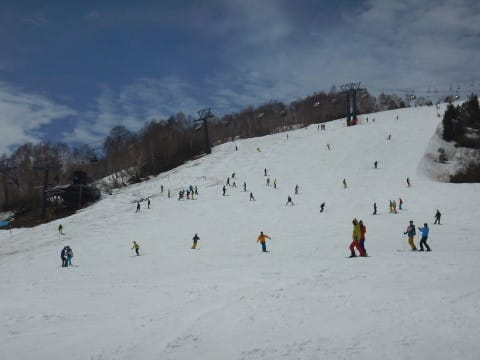

# GW最終日のかぐら・みつまたスキー場のゲレンデ状況，詳細レポート！

📅 投稿日時: 2018-05-09 07:02:16

🏷️ カテゴリ: [2018スキー滑走日記](c11b88dc181f34079ab41db74a3587646.md)

ってなわけで．

昨日はGW明けの仕事が溜まっていて．

かぐらの詳細レポートができなかったので．

…今さら感が無くはないのですが，

本日．

GW最終日のかぐら・みつまたスキー場の

ゲレンデ状況の詳細レポートをば！

えー．

GW最終日のみつまた駐車場．

かなり車は多かったですね～．

でも，満車になるほどではなかったので．

4連休も最終日だから，ちょっと人は少な目

なのかな？

で．

ロープウェーでみつまたゲレンデに出ると…

ふむ．

まだ，みつまた高速リフトまで，

紐ゲレンデがつながってますね…

でも．

みつまたゲレンデは全面的に紐状態で．

かぐらからの下山連絡のみにしか使えません…

…でも．

このみつまたゲレンデ．

[かぐらスキー場のFacebookに書かれてます](https://www.facebook.com/snowkagura/photos/a.307362099391117.1073741825.241102069350454/1533482586779056/?type=3&theater)が．

さすがに今週末は一部Pislab滑走になるようですね…

そして．

みつまたエリアからかぐらゴンドラへの

下り坂．

ここも完全に廊下です…

硫安をガンガン効かせまくってますが，

これも今週末は，ところどころ下地の

Pislabマットが出てくる感じに

なってるんじゃないかな～．

ってな感じで．

ゴンドラに乗って…

やってきました，かぐらメインゲレンデ！

今日もにぎやかですね～．

かぐらに来たからには，

かぐら第1高速リフトに乗るわけですが．

和田小屋から第1高速リフトへの道は，

まだ幅いっぱい雪がありますね…

そして，かぐらのメインバーンは…

一昨日書いたように，下から見てリフト支柱の

左側は，ちょいと土がではじめてますが…

下から見て支柱より右側は，まだまだ大丈夫！

雪質は，朝から滑りの悪い雪だったけど…

けど．

朝の10時前くらいまでは，リフトもそれほど混んでおらず．

ゲレンデも比較的フラットで

良かったかな！

でも．

10時を過ぎると…

うむ？

ゲレンデの人口密度があがってきたのですが…

当然，リフトも混んできます（涙）

とはいえ，ピークでこの程度．

せいぜい5分程度なので，

前日の5日に比べれば，かなり待ちは少なかった

ですね～．

さらに，昼になると搬器2-3台待てば乗れるほどの

ガラガラで．

午後はほぼ飛び乗りになってきたので，

GWもさすがに最終日．

比較的すいている一日だったと言えるかと…

いや，とはいえ．

メインゲレンデの人は終日多めでしたが…

そして，ジャイアントコースへも

行ってみますが…

一見まともに見える，このコース．

コースの取りつき部分，かなり土が出てます（涙）

途中の部分は，一応まともなコブ斜面に

なってますが…

最後の部分も，かなり土が出てきてますし…

リフトに向かって落ち込むところも…

振り返ってみると，コース幅が

狭くなってきてます．

うーん．

今週末はこのあたり，厳しくなってるだろうなぁ…

そして，テクニカルコース．

最初はまともですが…

斜度変化がある，中間地点．

かなりやばいです…

実質，この日でもう切れかかってました（涙）

ちなみに，下半分はもうすでに穴が開きまくってるので．

今週末は，下半分は滑れないでしょう…

ってな感じのかぐらを，一日滑ってましたが．

メインバーンは，夕方4時のラスト時点では．

やっぱりいつも通り，コブ斜面化してます…

でも，人が少なめだったので，いつもより

コブは浅めかな…

でも，コブがダメな人には厳しい感じの，

全面凸凹バーン化してます．

メインバーンの一番下の部分は，土が出ている側は

ちょっと雪が薄くなってきているので…

こうやって見るとまともに見えるけど，

今週末は，結構コブ溝に土が出ちゃうかも…

パークはまだ全然健在ですね．

ってな感じで．

4時のかぐら終了後，かぐらゴンドラコースを

下りて，みつまたへ向かいますが…

一部，ゴンドラコースも狭くなってきてますね．

うーむ．

ここ以外はまともに見えるゴンドラコースですが．

ゴンドラコースも，もってギリギリ今週末までかな…

そして，みつまたへ向かうリフトに乗りますが…

せいぜいこのくらいの待ちだったので，

25分～30分待ちになったらしい，昨日に

比べるとかなりマシ．

今日はやっぱり，人が少なめだったようです．

で，最後のみつまたコースを降りるわけですが…

うむ．

なんとなく，シーズン初めのYetiを彷彿とさせる

コース幅（涙）

最後の部分は，コースに結構穴が

開きかけていたので．

今週末は，ところどころPislabの上を

滑る感じになってそうですね…（涙）

ってな感じで．

志賀に比べれば，まだかなり雪が残っている

かぐらでしたが．

うーん．

やっぱり今シーズン，例年より1～2週間ほど早く

雪が消えてる感じ…（涙）

まぁ．

でも．

まだメインバーンはまともに滑れたし．

志賀が壊滅した現在．

かぐらがあって良かった…

って感じでしょうか．

でも．

今週末．

混むだろうなぁ…

## 💬 コメント一覧

### 💬 コメント by (新潟のスキーヤー)
**タイトル**: Unknown
**投稿日**: 2018-05-09 10:01:24

私も仲間に、まだ行ってるの？

てか、雪あんの？って言われる今日この頃！ 笑

昨日、かぐらに行って来ましたよ！

みつまたの廊下はピスラボが露出！

スタッフなのか業者か分かりませんが、

ピスラボのメンテ始めてました！

かぐらのメインバーンもリフト支柱片側は既に地面が大きく露出してましたし、テクニカルの下側は滑れなくなってました！

当然、ジャイアントもコブのラインを選ばないと滑れない状態に…

間違いなく例年より早いペースで融雪が進んでますので27日までの営業はかなり厳しく、出来たとしてもかなり悲惨な状態かと…

かぐらの営業が終了になると

私も今シーズン終了です。涙

### 💬 コメント by (Skier_S)
**タイトル**: 新潟のスキーヤーさま
**投稿日**: 2018-05-10 01:36:29

あら…

みつまたはもうPislab出てきちゃいましたか（涙）

やっぱり今週末までもたなかったか…

かぐらメインバーンも，かなり雪が減ったんですね（泣）．

週末は，ジャイアントもやばそうな感じですね…

あぁ…

雪解けが早すぎる…

とりあえず，27日まで無事営業できるよう

祈りましょう．

私はかぐらが終わったら，また例年通り月山へ

行きます…

