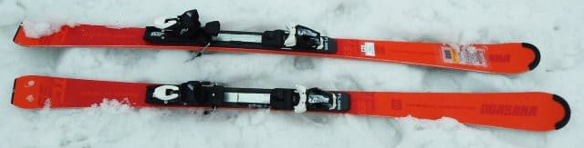
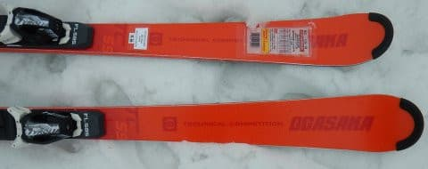
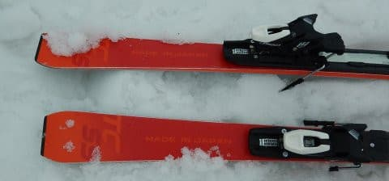
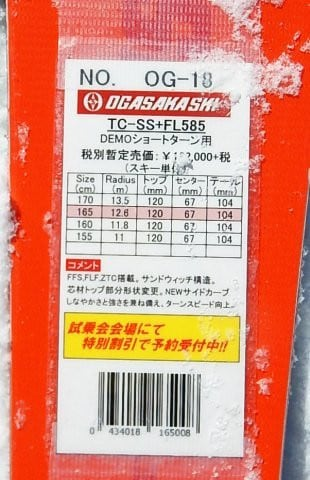
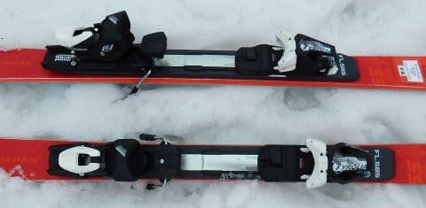

# 2020シーズンモデルのスキー板，試乗レポート…OGASAKA編その4

📅 投稿日時: 2019-06-20 02:47:28

🏷️ カテゴリ: [スキー板試乗](c0bd8048615710cee890e403a36cc9a2b.md)

えー．

今朝．朝8時半ごろまで．

なんだか，書きかけの記事が晒されていたのを

読んだ…とお思いになった方がいるかも

しれませんが．

それは，おそらく，目の錯覚です．

気のせいです．

決してSkier_Sが「下書き」で

投稿したつもりだったのが，

間違って「公開」で投稿した…

なんてわけでは無いので．

間違って投稿されていた記事なんて

なかった．いいね？

ほっぽさん，コメントくださいましたが

また記事を書きあげた時に回答します…（謝）

ってなことで．

本題へ行くわけですが．

…スキーをメインの話題とする，このBlog．

どうやら，Googleさんには，車Blogと

認識されてしまっているらしく…

車ネタを書くと，Googleさんが

大量に読者を送り込んできて．

スキーBlogなのに，スキーネタより車ネタの方が

圧倒的に多くの読者が訪問する

という，悲しい状況になってます（涙）

だもんで．

…あえて声を大にして言っておきます．

このBlogは，スキーヤーBlogです

なので．

スキーヤーBlogとしてのアイデンティティを保つために，

本日はスキー試乗レポートです！！

本日はオガサカ編．

今回からは，同じ板を2回試乗した，

2回目のレポートになります．

[前回](eb4982de44473bd2177f01f4c45f5aa7c.md)は

FLプレートとGRプレートの乗り比べをしましたが．

今回は，好印象だったFLプレートの板を再び

乗ってみました．

では，どうぞ～！

○OGASAKA TC-SS FL585 165cm

基礎小回り．

技術選選手向けのTCシリーズの小回りモデルですが…

前回は一番強いGRプレート付きを試乗しましたが．

今回は，2番目に強いFLプレート付きに乗ってみました～！

前回乗ったGRプレート付きは，かなり固めで．

硬い斜面でガッツリハイスピードで飛ばさないと

実力を発揮できない，ハイスピードカービング

マシーンだと思いましたが…

この，FLプレート付きだと，そこまで

過激なハイスピード板ではなくて．

そしてカービング専用板でもない感じ．

迎え角を作りながら板を動かしていくと，

板がぐっと旋回していきます．

サイドカーブに乗っていくだけの

オートマチックさに頼った滑りではなく，

板を自分から動かしていくマニュアル操作を

していくと，安定した中で強い旋回力を

発揮します．

荒れた斜面でも，板を動かしていくことで

安定して板が旋回してくれるので．

荒れた斜面でのコントロール性，

安定性も思った以上に高いです．

自分で板を動かした時に発揮される

高い旋回力で，荒れた斜面でも

すごくきれいに小回りをキメることができて．

かなり雪面への対応力は高いと思いました…

また，板を動かした量で思い通りに

弧をコントロールできるので．

ターンでいろんな表現ができそうな

感じで．

技術選で点数を出そう…という人には

いい板かも．

オートマチックに任せて脳内麻薬のままに

滑り降りれる板ではないけど．

幅広い雪面適応力と，高い表現力を

もっている板なので．

快楽に溺れる私のようなスキーヤーではなく．

本気でスキーが上手くなりたい人が

履くといいのかな…

と思いました．

あと，春の雪ってのもあったのかもしれないけど．

柔らかい雪で，私の体力＆体重だと，GRプレートより

FLプレートの方が良さそうな感じ…

## 💬 コメント一覧

### 💬 コメント by (ほっぽ)
**タイトル**: Unknown
**投稿日**: 2019-06-20 07:13:33

Ｓさん

コメントがblogごと消えてましたが、錯覚だったのですね。

もしかして何か気に障るコメントで抹殺＆出禁になったのかと心配してました。(^^;

いっそのこと、blogをスキーと車ネタ満載のblogと改称されても良いと思います。(^^♪

### 💬 コメント by (Skier_S)
**タイトル**: Unknown
**投稿日**: 2019-06-20 09:07:51

>ほっぽさま

ダイビングと車ネタ満載のスキーヤーブログかも…(矛盾だらけ)

### 💬 コメント by (ほっぽ)
**タイトル**: タイトル
**投稿日**: 2019-06-20 19:07:05

Ｓさん

blogのタイトル、妥当かと思います。

やはり最後をスキーヤーで締めくくるのは必須かと。(^^♪

### 💬 コメント by (葛飾のS)
**タイトル**: Unknown
**投稿日**: 2019-06-20 21:29:45

CX-8乗ってみたいなぁ😊

あっダメですか😱

### 💬 コメント by (Skier_S)
**タイトル**: これはスキーヤーブログです（笑）
**投稿日**: 2019-06-21 03:03:26

＞ほっぽさま

そしてさらに，時々混ざるPCネタ（笑）．

毎日のネタの長さと情報量の多さ（コピーや引用じゃない一次ネタの量）については，

このBlogはそうそう他のBlogに負けないと自負してます（笑）．

＞葛飾のSさま

CX-8のガソリンターボ…？

…いいね．あなたは何も見ていない．

そう．見ていないのです．

### 💬 コメント by (炎の北海道民)
**タイトル**: Unknown
**投稿日**: 2019-06-21 19:56:42

S様

国産のオガサカは応援したいけれど、いつもデザインが残念な感じです。今年のモデルは、オガサカの文字が経年劣化でかすれたみたいで、あまり欲しいとは思えないんですよね。ですが、所有しているショート板はオガサカのTC -SZとTC -SAです(笑)。SZはガンダムデザインですな。

### 💬 コメント by (Skier_S)
**タイトル**: ＞炎の北海道民さま
**投稿日**: 2019-06-22 00:35:51

そうですね～．

OGASAKAは，デザインが微妙な年が多いですよね…

でも，今シーズンモデルはまだマシだと思いました．

私は嫌いじゃないですよ．

しかし，TC-SZとTC-SAに乗ってらっしゃるんですか！

次もOGASAKAですか？？

ちなみに，私は板を購入する際には，デザインは全く

板を選ぶための検討要素に入りません（笑）．

性能が良ければ，どんなデザインの板でも

買ってしまいます．

