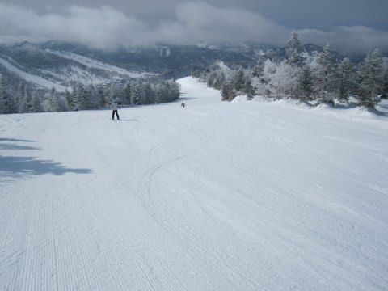
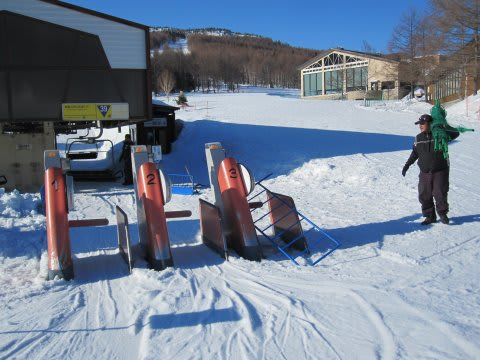
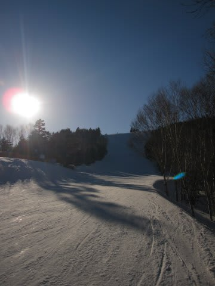

# さらば，我がホームゲレンデ

📅 投稿日時: 2011-04-05 00:35:30

というわけで．

この週末で．

我がホームゲレンデ，焼額は，地震の影響により

例年より1ヶ月以上早く営業終了してしまいました．

はっきり言って，雪はまだまだぜんぜんたっぷりあります．

まだまだ滑れます．

うーーん．

もったいない．

ゴンドラに乗り合わせた人も，

「せめてGWだけでもやってほしいよね…」

全く同感．

たまたまシーズン券を持っている人と乗り合わせたんですが，

「焼額がなくなると，滑れる範囲がぐっと減る．

　シーズン券の料金の一部を返してほしい…」

これも同感．

今回，4月第1週で営業終了になっちゃいましたが，

これは震災の影響による今年ぽっきりの措置であることを

祈るばかり．

来年からずっと，4月上旬で終わるようなことがありませんように…

とにかく．

営業最終日．

最終リフトの最後の営業時間ぎりぎりまで粘り…

今シーズン最後のお別れの挨拶を焼額にしてきました．

また来シーズン来るからね～

