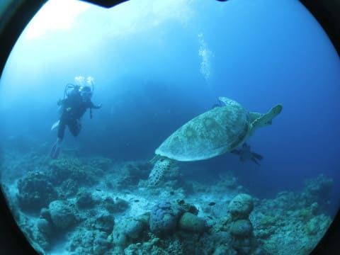
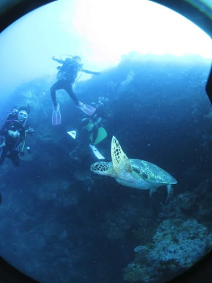

# 2019年8月，4度目のモアルボアル・小6の娘Cカード取得1周年！その4…モアルボアル1本目のダイビング

📅 投稿日時: 2020-07-27 00:36:14

ああ…

4連休が終わってしまった…

なんだか前半2日ちょっとバタバタして，

そのあと後半2日は洗車したりなんだり

していたら，あっという間に終わってしまった…

コロナ騒ぎの前だったら，絶対に4連休で

どこか遠くに旅行に行っていたのに…

惜しい．

コロナ騒ぎが惜しい…

そして，だんだん自分のストレスが

溜まっていくんだけど…（涙）

ホントにこの8月，沖縄にいって大丈夫なのかな？

…と，心配になりながらも．

去年のダイビング日記です～！

ーーー

ということで．

ボートに乗り込んで，

モアルボアルの１本目へ出航！

娘は，去年ジュニアオープンウォーターの講習を

してくれたアサミさんと一緒に器材チェックを

していますが…

基本的に，フィリピンは殿様ダイビングなので

器材は全てスタッフがセットしてくれます．

楽でいいんですけど…

娘，お前自分でやらないと，

絶対器材セッティング忘れるよな…

と，ちょっと心配．

そして娘は，ボートに乗ると

いつもの特等席をキープ…

風はちょっとあるものの，

朝早くのどんより空とうって変わった

晴天の中，ボートは1本目のポイントへ

向かいます…

船のスピードがかなり遅いので．

それほど遠くないポイントでも，

結構時間がかかりますが…

30分ほど走ると，ポイントに

近づいてきました．

エントリー前のブリーフィングが

始まりますが．

1本目のポイントは「トンゴサンクチュアリ」

珊瑚が群生しているドロップオフ気味の

スロープに沿って流していくポイント．

とりあえず．

いざ，モアルボアル1本目へエントリー！

今日は，12歳未満で最大12mの深度制限が

ある娘のために，我が家の3人で浅めコースの

1チームを作ってくれました．

娘のCカード講習をしてくれたアサミさんが，

我が家をガイドしてくれます…

やはり，自分が講習した生徒なので

ちょっと気になるのか，

最初は娘にぴったりくっついていた

アサミさんでしたが…

2週間前に座間味で8本ほど潜って

きたばかりのわが娘の安定感を見て．

大丈夫だと思ったようで…

安心して，普通のガイディングに

入っていきました．

…が．

なぜかこの1本目．

カメラのセッティングが悪かったらしく，

外付けフラッシュが全く光ってませんでした(涙)

で．

エントリーからしばらく．

大きなアオウミガメさんがいますね．

この右側に写ってます…

フラッシュが光ってないので，

透明度が悪く見える…（泣）．

ちょいと近づいてみますが…

うむ．

全くダイバーを恐れる気配が

ありませんね．

異常にダイバー慣れしてるな…

と思ったら．

さすがに居心地が悪くなったのか…

「なんだよ～」

ってな感じで．

娘の目の前を泳ぎ去って

いきました…

ワイドレンズなので，娘とアオウミガメさんの

距離が離れて見えますが，

娘は至近距離でカメさんを観察

できてました…

その後も，珊瑚がきれいなところを

泳いでいきますが…

また別のアオウミガメさんが

目の前を泳いでいきます！

…でも．

この日の1本目，フラッシュの同調ケーブルが

イマイチしっかりついてなかったようで，

フラッシュが光って無くて．

写真の仕上がりがイマイチ…（涙）

さらにしばらく．

岩場の隙間にいた，

スパインチークアネモネフィッシュなどを

撮ってみますが…

うむ．

やはりフラッシュが回っておらず，

ちょっと写真がイマイチ…（泣）

と，思ってたら．

またアオウミガメさん登場！

このアオウミガメさんは，

ちょうど狙ったように私と娘の

間を通ってくれたので…

「カメさんが泳ぐポーズ」を

している娘とカメの写真が

撮れました…

そして．

ボート下の浅瀬に戻ってきて．

珊瑚の合間にいるマンジュウイシモチなんかを

ながめていると…

ダイブタイム50分ほどで，

エグジットタイム．

ウミガメをいっぱい見れて

娘も満足だったらしい1本目が

終わったのでした…

しかし．

1本目でセッティングが甘くて．

フラッシュが光ってなかったのが

残念だった…
