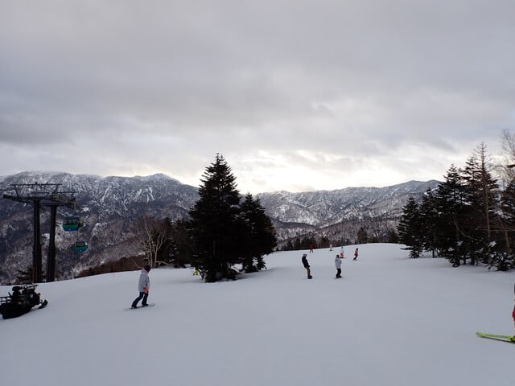
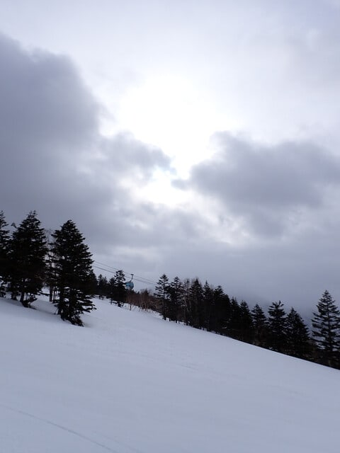
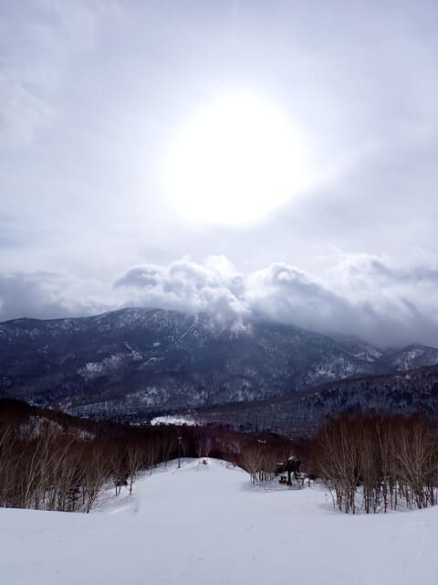
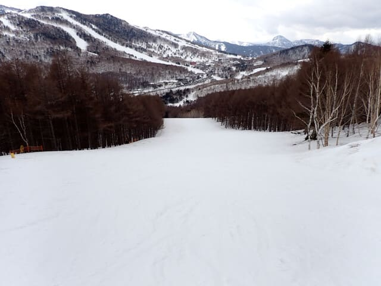
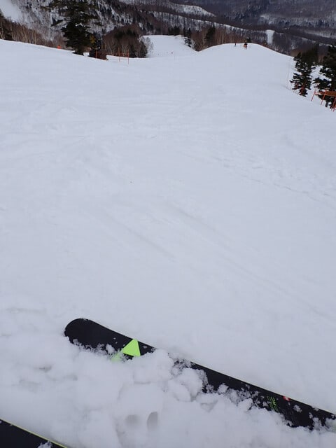
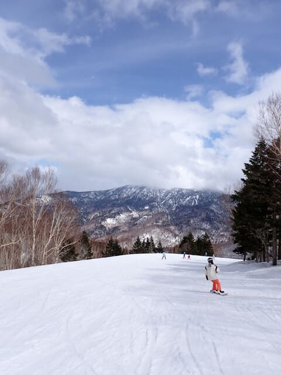
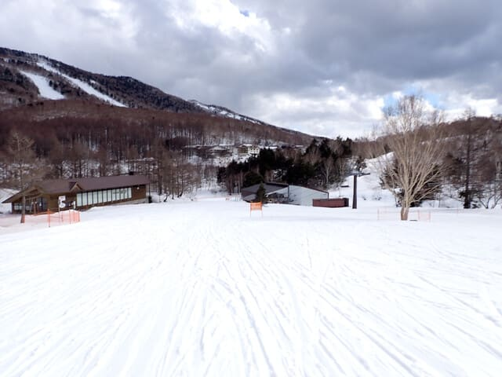
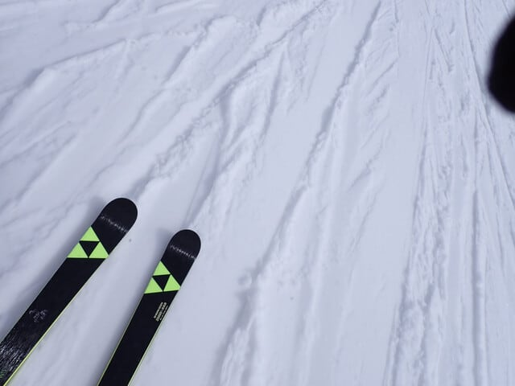

# 2025/4/6(日)の志賀高原焼額山スキー場は…終日曇りで雨はほとんど降らず！人も少なく午後までバーンが荒れない，意外と良かった一日

📅 投稿日時: 2025-04-07 02:03:24

ということで．

今日は帰り道で夕食にも立ち寄らず，

いつもより早めの夜10時ごろに

帰宅できましたが…

帰宅後一仕事やっていると，もうこんな時間

なんですが（涙）

今朝は早朝営業のスタートに間に合うように

朝5時に起きたというのに…もう深夜2時

なんですが…！

活動時間21時間を越えているんですが（泣）

そして，明日の朝は5時半に家を出て，

遠くへ出張に行かなくてはならないの

で…

今日も3時間しか寝られないのですが（泣）

とりあえず，今日も長い記事を書いている

時間が無い…

というか，長い記事を書いていると命に

関わりそうなので．今日も帰宅日恒例の

速報モードにて，本日の志賀高原レポート

です！

ってなことで．

今日は朝6時の早朝営業スタートから

焼額を滑ってきましたが．

早朝では，雲が多かったものの雨は降らず…

それどころか，ときおり降るのは雨じゃなく

雪でした！！！

そして．

早朝の時間も，曇りとはいえ空は明るめで，

バーンはガチガチバーンがちょっと緩んだ

くらいの，かなり滑りいいバーン！

さらにはうっすら日が射すタイミングも

あったりして…

雨が降るかも

と恐れていたのに比べれば，100倍いい

コンディションですよ！！！

そして何にしろ．

天気予報が悪かったからか…

人がいない！！！

ゲレンデがガラガラ！

どこもかしこも，だいたい貸し切り

バーン状態ですよ！！

まぁ，昼間は雪も緩み始め，

しっとりした雪になってきたけど…

終日雨は降らず（ゴーグルにわずかに

水滴がついて，あれ？降ってるかな？？

という程度の降りがあった程度）

そして強い日差しもなかったので，

土曜の午後より雪は緩まなかったですよ！！

午後2時過ぎにはかなり空が明るくなり，

ときおり青空も出てきたので，日差しで

ちょっと雪は緩んできたけど…

でも，見ての通り完全無人！！

ホントに人がいない！！

なので，雪は緩んでもバーンはスキーヤーに

蹴散らされてボコボコになることはなく．

土曜よりずっとフラットなバーンで，

ラストまで大回り板で滑れるバーン状況

でした！！

いや…

雨が降るという予想は外したけど．

でも，いい方に外れてくれて，

予想より100倍楽しめる感じの，

意外といい一日でした…！！！

良かった…

いい方に外れてくれてよかった…

やはり私の日ごろの行いが良すぎたに

違いない…

ということで．

また明日，気力があれば詳細レポート

書きます～！

とりあえず，今日は死ぬほど眠いので

もう寝ます．

…でも，あと3時間しか寝られない（泣）←だから

Blog書いてないで早く寝ようよ
