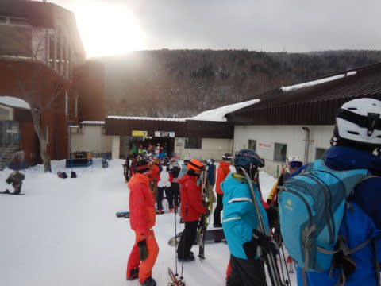
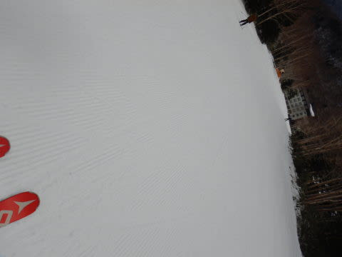

# 2021/12/4(土)志賀高原・焼額スキー場2022シーズンオープン！！レポート…曇り時々雪，そこそこ冷えた締まり気味の硬めスピードバーン！

📅 投稿日時: 2021-12-05 00:40:17

ということで．

今日，わがホームゲレンデの焼額スキー場が

オープンしました～！！

だもんで．

GW以来，久しぶりに焼額へ向かうわけですが．

実に久しぶりの志賀への登り坂．

昨日，積雪がなさそう…と予想を修正した通り．

登りの道路はほぼ積雪なし（涙）

残念ながら，昨晩からの積雪はせいぜい

1cm～数mm程度(泣）

ってなことで．

昨シーズン以来．

久しぶりに，わがホームゲレンデ，

焼額スキー場に帰ってきました～っ！！

…実に7か月ぶりですっ！！（感動）

今日は，唯一ゴンドラが動く焼額は混むだろうなぁ…

と思っていたけど．

ゴンドラ営業開始時には，想定を超える

長い列…（涙）

営業開始も多少遅れたのと長い待ち時間の

ダブル効果で，営業開始予定時刻の8:30から

20分経った8:50くらいに，やっとゴンドラに乗れて．

山頂まで行くと…

気温は-4℃と，残念ながら予想ほど

冷えておらず（涙）

そして，朝はガスがかかって，視界があまり

良くないんですが…（泣）

でも．

あさイチはシマシマっ！！！

12月第1週から第2ゴンドラが動いているだけで

無茶苦茶ラッキーなのに．

雪がしっかり締まった上に，うっすら

柔らかい雪が乗っているという，

この時期としては，限りなくいい雪！！

そして，コース幅いっぱいに滑ることができ．

さらに，土が出てくる気配なし！！

12月第1週にゴンドラが滑れた年は

これまでに何度かあったけど．

大体積もりたてモサモサで，

表面のやわらかい雪が剥げると

下地の土がすぐ出てくるようなヤバい感じ

のことが多かったですが…

今日は1日の雨のおかげか，下地がガッツリ

固まって，表面が剥げて下地が出たり

することはなさそうな，この時期としては

限りなく恵まれているいいバーン！！

あさイチはゴンドラがかなり混んでたけど．

それ以降は人が分散して…

大体5分待つか待たないか程度で．

このバーンコンディションにしては待ち時間

少な目！

下地がしっかり硬めのバーンだったので，

10時近くになっても，バーンは荒れず…

天気は基本的に曇り空だったけど．

時折晴れたり，積もることはなかったものの，

時々雪が強く降りつけるタイミングも

あったりの目まぐるしい天気で…

気温は終日低いままだったので．

雪は終日全く緩まず．

硬めのスピードが出る下地を一日中

キープしたまま！

この時期に，朝から夕方まで，

しっかり締まったバーンを終日

滑れることなんて．

自分がスキーを始めてからで

初めての経験じゃないかという，

最高の1日！！

日暮れが早いので，ゴンドラは15:30と

早めに終わっちゃったけど…

14時過ぎにはゴンドラ待ちも搬器数個分と

短くなり．

この時期に，こんないいバーンで，

こんな待ち時間が短くていいんですか！？？

とりあえず．

ゴンドラのコースがコース幅いっぱい滑れ，

雪質も硬めに締まって，午後になっても

土が出たり荒れたりせず．

ゴンドラもそこまで混まない…

という，我が人生でも，最高の12月の

焼額スキー場のシーズンオープンだったんじゃ

ないだろうか？？

…という．

最高のコンディションで．

マイホームゲレンデのオープンを

迎えることができ．

歓喜にむせびながら，最終リフトまで

滑り続けたのでした…

いや．

バーンは硬めだったけど．新雪がモサモサより

コースが荒れなくて良かった．

最高のコンディションでした…！！

…今晩も，残念ながらそれほど雪は積もらなさそうですが．

でも，このまま明日もしっかり締まったいい雪を

キープし続けそうなので．

明日もよさそうです～！

ってなことで．

明日も焼額滑ってます！

## 💬 コメント一覧

### 💬 コメント by (koi)
**タイトル**: Unknown
**投稿日**: 2021-12-05 08:32:20

ホームへの帰還、おめでとうございます！

こちらを読ませていただいてたぶん3シーズン目だと思いますが、今年こそは雪が多いシーズンになりそうですね。

私も白馬や北海道の計画を立てて楽しみにしています！

### 💬 コメント by (Skier_S)
**タイトル**: Unknown
**投稿日**: 2021-12-06 12:40:52

〉koiさま

コメント返信遅くなりました…

今年は雪が多いかな…？と思ったら、意外と暖冬になりそうな気配…

この予想が外れて、スキー場に雪がいっぱい積もってくれることを願うばかりです…

北海道、白馬に雪が積もるといいですね！

### 💬 コメント by (油漏＠プロリンク)
**タイトル**: Unknown
**投稿日**: 2021-12-07 23:06:33

土曜日日帰りでしたが、焼での初滑りを満喫できました。

４ロマ最終は３０秒程遅れて乗れませんでしたが、心から楽しい一日を過ごすことができました。

また機会がありましたらご挨拶させてください。

### 💬 コメント by (Skier_S)
**タイトル**: ＞油漏れ＠プロリンクさま
**投稿日**: 2021-12-08 01:26:21

だれだかすぐ分かるコメント名ありがとうございます（笑）．

土曜日は一緒に滑ってくれて，ありがとうございました！

4ロマラスト乗りそびれたんですね．

最後に挨拶できずにすみませんでした…

