# Garmin Fenix7Xのカバーを買ってみた

📅 投稿日時: 2022-11-05 01:34:22

えー．

木曜祭日もイエティには行けなかったので．

明日の土曜，滑りに行きたいところですが．

明日は滑らず，また一日家で仕事をする

ことになりました…（涙）

でも．

行く．

日曜は絶対滑りに行くのだ！！

ってなわけで．

今週は日曜にYetiへ出没予定です～！

…明日，仕事が無事終わってくれることを

祈ろう…

というところで，本題へ．

今年の7月に，山登り用に購入した

[GarminのFenix7X](e516b23a4874189de2e9208be87fa5184.md).

もう，これがないと山を歩けない体に

なるほど依存しているわけですが…

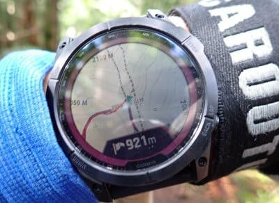

ただ，サファイアガラス＆GLCチタンと，

考えうる最も頑丈な構成の時計ではあるけど．

やっぱり，こういう岩場を手足を使って

登らなくてはならない山を登ると…

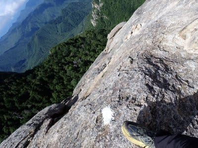

意識していても，やむを得ず時計を岩に

ヒットさせてしまうことはよくあるので．

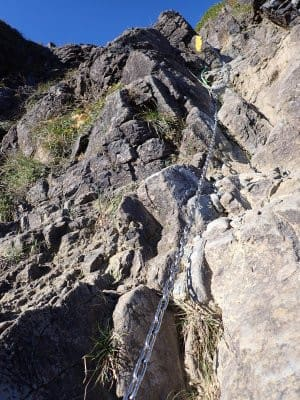

普通の岩なら，岩が削れるくらい頑丈な

時計であっても．

やはり，傷がつくのは避けられない

わけですね…

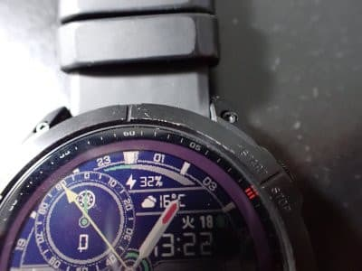

スキー板を買えてしまうくらいお高い

時計が岩にガリガリ擦られて，傷がついて

いくと．

それはそれは，精神衛生上よろしく

ないわけで（涙）

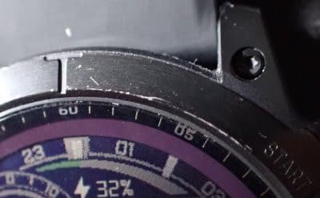

どうやら，この非常にお高い時計に

傷がつかないよう，なんとかならんか…

と思う人が多らしく．

Garmin Fenix7X専用の，こんなカバーが

売られているんですね～！！！

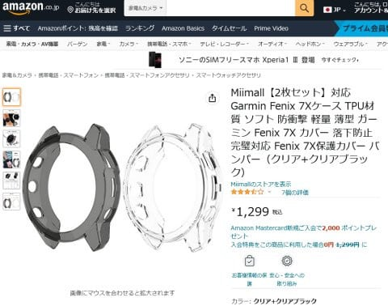

さすが，世界で売れている時計だけ

あって，いろんなメーカーからカバーが

売られているようで．

普通はだいたい一個1000円前後のところ，

こいつは2個入りで1299円，一個当たり

650円と安かったし．

発送元も謎な中華系企業ではなく，

Amazonから発送だったということも

あり，ちょっと試しに買ってみました…！

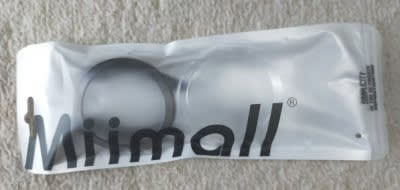

こんな感じで，透明と薄っすら黒っぽい

スモークの2種類が入ってます．

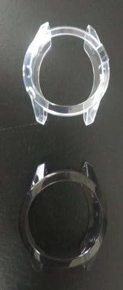

触ってみたところ…

結構柔らかい材質で，スマホの柔らかい

透明ケースの時計版ですね．

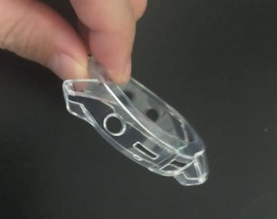

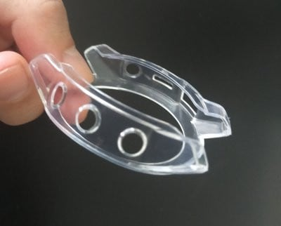

柔らかい材質なので，押し込むと

簡単に時計にはめられます！

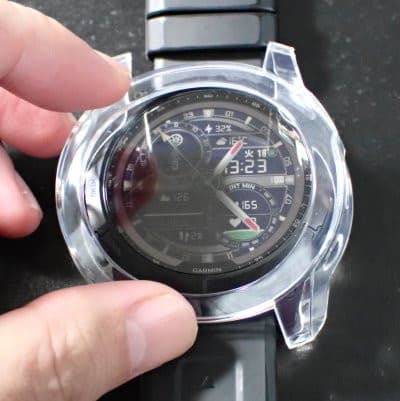

取り付けは10秒くらいで簡単に

着けられます．

外すのは一瞬で外せて，

付け外しは楽ですね…

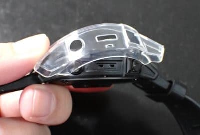

寸法はピッタリ！！

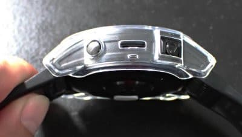

ボタンがカバーの穴の奥に引っ込んで，

押しにくくなると嫌だな…

と，心配してたけど．

思ったほどゴツくなく，ボタンの頭が

カバーより外に出てくれて，ボタン

操作も問題なし！

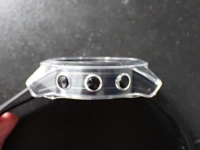

…ただ．

安っぽい…

透明はかなり安っぽいよ（涙）

これ，お値段が500円くらいの時計かな？

っていう見た目になっちゃったん

ですが…（泣）

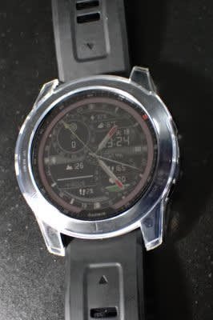

これはいただけない…（涙）

と，黒いほうをつけてみると…

をを？？

こちらはそれほど安っぽくない！！

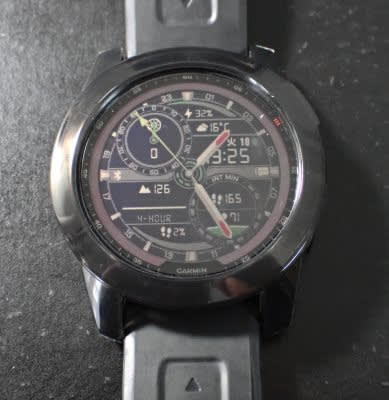

うん…

これなら，ほとんどの人はカバーを

つけていることに気づかないレベルでは？

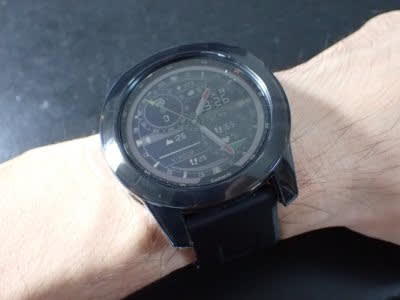

黒色なら，カバーを外した時との差も

そんなに無くて．

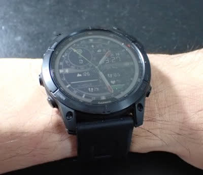

透明カバーなら，山登りの時とかだけ

着けて，それ以外の時は速攻で外そうと

思うけど．

この黒い奴なら，普段からつけてても全く

目立たない感じ！

ってなことで．

このカバーなら，グローブをしてても

ボタン操作できそうだし．

これで，岩場を登っている時に時計が

岩にヒットしても，

「やっちまった～！」

と精神的ダメージを食らわずに

済みそうです！！

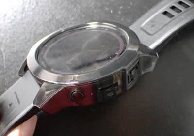

## 💬 コメント一覧

### 💬 コメント by (koi)
**タイトル**: Unknown
**投稿日**: 2022-11-05 06:45:59

スキーシーズンですね！恒例の長期予報記事、少し出遅れましたが熟読いたしました！

あと、一連のガーミン記事に影響されて私も買いました。ただしお安いInstinct2。いつも興味深い内容、ありがとうございます！

### 💬 コメント by (モイストシルバー)
**タイトル**: Unknown
**投稿日**: 2022-11-05 07:02:44

私も触発されて？ジョギング用兼ねてForerunner買いました。カバーも気になり画面フィルム一体型カバー付けました。画面フィルム無しのバンパーも良さそうですね。画面フィルムが付いていると、微妙に隙間が出来て結構曇ります。スキーでの活用のご報告も期待しています。

### 💬 コメント by (Unknown)
**タイトル**: Unknown
**投稿日**: 2022-11-05 22:40:39

https://twitter.com/anohinoGOUSETSU/status/1588822694359085056

### 💬 コメント by (Skier_S)
**タイトル**: 仕事が終わらない…
**投稿日**: 2022-11-06 01:10:23

＞koiさま

Instinct2お買い上げですか！

地図昨日は無いけど，基本機能は一通り全て揃えているのでお買い得だと思います…

使いこなし大変かと思いますが，楽しんでください！！

＞モイストシルバーさま

Forerunnerは255？955でしょうか…？

私もForerunner955がもう少し早く出てたら955を買っていたかも…

画面フィルム一体型カバーってのがあるんですね．

知らなかった…

＞Unknownさま

あら…これはちょっと残念（涙）

20000mな皆さん，お行儀よくお願いします…

