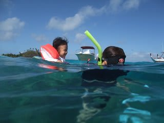
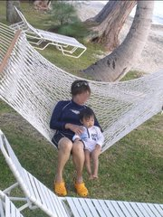
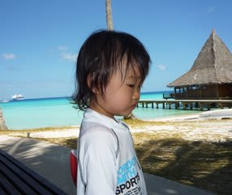
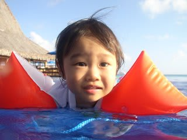
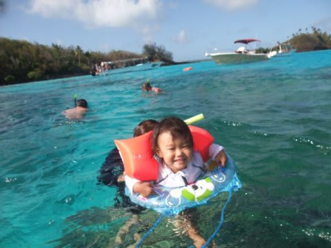

# 2009年　初の海外子連れダイビング旅行記　Epilogue

📅 投稿日時: 2012-10-03 00:28:59

出発前には，いろいろと心配していた．

旅行先の気候があわず，体調を崩したらどうしよう．

12時間のフライト時間，ずっと泣き続けだったらどうしよう．

時差ぼけで，夜寝ないでずっと泣き続けたらどうしよう．

食べられるものが無く，食事を全然食べれなかったらどうしよう．

母親と離れるのを嫌がって泣いて，ダイビングにいけなかったらどうしよう．

慣れない場所を嫌がって，ずーーーっと泣き続けだったらどうしよう．

嫌がって家に帰りたがったらどうしよう…

…しかし．

しかし．

そんな心配をよそに，娘は毎日元気に飛び回り．

プールに漬ければおおはしゃぎ．

さらには大喜びで海デビューも果たし．

知らない外人さんに数時間預けられる，

という経験までしてきた．

事前にあれだけ心配した数多くの事柄は，

後で振り返ってみると，笑い話のネタにしかならないような，

全く心配する必要の無いことだった…．

…

そして．

日本に帰ってきて，数日後．

エア・タヒチ・ヌイの機内で配られ，飲みきれずに持ち帰った

水のボトルを見て．

娘が突然，言った．

　「…飛行機，乗ったね．

　　ママと海，行ったね」

なに！？

娘，ボトルを見て，飛行機の中で配られたものだとちゃんと覚えて

いたのか？？

っつーかそれより，海に行ったことを覚えているのか？

飛行機に乗ったのが，海に行く目的だったと分かっていたのか？

なにより，初めてじゃないか？娘が過去形をしゃべったのは…

娘がそんな過去のことを覚えているなんて，初めて知った！！！！

さらに一言．

　「楽しかったね」

…実は今回．心にチクチクと痛みを感じていた．

まだ過去を正しく記憶することがままならない娘には，

旅行は終わった瞬間に記憶から消え去り，思い出には残らないだろう．

親が楽しむだけのために，むりやり娘を長時間飛行機に乗せて．

無理な旅行をさせてしまったのではないか…．

と．

しかし．

少なくとも今のところ．

タヒチの美しい海と．

そこで過ごした日々の思い出は．

楽しかったものとして，娘の心の中に残っているらしい． 

## 💬 コメント一覧

### 💬 コメント by (KENKEN)
**タイトル**: いつかタヒチへ
**投稿日**: 2012-10-03 21:37:26

そろそろ涼しくなってき時期でのダイビングネタでしたが、楽しませて頂きました。

スキーヤーさんに教えて貰って行きたくなった場所がコモドに続いてタヒチも加わりました。

イルカダイビングとても(奥様が）うらやましい。

野生イルカはボートの上からパラオで見た位で、一緒に泳いだことはありません。

(いつか小笠原でと狙っているのですが・・・・・）

初の子連れ海外、自分達は近場のグアムでしたが、困ったのは娘がご飯を食べなかったことです。

今でも理由は？ですが、娘はパンとお菓子だけで過ごしました。

それに比べてスキーヤーさんの娘さんのたくましい事。

次回はモルディブダイビング旅行ですね。

また娘さんとスキーヤーさんの珍道中楽しみにしてます。

我が家がモルディブに行ったのは10年前でした。

当時の自分達にはかなり(金銭的に)無理をした旅行でしたが、水上コテージに泊まり、透き通る青い海でのダイビング、天国みたいな時間でした。

また行こうと嫁に何度も口説いたのですが、移動が大変となかなか前向きになってくれないうちに娘ができ、これでモルディブはさらに遠くに・・・、と思っておりました。

スキーヤーさんのモルディブ旅行記を嫁に見せ、“あらこれなら我が家でも行けるかも”と洗脳したいきたいと思いますので、名文を期待してます。

### 💬 コメント by (Skier_S)
**タイトル**: 名文？迷文？（笑）
**投稿日**: 2012-10-04 01:46:56

うひゃー．

水上コテージに泊まりましたか！

それは高かったかと…

でも．

タヒチは高いです．

モルジブが安く感じます．

ありえないくらい高いです．

さらに，現地での物価も高いです．

我が家も，多分もう二度といけない気がします…

モルジブも9月になれば結構安く行けますよね．

南マーレ環礁のスタンダードタイプなら，パラオ＋2～3万円でいける気が…

でも．

ダイビングだけなら，コモドのほうがいいですね～．

では，モルジブ旅行記を楽しみにお待ちください！

＃執筆難航中ですが…（汗）．

