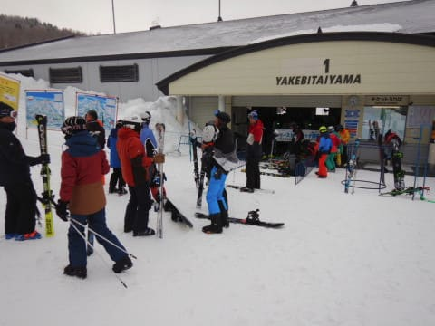
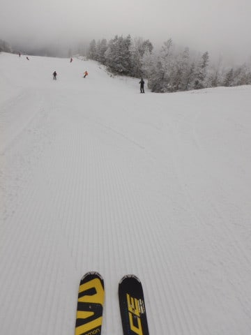
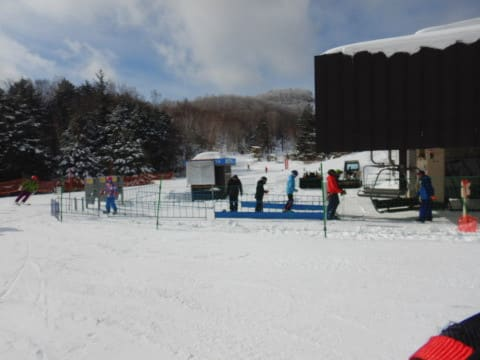

# 2020/1/19(日)の志賀高原スキー場，詳細レポート！…今シーズン一番の雪質，志賀はトップシーズンの雪！曇りのち晴れ，ゴンドラ待ちもそれほどなし．

📅 投稿日時: 2020-01-21 03:08:38

🏷️ カテゴリ: [2020スキー滑走日記](c282e9230de179e245c7334eabeb0a3b3.md)

えー．

今シーズンから月，火曜を公式に休みにした

一の瀬ファミリーのナイター．

志賀高原中央エリアのホームページを見ると．

今後は金曜も営業しないことに

なったようです…（涙）

（[志賀高原中央エリアホームページ](http://shigakogen.co.jp/archives/5282)より）

「安全確保の点から降雪作業を行うため」

という理由が書かれてますけど．

カレンダーを見ると，今後，

3月下旬まで全ての金曜が営業中止

となってます．

…いや．2月後半とか3月に，人工降雪

やらないでしょ…

どう考えても人工降雪は言い訳でしか

ない気がするのですが…（涙）

3連休を除く土日の，サンバレーとダイヤの

ナイターをやめた上．

さらにファミリーの営業日も減らすとは…

志賀高原中央エリア，ちょっと残念な感じ

なんですが…（激涙）

もし，3月下旬になってもホントに

人工降雪を打ち続けてくれているなら．

その時は，

志賀高原リゾート開発は素晴らしい！！

と褒めたたえなくてはならないところですが．

うーーーーん．

ここ数シーズン，志賀の中央エリア．

ゲストの立場から見て，

いい方向の変化がほとんどないなぁ…（涙）

そして．

良くないニュースが続きますが．

やはり，最新の天気図を見ても．

23日から27日まで，かなりヤバい

高温＆雨の日々が続きそうな感じ（泣）．

うーむ．

ヤバい．

ヤバいんですけど…

最新天気図では，23日は夕方～夜に

液体が降ってくることはほぼ確実なれど．

24日は志賀の標高が高いところなら

ギリギリ雪になり．

25日は気温が高いながら，志賀は

降らずに済みそう…

という，きわどいところ．

26日は液体が降る可能性が高いですが．

うーん．

なんとか．

何とか，気温が高い日は降らず．

気温が落ちた時に降ってほしい…

でも．

祈る！！

これからひたすら祈り，踊り続ける！！

このBlog読者6兆8000億人の全員が，←地球人口の1000倍くらいいるけど…宇宙人も読んでるのか？

偉大なる存在に向かって，狂ったように

冷え冷え踊りを踊り続ければ，

この週末も雪になるのだ！！←怪しい新興宗教化している…

ってなことで．

前フリだけで十分長くなったので．

これで今日の記事は終わり

…として，今日は早く寝たいところですが．

これから，日曜の詳細レポートに行くのだ！！

偉いぞ，自分っ！！（とりあえず自分で褒めておく）

まず．

あさイチは，いつも通り焼額第1ゴンドラの

営業開始前に並んでのスタートなわけですが…

山頂の気温は-9℃と，予想以上の冷え冷え！！

天気は曇りながらも，雲は薄めで，

ゲレンデの凹凸もある程度見える感じで．

そして．

…そうです．

あさイチは，シマシマっ！！！

ふははははは．

気持いいこのシマシマを滑るために，

自分は生まれてきたのだっ！！←生きる目的が，かなり偏ってないか？

今日は殺人コロコロもなく．

いい感じで冷え冷えの，

エッジがガッツリ食い込む，

好きなだけ傾きたい放題の

超快楽シマシマバーンっ！！！

いや，トップシーズンだ．

焼額は，間違いなくトップシーズンだ…！

と，気持ちよく滑っていたら．

じきにガスが出てきて，

視界が悪くなってきたんですが…（涙）

せっかくの最高シマシマバーン，

前が見えなくて滑りにくくて，

すごい残念なんですけど…（泣）

と，悲しんでいたら．

10時過ぎには，ガスも晴れ．

それどころか，うっすらゲレンデが

太陽で照らされるようになり…

タイミングによっては，ゲレンデが

見やすくなってきましたよ！！

午前中は，人気のあるサウスコースや，

GSコースなどは，ゲレンデの人口密度が

高い時もあったけど…

ゴンドラ待ちは最大でも

ゲートを超えることは無く．

リフトは全く待ちなし！！

そして…

さらに，11時ごろには．

なんと，青空が見えてきましたよ！？？

ゲレンデは，いい感じで晴れて

きましたよ！？？

日が射してきたというのに．

昼間の最高気温も-5℃と，

いい感じで冷え冷えのまま！

だもんで．

日が射した晴天なのに，

終日こんないい雪質をキープして…

さらに．

午後になると，ゲレンデ上の人も

減っていき．

…コース上，ガラガラなんですけど！？？

いいんですか？？？

晴天で，いい雪質で，こんなガラガラの

ゲレンデを楽しめるなんて…

何か罰があたったりしないですよね？？

そして．

なぜかこの日は．

午後1時間ほどだけ，焼額の呪いが解けて

しまったらしく，知らぬ間に奥志賀方面へ

流されてしまいましたが…

奥志賀のゴンドラ側，ダウンヒルコースも．

午後になると，ちょいとだけ荒れていたものの，

冷え冷え雪の，いい感じの圧雪バーン！

ゴンドラもガラガラ！！

奥志賀のリフト側，エキスパートコースは，

急斜面なので，さすがに午後は結構荒れ気味

だったけど…

下地がしっかり締まった雪なので，

コブ斜面って程ではなく．

そして，ガラガラ！

リフトも当然飛び乗り！

そして．

最後はやはり，ホームゲレンデの焼額に

戻ってこなくてはならないわけですが…

焼額も，夕方までしっかりトップシーズンの

冷え冷え雪で．

ところどころ軽いバンプはあるものの．

ラストまで，それほどひどい凸凹に荒れず，

大回りできるバーンコンディションを

楽しめました～！！

結局，この日は．

イーストコースのごく一部と，

白樺コースに，

一部雪が薄くなり，浮石が出てる

ところがあったけど…

それら以外のコースは，全くブッシュが

出てくる心配もなく．

日が暮れる夕方まで，トップシーズンの

雪質を楽しめたのでした…

うむ．

他のスキー場は雪不足に悩まされてるようだけど．

少なくとも今のところ．

焼額は雪質も良く，ほぼ全面滑れるので，

恵まれてますよ～！！

で．

これから明日21日（火曜）の朝にかけて，

雪が積もりそうな気配…！

21日朝は，ブーツパフ程度の新雪になりそう！

午前中も雪が降り続けるので．

ゲレンデ状況は改善しそうです！！

22日水曜は，21日に積もった雪が圧雪されて．

あさイチはいい感じだろうなぁ…

…

23日から27日の超高温で，この雪が

ダメになってしまわないよう，

今からひたすら踊り続けることを誓った，

Skier_Sだったのでした…

## 💬 コメント一覧

### 💬 コメント by (ほっぽ)
**タイトル**: 1/20　志賀高原
**投稿日**: 2020-01-21 07:10:55

Ｓさん

昨日の志賀高原の様子をアップしておきました。

小雪舞う志賀ですが雪が増えた感じは無し。

どこも志賀高原らしくない硬い高速バーンでスピードが出てしまいます。

もう少し老体に優しい柔らかい雪のゲレンデになって欲しい。

昨日は若杉さんご一行、ｙｕｍｉさんご夫妻にご挨拶できました。

今日も朝イチからヤケビ滑ってます。

http://www2.tokai.or.jp/nana_hoppo/

### 💬 コメント by (はなげ親分)
**タイトル**: Unknown
**投稿日**: 2020-01-21 10:28:57

結果的に今シーズン最後の金曜ファミリーナイターを滑った事になりました

たしかに滑っている人数は10～15名程でしたのでスキー場側からすれば厳しい状況なんでしょうね

これ以上残念なニュースが無いよう祈るばかりです・・・

知らないうちに板が増殖しているS様の不思議な能力で、朝起きたら岩菅山にゴンドラが架かっていたなんて事にならないかなぁ～

### 💬 コメント by (Unknown)
**タイトル**: Unknown
**投稿日**: 2020-01-22 02:19:58

来月頭に行くんでそこまで雪もってほしいなぁ…

### 💬 コメント by (Skier_S)
**タイトル**: 週末の雨は回避されそう
**投稿日**: 2020-01-22 06:42:54

＞ほっぽさま

20日はそれほど降らなかったようですが．

21日は結構積もったようですね…

このまま，23日の雨がひどくならず，

ゲレンデ状況がいいまま週末に突っ込んでほしいところです…

＞はなげ親分さま

今シーズン最後の金曜ファミリーナイターでしたね…

もしかすると，歴史上最後の金曜ファミリーナイターかも（涙）

だんだんいろんなものが縮小されていく…（泣）

＞Unknownさま

週末の天気，予想よりまともになってきたので．

志賀高原は来月まで問題なく雪はもちます！

…標高の低いスキー場は分かりませんが…

