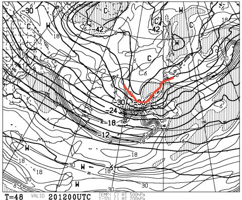
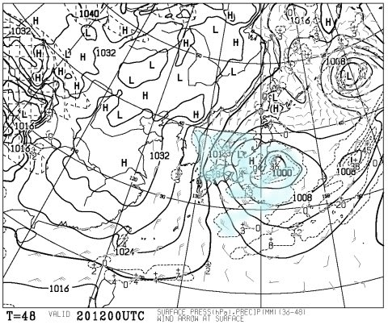
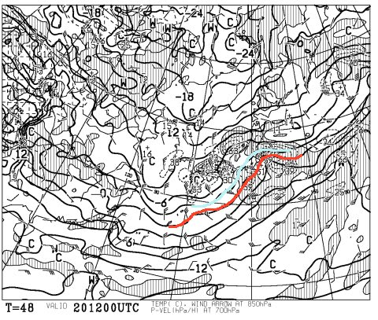
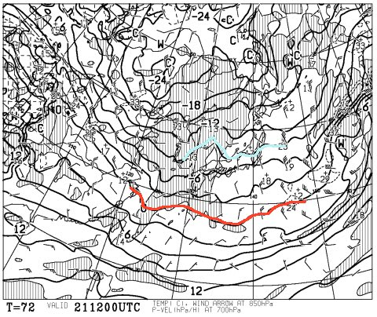
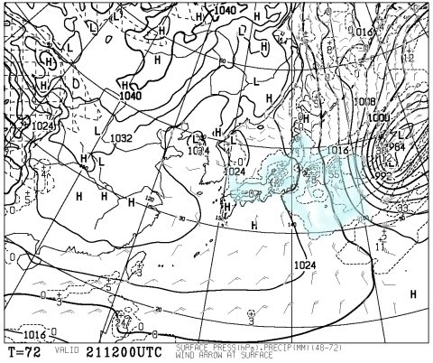
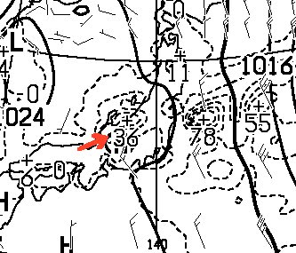
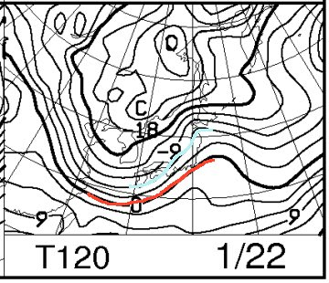
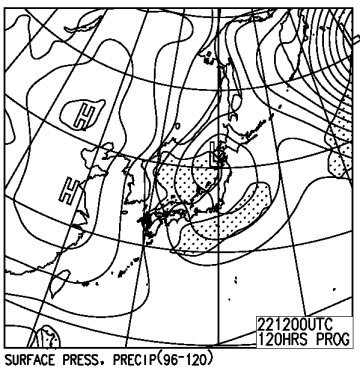

# 今週末，1月21，22日の志賀高原スキー場の天気は？積雪は？…土曜朝はパウダー！日曜は晴れのち雪かな

📅 投稿日時: 2017-01-19 02:33:20

先週は．

「もう，こんなに降らなくてもいいからっ！」

…ってほど雪が積もり．

焼額の公式発表の積雪量が，3日間で90cmも増えた

週末だったのですが．

まだまだ冷え冷えウィークが続いている今週．

果たして，週末の天気やいかに？

また，ドサドサ降るのか？

…ってあたりを，また予想してみましょうか…

まず．

週末の前日，20日金曜ですが…

500hpa図を見てみると．

うむ？？

また，大雪の目安である．

「上空5000m付近の-36℃の寒気」

が志賀に近づいてますよ！

で．地上天気図は，こんな感じで

低気圧が通過して西高東低の気圧配置になるので．

…これ，20日の夜から，また降り出しますね…

ってか，これ．

850hpa気温図を見ると…

平地でも雪が降るかも…っていう，水色の-3℃線．

関東近辺まで下がってませんか？？

もしかすると，関東近辺も雪？？

…また，土曜の朝．

スキー場に行く際に，群馬県あたりでチェーン規制が

始まる可能性が…

で．

21日の土曜，850hpa図ですが…

ここしばらくの冷え冷えウィークはまだ続く．

赤く印した0℃線は，日本のはるか南まで

下がっちゃってて．

志賀高原には，水色の-9℃線がかかってます．

だもんで．

この日の朝も，山頂は-12℃程度と，そこそこの冷え．

そして，地上天気図は…

西高東低で，水色の降水気域が日本全体を覆ってますので．

この日も，冷え冷えの雪が積もりそう！

ちょっと拡大してみると…

日本海側，富山～新潟のあたりで，36という数字が見えます．

これは，降水量36mmを意味していて．

積雪量なら，36cmです…

この日も，日本海側はかなり積もりそう！

…ただ，志賀はそれほどでもないかな．

また，午後には雪は止みそうな感じ．

んで．

次の22日の日曜ですが…

850hpa図は，この日もおおむね水色の-9℃線が

志賀高原に掛かっており．

まぁ，朝は-10℃以下．

昼間も-5℃以上になることは無い感じで．

志賀のトップシーズンらしい雪質の一日ですね～．

日曜の地上天気図は，こんな感じで．

また，日本上空を低気圧が通過しそう…

低気圧が接近するときは降らず，通過後に

降りそうな感じなので，

日曜は午後遅くから雪がちらつきだすかな．

それまでは晴れ～曇りって感じ．

とりあえず，この週末も冷え冷えの2日間になりそう！

まとめると…

土曜：朝はそこそこの積雪！

　朝イチは先週と同じくらいの，ちょい重めの新雪が，

　20～30cmほど積もってるかな．

　高速道路は長野県に入る前からチェーン規制がかかりそうなので，

　移動時間がかかることを覚悟！志賀の登りは当然本格積雪路．

　朝は結構雪が降っていて，圧雪バーンでもコース上にうっすら新雪．

　非圧雪バーンはスネ～膝パフ！

　昼ごろには雪が弱まり，午後は雪が止む．

　昼過ぎには，コース上はかなり凸凹した荒れた斜面に…

　昼間も山頂は-10℃近くをキープする冷えた一日．

日曜：朝は晴れてるかも？？

　朝イチは，昨日積もった雪がきれいに圧雪された，

　トップシーズン最高雪質シマシマバーンがお出迎え！！

　おそらく朝イチは久しぶりの，新雪が乗っていない

　かっとびシマシマバーン！

　午前中は曇り，時折晴れ間もあるが，

　午後に向けて雲が増えていき，午後遅くに雪がちらつき始める．

　夕方は結構本格的に降り始める．

　気温は朝は-10℃以下，昼間も-5℃程度までにしか上がらず，

　雪質は終日Good！

…って感じでしょうか．

とりあえず，土曜はまたまたパウダーデーになりそうですよ～！！

## 💬 コメント一覧

### 💬 コメント by (かず)
**タイトル**: また重めですかー…
**投稿日**: 2017-01-19 06:01:18

すね位であれば板走りそうですね　念の為新型の重めのワックス購入しましたが　そろそろ志賀らしい軽いの来てほしいです

### 💬 コメント by (Skier_S)
**タイトル**: かずさま
**投稿日**: 2017-01-20 01:59:24

うーん．

脛より少なめ，ブーツパフよりちょっと上…

くらいの感じの予想になってきました．

このくらいの積雪なら，そんなにすごい

重さを感じずに済むかな～，

って感じです．

