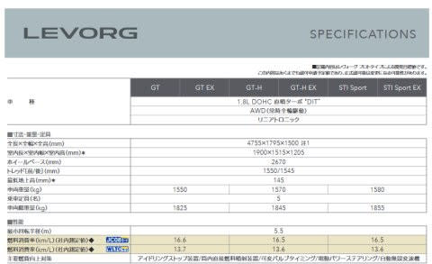

# 新型LEVORGの詳細情報が出てきたけど…え？STI Sports EXの見積もりが乗り出し480万円？

📅 投稿日時: 2020-08-23 00:01:58

🏷️ カテゴリ: [日記](cc4b5682fb7b8b144980957a978653fb0.md)

ってな感じで．

8月20日から新型LEVORGの予約が始まり．

それに伴い，いろんな情報が解禁され，

SUBARUのホームページにも，

[主要諸元](https://www.subaru.jp/levorg/levorg/spec/spec.html)や[装備](https://www.subaru.jp/levorg/levorg/spec/index.html)が公開されましたね…

（[スバルHP](https://www.subaru.jp/levorg/levorg/)より引用）

だもんで．

もうすぐ旧型になってしまう，

現行LEVORG乗りとしては．

このいろんな仕様を読み込むわけですが…

([スバルHP LEVORG 諸元表](https://www.subaru.jp/levorg/levorg/content/spec/pdf/new_levorg_specifications.pdf)より）

うむ．

まだ形式名は出てませんね…

VMの次だから，VN？

他の細かなところを見てみると…

[プロトタイプの写真が公開されたとき](e08e2242aed53935160c176a0954e717f.md)，

「ディメンジョンは現行とほぼ同じ」

と書きましたが．

意外と大きくなってますね…

特に長さは現行の4695mmに対し，4755mm！？？？

そこまで大きくなっているとは…っ！！

そして幅は1795mmに拡大って…

これ…

大きいって文句言われたBRレガシィとほぼ同じ寸法

になりましたね…

ただ，車高がルーフアンテナを除くと1480mmと，

現行より15mm高くなったとはいえ．

まだBRレガシィの1535mmより50mmも低いので，

ここがBRレガシィより

コンパクト＆スポーティーに見える

大きな理由ですかね…

ホイールベースは，新型も旧型と変わらない…

と書きましたが，現行の2650mmから，

わずか2cm拡大の2670ｍｍ

と，ほんのちょっと拡大されましたね…

BRレガシィの2750mmに比べると8cmも短く．

全長が伸びた割に，ホイールベース拡大は

それほどでもないということですね…

全長が伸びた分，後ろ座席が広くなってる

わけじゃ無いのか…

ホイールベース2670mmは，

XVやインプレッサ，フォレスターと

全く同じなので．

ここで，これらのSGPシャーシ，全て同じ

ホイールベースに統一されましたね…

そして，この表の下の方を見ると…

燃費，

JC08モードで16.6～16.5km/L，

WLTCモードで13.7～13.6km/L

ですか…

うーむ．

リーンバーンってことで，もう少し良くなるかと

思ったら，JC08モードは現行1.6Lとあまり変わらない

感じですね…

まぁ，排気量が200ccアップしたのに

燃費をほぼ同等に抑えられた，とも

言えるのですが…

もう少し良くなるかと思ったんですけど．

そして，この部分を見ると．

エンジンは177馬力．

まぁ，そんなに馬力は高くないけど．

トルク30.6kg/m？

これは，現行1.6Lに比べると，5kg/mアップ！

これは大きい…

馬力の数字を追わず，低回転のトルクを

素直に上げてきたということは．

ターボも低回転側に合わせてきて．

小型＆レスポンス重視の脈動利用型に

してくるんじゃないか…

と思うので．

LEVORG1.6Lの弱点だった，ブーストが

上がるまでのトルク不足感をかなり

解消してくるんじゃないかな？

あとは…ガソリンタンクが63Lと

ちょっと大きくなるのね…

そして．

「お？？」

と思ったのが，ここ．

…なんと．

リニアトロニックの変速比4.066～0.503って，

むちゃくちゃ範囲が広がってる！！

なにこれ？？

レシオカバレッジ8超えてるんだけど！？？

現行1.6Lのリニアトロニック，3.581～0.570の

レシオカバレッジ6超えで結構すごいと

思ってたのに，

さらに拡大してくるとは…

これって，ほぼ世界最高のレシオカバレッジ

のCVTじゃない？

ファイナルは3.900で現行1.6Lと新型で

変わってないので．

CVTのハイギア側が0.570から0.503になったら，

純粋計算で，時速100kmで1600回転くらいだったなら，

1400回転に落とせる勘定になりますね…

低回転，高負荷で使えば燃費向上に効くので．

高速燃費はかなり良くなるかも？？

まさか，ここにきてリニアトロニックまで

完全につくりかえてくるとは…！！

で．

後は装備をみてみますが…

大きな変化は，やっぱりアイサイトEX．

アイサイトEX付きは，センターコンソールに

大型ディスプレイがつくみたいですね…

（以下写真は[スバルHP　LEVORGページ](https://www.subaru.jp/levorg/levorg/)より引用）

エアコン，ナビ，オーディオの全てを

このディスプレイで操作するようです…

そして．

アイサイトEX車は，メーターも

フルディスプレイ化するのかっ！

普通のメーター表示にすると，

現行とあんまり差がないような

画面ですが…

ちなみに，アイサイトEX無しの

バージョンでは，センターコンソールに

7インチのインフォメーションディスプレイ

がつき，

メーターも普通のメータの真ん中にアイサイト

表示等を写す画面がつく，現行みたいな形に

なるみたいです…

そのほか，装備一覧を見ると…

([スバルHP LEVORG 主要装備表](https://www.subaru.jp/levorg/levorg/spec/f)より）

GT-H以上では，トランクのオーナメントに

手をかざすだけで電動でトランクが開く

パワーリアゲートとか．

後部座席シートヒーターがつくとか，

STI Sportにつくモードセレクト，

Comfort / Normal / Sport /Sport+ / Individual(ステアリング，エンジン，サスなどを個別に調整できるモード)

の5モードだとか，

4WDの方式が，現行LEVORG2.0の不等トルク配分

センターデフ方式じゃなく，LEVORG1.6 と同じ

電子制御カップリング方式（アクティブトルクスプリット4WD）

だとか…

そのあたりが読み取れますね…

ってなことで．

いろいろ気になる新型LEVORGですが．

大体の価格が

GT：310万，GT EX:350万，

GT-H：330万，GT-H EX：370万，

STI Sports：370万，STI Sports EX 410万

ということらしいので．

全体的に現行1.6Lから20～30万アップ，

さらにアイサイトXで大体40万アップ…ということで．

アイサイトXがつくと，現行2.0Lより

高くなる感じですね…

ちょいと高い…

ちなみに．

私の知り合いが早くもSTI Sports EXの見積もりを

とってみたみたいですが．

乗り出し480万

という，すさまじい見積もりが出たようです…

車両価格が410万の上に，

メーカーオプションのスマートリアビューミラーとか

ホワイトパールの加算で10万，

税・登録関係で20万，

その他，5年点検パックで15万，

ベースキットやボディコート，ETC＆

ドラレコの，ディーラーおススメの

基本オプションで25万…

ということで，480万．

ホイールを変えたとかSTIパーツをつけたとか，

そういうの無しの，標準的なオプション25万円

だけでこのお値段です…

ということで．STI Sportsでさらに

アイサイトXをつけると，

1.8L車で500万近い高級車になるようです…

うーむ．

STI sportsじゃなくても，アイサイトX付きは，

最低グレードでも車両本体350万円からスタートと．

我が家では買えない価格帯の車になったかも…

## 💬 コメント一覧

### 💬 コメント by (AK)
**タイトル**: Unknown
**投稿日**: 2020-08-23 18:40:20

さすがカタログの見る所が違いますね。

レヴォーグで500万ですか…次期アウトバックは一体いくらになるのでしょう。

どんどん車が高くなって庶民にはコンパクトカーしか乗れなくなっちゃいますね(涙)

### 💬 コメント by (あ)
**タイトル**: Unknown
**投稿日**: 2020-08-23 20:08:36

1.8LのFFベースで400〜500万ってぼったくりとしか思えないが最近の車の開発にはそんなに金かかってんのかね

昔は直6FRが300万切る価格で買えたのに

こりゃWRXは大変なことになりそうだな

### 💬 コメント by (Skier_S)
**タイトル**: 高いけど、かなりいい車らしい…
**投稿日**: 2020-08-23 22:49:27

＞AKさま

アウトバックの2.4Lターボ、アメリカの価格表を見てみると

$3.5万～＄4万というところなので、日本円なら390万～450万円ってところでしょうか…

LEVORGより20～30万円アップってところですが、

アイサイトXがつくと、さらにアップするのかも？

＞あさま

もう、今の排ガス規制やら燃費規制のドキュメントを読んでみると、

「こんな制限条件が付いた中で、よくエンジン開発するな…」

というガチガチな縛りがいっぱいあります。

そのほか、ボディの方も衝突安全性、歩行者安全性などの

要件を見ると、フロントオーバーハングを伸ばしてボンネット高くするしかないよね…

とか、

「これ、車のデザインの自由度ないよね…」

って思う条件山盛りです。

そして、ADAS開発においては…

おそらく、数年前の巨大システム並みのコード規模だと思います…

人命がかかわるのに、ホントのリアル環境でのランニングデバッグができない状況で、

どうやって検証してるんだろう…

と不思議になります。

これ、アイサイトXのソフト、どこまで従来のコードをリユースできるか

によりますけど、開発・検証含めると、おそらく開発費は余裕で3桁億円行きますよね…

燃費規制も排ガス規制も衝突規制もゆるく、

安全装備ソフトもほとんど不要だった昔に比べると、

今の車の開発費は数倍に膨れ上がっているので、

自動車会社は大変だと思います…

これら規制が車のお値段を引っ張り上げているわけですけど、

実際ユーザーが払う費用に跳ね返ってきて、車が売れなくなり

台数が減れば、交通事故件数や地球環境的にはそっちがいいという

ことなのかも…？？

### 💬 コメント by (ikkun)
**タイトル**: Unknown
**投稿日**: 2020-08-24 12:11:29

えー(・・;)ごご百万？  えー高級車ですね～買えないけど(笑) 唯一の足は軽トラなので(泣)

### 💬 コメント by (chiwei)
**タイトル**: 売れないんじゃないの
**投稿日**: 2020-08-24 12:17:18

ずっと、スバルに乗っています。WRX STIとフォレスターの2台ですが、今回のレボーグには全く興味が湧きません。色々あって開発に投資出来ないのでしょうが、スバルらしさが無くなって残念です。

最近のスバルは古くからのスバルユーザーの事を考えずアメリカ人の顧客中心主義みたいなので、何十年か付き合いましたが、今年で終わりにしようと思います。

多分、この路線で続けても存在感のある会社として存続は難しいでしょうね。

### 💬 コメント by (zetton)
**タイトル**: Unknown
**投稿日**: 2020-08-24 17:17:32

アメリカ及び西欧諸国はこの20年で平均収入が1.5倍以上になったのに、日本は0.9倍（減っている）だそうです。

日本で500万でも、彼の国では300万位の感覚になると思われ。

いつの間にか日本人は貧乏になってしまったのですね

### 💬 コメント by (Skier_S)
**タイトル**: コメント回答遅れました…
**投稿日**: 2020-08-26 00:28:22

＞ikkunさま

まぁ，STI SportsのアイサイトX付きですから…

エントリーグレードならもう100万安い！

…って言っても，乗り出し400万近いのか…

＞chiweiさま

昔からのスバル愛が強い方には，最近のLEVORGを初めとする

スバル車は受け入れがたいところがあるのかと…

今回の1.8Lリーンバーンは，燃費規制をクリアするために

必死で出したエンジンですし，最近の燃費規制が旧来のスバルユーザーを

悲しませているのかも…

＞zettonさま

確かに，米国行くと思いますね．

物価が高い

と…

お昼を$10以下で食べることは不可能で，

夜は安いフードコートでも$20を超えて．

日本は物価が安いと思いますね…

確かに，500万の車でもUSだと300万の間隔かも！？？

