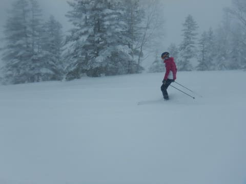
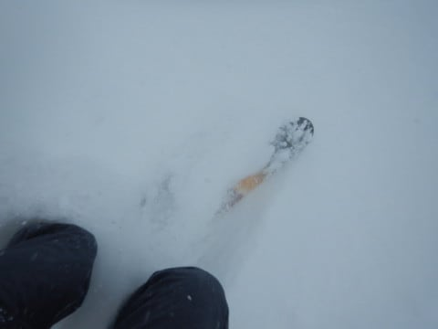
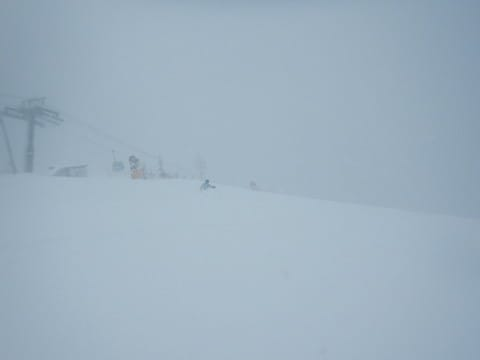
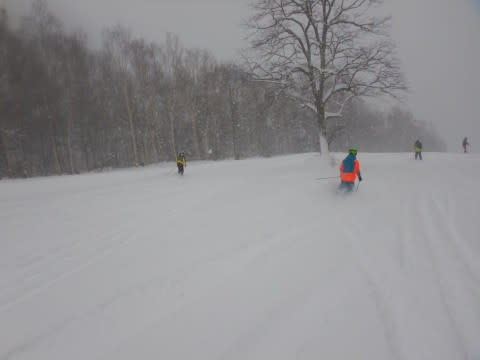
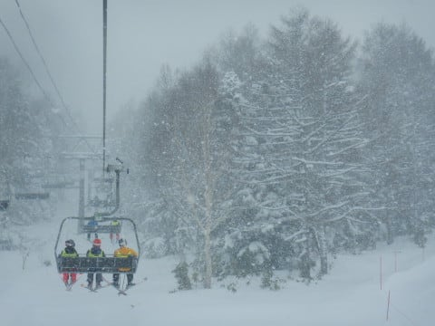
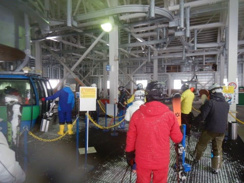
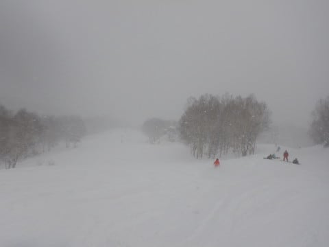
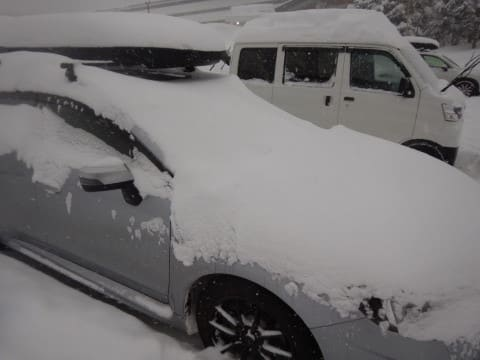

# 2021/12/26(日)志賀高原焼額山スキー場速報レポート！…終日雪降りの激寒デーだったけど，パウダーは脛パフ，それほど深くなかった…

📅 投稿日時: 2021-12-27 00:46:04

えー．

いつも通り，志賀でしっかりラストリフト

まで滑ってしまい．

家に着いたのは’深夜0時ごろ（涙）

明日も朝から仕事に行かねばならず…

もう眠い…

ってなことで．

帰宅日恒例の，速報モードです！

まず．

今朝は-15℃の冷え冷え雪降りでスタート！

圧雪コースもブーツパフくらいに新雪が

乗っていたけど…

ただ．

新雪コースのオリンピックコース．

せいぜい膝パフ程度で，

それもブレーキがかかる，ちょっと抵抗感が

強い雪です…(涙）

おかしい．

もっと軽い雪が，太ももパフくらい

積もってるはずだったのに！！

でも，膝パフのパウダーを何本か

いただきました～！！

さらに，いたるところに30cmくらいの

新雪が積もってるので，

コースのそこかしこで新雪を楽しめましたが…

でも，これなら普通にシーズン何回かある

程度の積雪量なので…

うーん．期待したほどの積雪じゃなかったな…

とはいえ．

今日は終日気温は-10℃を下回り続け．

さらに雪がガンガン降り続ける，

根性の無いスキーヤーふるい落とし機能

全力発揮の状態だったので…

ゲレンデはガラガラ！

当然，リフトもゴンドラもガラガラ！

8人乗り1ゴンが乗車制限4人，

6人乗り2ゴンが乗車制限3人と，

半分に乗車人数が制限されていて，

さらにおひとりさまレーンも

無くて混雑する最近としては，珍しいガラガラ

具合！

(同一グループなら定員いっぱいまで乗れます)

終日雪降りだったので，昼間もゲレンデに

雪が積もっていき，GSコースなど

一部ちょっと荒れ気味のところも

あったけど．

人が少なかったので，新雪が積もっても

それほど荒れず，終日プチ新雪状態でした！

…リフト営業時から終了までに積もったのは

20cm強くらいかな…

まぁ，そこそこ降ったけど，シーズン中は

時々あるレベルで．

志賀高原は，ニュースで騒いでいるほどの

積雪量じゃなかった感じ…

でも．

志賀高原，まだガンガン降っているので．

明日の朝も30cmくらい，脛パフ程度の

パウダーが楽しめるんじゃないかな？

とりあえず．

この積雪で，志賀高原も全面無事オープン

したようですし．

もう，志賀高原は完全トップシーズン入りです！！

## 💬 コメント一覧

### 💬 コメント by (しんちゃん)
**タイトル**: Unknown
**投稿日**: 2021-12-27 06:03:58

お疲れ様でした。

日曜は冷えていましたね。昼間もイチゴン山頂で-14～-15℃でしたよ。ゴンドラじゃなかったら耐えられなかったと思います（凍）

### 💬 コメント by (新米パパさん)
**タイトル**: Unknown
**投稿日**: 2021-12-27 14:43:07

ご挨拶できてよかったです。

日曜は、イチゴンニゴンを10回ほど回せました。

寒かったー。視野も悪くチビも怖がってしまい、

他はスーパーキッズ達の営巣地にいました。

ゲレンデでお会い出来ず残念です。

また、30日にうかがいます。

チビの練習に良い斜面って、唐松、白樺あたりなんでしようか？

GSは長くて、機嫌損ねると大変です、、、

### 💬 コメント by (レインボー74)
**タイトル**: Unknown
**投稿日**: 2021-12-27 18:35:26

月曜日の志賀高原情報

朝の湯田中は積雪1センチ。

上林-6℃　蓮池-12℃は、不思議なことに昨日と全く同じ！

まずはニコンからGSサイド非圧雪へ。

ヒャッホー！！一番だ。誰も踏んでない自然を蹴散らすこの快感！

続いてはスーパー。例によって左端の踏んでない雪を選んでの滑走。幸せすぎる！

仲間もみんな太板を使用。せっかくの新雪は、やっぱり道具によって、さらなる快感とさらなる向上心を生んでくれると、つくづく感じました。

10時を過ぎると、ちょっと凸凹が、昨日よりも感じるようになりました。

正月にはいいお爺さんにならなければならないので、理髪などの用もあり、今日も11時終了。

今のところ29日滑走で終了です。10日間も滑れないなんて、エス様よりすべれないなんて、せっかく上手になりかけてるのに、残念です。

皆様来年も楽しく過ごせますように！

### 💬 コメント by (Skier_S)
**タイトル**: 明日も志賀に舞い戻ります～！
**投稿日**: 2021-12-28 00:10:23

＞しんちゃんさま

日曜は良かったですね～！

月曜はもっと良かったんじゃないですか？

また来年お会いしましょう！

＞新米パパさま

私はイチゴンメイン，時々白樺コースに行って2高にも

乗ってました…

お子さんの練習に最適と言えば，第3高速に乗ってイーストコースでしょう！

フード付きリフトだし，斜度はそれほどきつくないし，

イーストをおススメします

＞レインボー74さま

あら…10日も滑らないとは！！

私はコロナがなければ，10日もスキーせずにいたら死んじゃうので

そんなに間隔をあけたことは無いです（笑）．

また来年もよろしくお願いします！！

