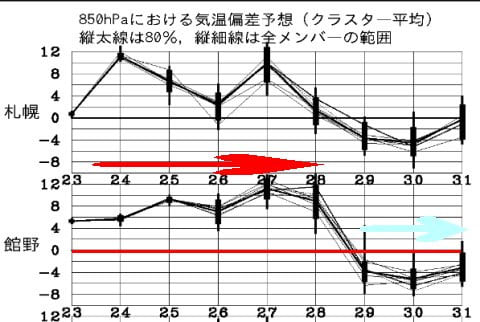
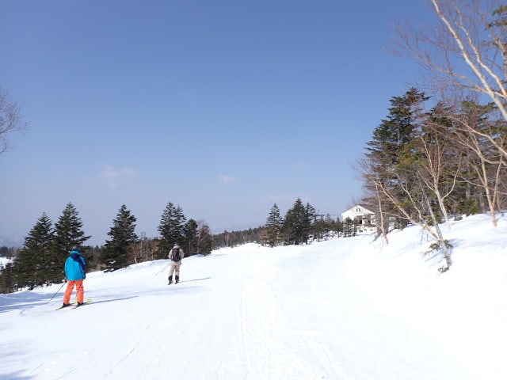

# 2025/3/23(日)の志賀高原焼額山スキー場，詳細レポート！…終日晴天だけど，気温が高く朝から雪は緩み一部ストップ雪．ガラガラだったけど完全に春

📅 投稿日時: 2025-03-25 03:07:14

🏷️ カテゴリ: [2025スキー滑走日記](cacd3fbf84d4a679ee61a5894c3f95e14.md)

ということで．

本日の志賀高原も気温が上がって，晴れた

ようで．

つまり…

今日も完全に春スキーの一日だったという

ことですね…

うーん．ここ2-3日で季節が一気に進んで

しまった感がありますが．

この高温は28日まで続きます．

そして，28日(金)に壊滅的な高温の

雨が降りそうですが…

そのあとは，29日の土曜から冷えます！

29日の土曜は雪がちょっと積もって

くれそうなので…

28日の雨で融けた雪が固まったアイス

バーンを隠してくれるくらい，積もって

くれると嬉しいんだけど…

そこまで積もらなさそうな感じ(泣)

まぁ，どちらにしろ．

29，30，31日は平年比-4℃くらいまで

冷えそうなので，この週末は久しぶりに

冷えた週末になりそうです…！！

「山では春のアイスバーン祭り」に

ならなければいいんだけど…

ってなことで，本題へ．

昨日速報した，日曜の志賀高原の

詳細レポートです！

まず．

いつも通り，通常営業開始の8時半前に

焼額第1ゴンドラに並びますが…

まぁ，今日の列の長さは土日の平均的な感じ

ですか．

そして，朝イチゴンドラで山頂に着くと…

えええ！！！？？

朝からプラス気温っ！？？

いや，まぁ0℃くらいって予想してて，

プラスに振れる可能性もあるとは

思っていたけど．

実際に3月の志賀高原の朝イチでプラス

気温なのは，ちょっと衝撃…(涙)

で．山頂は見事に晴れ上がっているので…

朝からのプラス気温と強い日差しの

ミックスで，朝から雪はちょい緩め．

硬さを全く感じない朝イチバーン（泣）

一応，いい感じのシマシマに見えますが．

…まぁ，ガチガチに硬くなくて，

しっとりとした，エッジが良く効く

バーンなので，そこまで悪くはないんですが…

この柔らかさのおかげで，こんないい

バーンだったのはせいぜい1-2本程度．

夜のうちに全く締まらなかった柔らかめの

雪だったせいで，すぐにバーンが掘れて，

朝9時過ぎにはこんな悲しい状況に

なってました…

高温と日差しが憎い…（泣）

で．

今日はあさイチから強風で第2ゴンドラが

運休だったようで．

そのおかげで，2ゴン側のパノラマコースを

滑る人が少なくて．

パノラマコースはガラガラだったうえに，

雪が柔らかめだったのに，10時を過ぎても

バーンがまだ荒れていなくて，意外と

良かったです！！

いや…ホントにガラガラ！！

これならバーンも荒れないな…

と，思っていたら．

ムチャクチャ日当たりがいい

唐松コースやブナコースは，滑ってる

人が少ないわりに，日差しが強かった

こともあり…

午前11時前には，かなり残念な感じの，

湿った重い雪になっていき．

唐松下部，ブナ，2ゴン～1ゴン連絡路，

プリンスホテル東館前付近は，

かなり板が滑らないストップ雪に

なっていきました…（泣）

ただ，晴れなのにそれだけコンディションが

悪くなってしまったからか．

第1ゴンドラも，最高のピークでもゲートの外

まで並ぶことはなく．

昼前からは，だいたいこんな感じだったし…

滑りの悪いブナか唐松を通らないと

やってこれない第2高速もガラガラ！！

そして，11時ごろには減速運転ながらも，

強風で運休していた第2ゴンドラが

動き出しましたが…

この第2ゴンドラも，全然待ってる人が

いない，飛び乗り状態！！

しかし．

容赦なく照り付ける太陽と．

昼間は最高気温が+8度まで上がっちゃった

こともあり…

ストップ雪ではなかったパノラマコースや

GSコースでも，雪がすごく重くなり，

人が少ないのでそこまでボコボコに

ならなかったまでも，春雪らしい

荒れたバーンになっていきました…（涙）

バーンが荒れ気味とはいえ，

パノラマーサウスコースは割と

フラット気味で，板も良く滑る

雪だったし．

早い段階から結構凸凹が出る，

GSコースに比べればマシかな…

この写真ではそこまで凸凹に見えない

けど，細かなバンプがあり，滑ると

結構飛ばされます．

しかし．今日はこんな雪だったこともあり．

午後は晴天にもかかわらず，ガラガラ

だったけど．

+8度の高温で一気に緩んだバーンは，

夕方には結構ボコボコになっていったし．

ボコボコになってないところも，

細かな荒れがあって，滑りやすいとは

言わないまでも．

晴天で穏やかな，暖かい一日を

過ごすことができ．

夕方16:15の営業終了タイムラストには，

今日で今シーズンの営業終了となる

第3高速リフトに，今シーズン最後の

お別れを述べて．

今日もいつも通り，営業終了タイムまで

しっかり滑り倒してきたのでした…

いやー．

でも．

今日は雪が重くて荒れて，さらに一部は

滑りが悪い雪になってたけど．

パノラマ・サウス・GSコースでは，

つんのめるほどの妖怪板つかみには

襲われなかったし．

（エキップさんチューンの板が，結構

　滑ってくれたからかな…？？）

春雪では絶大な信頼を寄せる，

我が愛機のDeacon 84君を履けば，

重くて荒れた雪でも問題なく踏み

つぶしていけるので，営業終了タイムの

GSコースでも，ハイスピード大回りが

決められたし．

他の人は今日の雪はひどいと言っていたけど，

私は「そこまでひどい雪かなぁ…」と

思いながら，営業終了時間まで

GSコースを楽しく大回りで滑って

いたのでした…

思ったより楽しかったよ！！←基準が他人よりズレているから参考にしないほうが良い

## 💬 コメント一覧

### 💬 コメント by (レインボー77)
**タイトル**: Unknown
**投稿日**: 2025-03-25 15:13:16

火曜日の志賀高原情報

朝の蓮池+6℃。昨日と同じだけど暖かい。

渋峠は広い方のゲレンデが、パーク作りのため閉鎖。狭い斜面だけの滑走でしたが、硬くもなく夢中で滑れました。10時過ぎから第二まわし。下部は流石に両端などで一部ストップ雪になりましたが、上部は快適カービングバーン。最高でした。

最後の第一は全く滑らず、人間修行ができました。明日の横手は強風予報なので、行かない方が無難かと思います(間違ってたらごめんなさい)。

### 💬 コメント by (Skier_S)
**タイトル**: ＞レインボー77さま
**投稿日**: 2025-03-26 00:51:12

今日も気温が高かったんですよね…

横手はそれでも上部は快適バーンなのがすごい．

明日はやっぱり風が強そうなので，横手は避けたほうがいいかもです．

