# 2022/11/9(水)横手山スキー場オープン！特派員からいっぱいゲレンデ写真送ってもらったよ

📅 投稿日時: 2022-11-10 01:36:08

なんと．

本日．

ホントに横手山がオープンしました！！！

草津越えの冬季閉鎖前にオープンできるとは…

すごい．

まさに，横手山スタッフの執念ですね…

これは，すごい．

ってなことで．

本日，2022/2023シーズンのオープンを迎えた

横手山スキー場ですが．

志賀高原への忠誠度が高い特派員が，

ちゃんとオープン日を狙って横手山で

滑ってきたようです…！

…いや．

ホントに志賀高原愛にあふれてますね…

だもんで．

自分は行ってないにもかかわらず，

特派員の写真で記事を書いてしまう

という他力本願なこのBlog．

今日の横手山オープン情報です！！

えー．

今日は朝から終日すっきり晴天！！

（だったらしい）

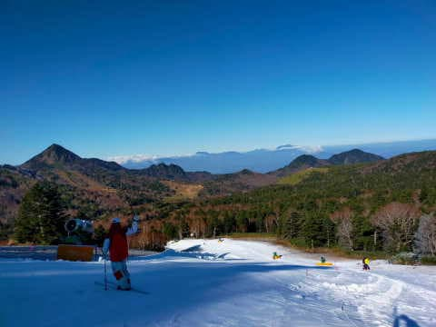

気温は朝は低め．

昼もそれほど上がらなかったみたいで，

あさイチはかなり硬めのバーン…！

（だったらしい）

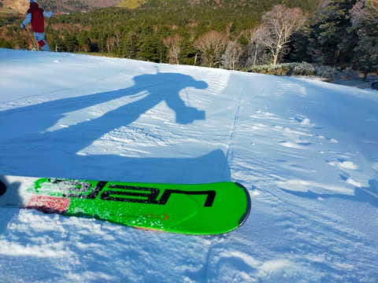

リフトの乗り場も，狭いながらも

ちゃんと雪がついてます！

（だったらしい）

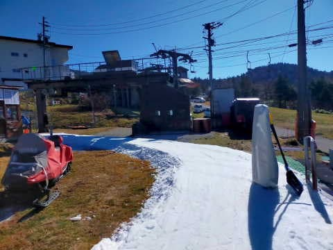

そして，降り場にも結構しっかり雪が

ついてて安心！

（だったらしい）

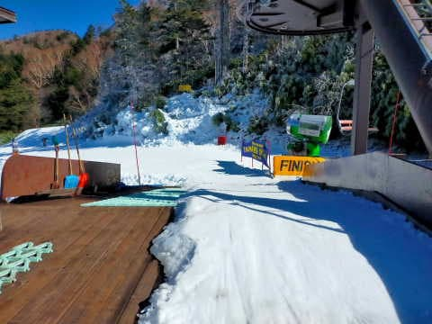

リフトを降りたあたりも，雪は十分…！

（だったらしい）

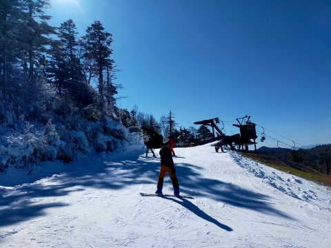

ここだけ見ると，イエティよりは

広く見えますが…

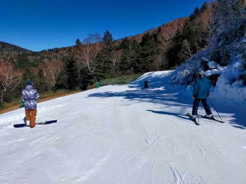

実際の斜面は，そこまでコースは広くない

感じ．

（だったらしい）

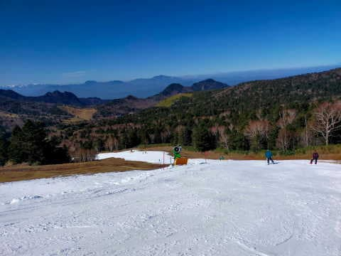

ここも，白い部分の幅はそこそこありますが，

実際は人工降雪機より右側だけが滑れる

エリア．

（だったらしい）

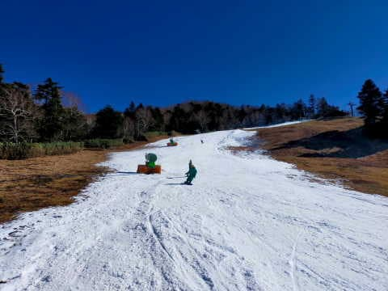

とはいえ．

シッカリ人工雪がつけてあり，

雪の厚みは十分！

（だったらしい）

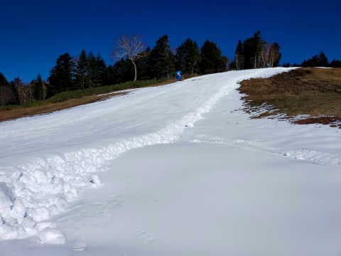

さらに，がっちりした下地を作るため，

かなり硬めのバーンに仕上げてあることも

相まって．

バーンが緩んで荒れることはなかったようです！

（だったらしい）

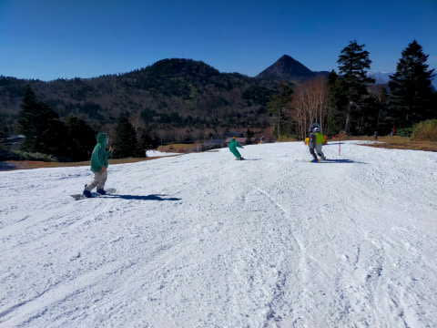

昨シーズンは，オープン初日の雪が薄くて．

気温が高かったのもあり，すぐにバーンが

荒れて茶色くなってきたところもあったのに．

今シーズンのオープン日はコース上に

穴が開いたり，雪が茶色くなることは

なかったみたいで…

（だったらしい）

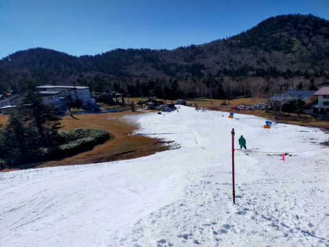

朝は硬かったバーンも，昼ごろには

ちょどいい固さになってきて…

（だったらしい）

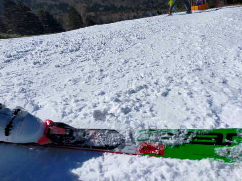

ラスト近くになっても，バーンの

コンディションはそれほど悪化しなかった

みたいです！！

（だったらしい）

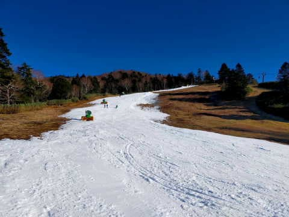

どうやら．

この特派員は，オープンから15:00の

クローズまで，滑り続けていたようです…

（だったらしい）

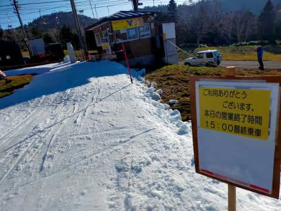

いや．

でも．

今日の夕方になっても，全くバーンに

穴が開いたり，茶色くなっちゃうことも

なかったみたいで．

かなりいい感じで厚みのある硬い下地が

できていたようです…！！

（だったらしい）

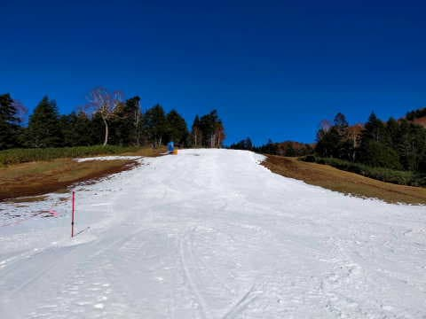

…ってなことで．

自分では行っていないので，

伝聞形で伝えた

横手山オープン日のゲレンデ情報でしたが．←途中から，伝聞形にさらに伝聞形がくっついてなかったか？

このあと，少なくとも13日までは

人工雪が打てない日が続きそうだけど…

この調子なら，12日の土曜くらいまでは

もつかな？

…13日の雨にゲレンデが耐えるかどうか…

今週末滑りに行く人は，日曜だとヤバいです．

土曜を狙ってください！！

（土曜，混むだろうなぁ…)

でも，14日の夜あたりから冷えて．

15，16，17日は結構冷えそうなので…

最悪13日にクローズになっても，

16日か17日には再オープンできるんじゃ

ないかな？

ってなことで．

自分では滑りに行ってないのに，

特派員に依存することで記事を1本

書いてしまった，Skier_Sだったのでした…

某特派員に，感謝！

## 💬 コメント一覧

### 💬 コメント by (naoちゃんねる)
**タイトル**: Unknown
**投稿日**: 2022-11-10 10:41:22

メッチャ的確なレポート記事になってる！(笑)

…いや〜たまたま不定休な私が休日指定の日に横手のオープンが重なっただけですよ〜

(休日勤務を頼まれたけど、とっても大事な用事がある！と断ったのはナイショで…)

しかし横手、オープンにこぎつけたのは流石です。

しかも初日は思ったよりいいコンディションで…

何とか高温の週末を乗り切って欲しいです。

### 💬 コメント by (炎の北海道民)
**タイトル**: Unknown
**投稿日**: 2022-11-10 12:34:33

いいなぁ。

滑りたいです。

北海道ぜんぜん雪降りません。

### 💬 コメント by (Unknown)
**タイトル**: Unknown
**投稿日**: 2022-11-10 22:32:34

特派員の大活躍ぶりが報道されてますよ。

https://www.youtube.com/watch?v=rwRGgLpBB3w

### 💬 コメント by (Skier_S)
**タイトル**: これから2週間ほど気温が高い期間が続く(涙)
**投稿日**: 2022-11-11 02:43:31

＞naoちゃんねるさま

写真，ありがとうございました～！！

たくさんあって助かりました．おかげで，まるで自分が行ってきたかのように（？）

レポートが書けました…

でも，予想よりいいバーンコンディションでしたね．

横手山スタッフ，すごい…

13日の雨をのりきれるのか？？

ぜひ乗り切ってほしい…

＞炎の北海道民さま

そうなんですよね…

今年は北海道は冷えた時に降ってないので，雪が積もらないですよね…

13日夜は北海道は山は雪が積もるかもです！！

＞Unknownさま

確かに…特派員が映ってますね(笑)

