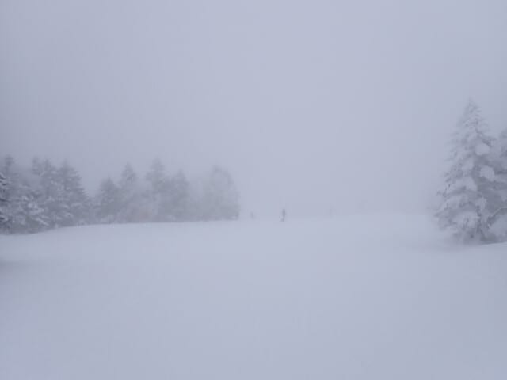
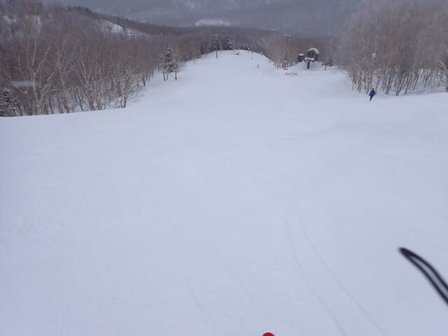
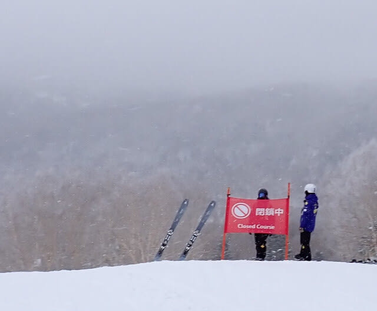
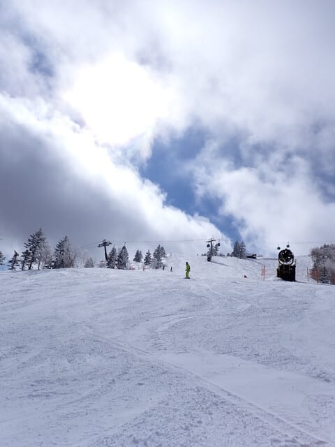
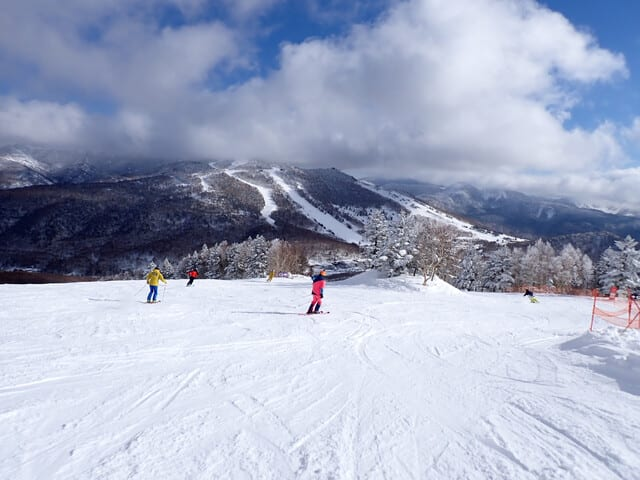
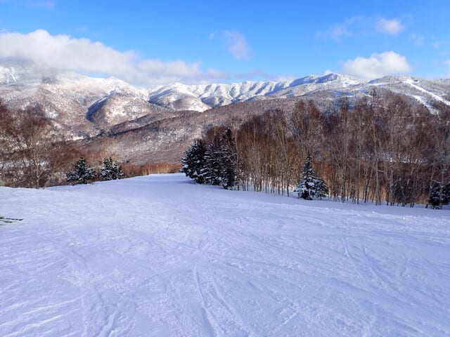
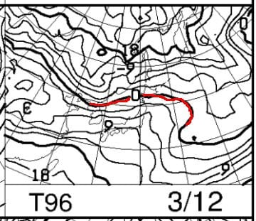
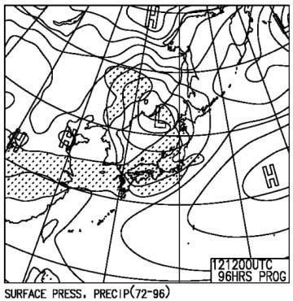
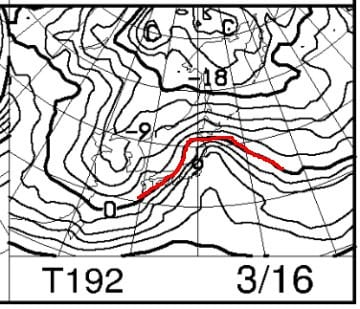
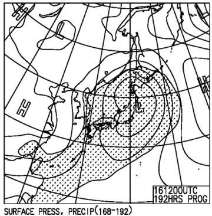

# 2025/3/9(日)の志賀高原スキー場速報レポート…雪のち晴れ，雪は回復していい感じの一日！そして12日深夜と16日にまた雨の可能性が…（泣）

📅 投稿日時: 2025-03-10 01:11:55

ということで．

今日もいつも通りラストまで滑って，

夜遅くに帰宅しました～！

…実は明日朝までにやっつけなくては

ならない仕事があるので，

これから仕事しないと…

ってなことで．

帰宅日恒例の速報モードにて，

本日の志賀高原のレポートです！！

まずは朝，予想通り曇り…というより，

朝までに数㎝の積雪があった上に，

朝になっても雪が降り続け…ちょっと

予想外の雪降りで始まりました…！

朝早くは山頂付近にガスが出て視界が

悪かったけど．

視界が悪かったのは朝の山頂付近だけ．

あとは曇り空ながら，視界はそこそこ

あって．

ゲレンデは昨日はコロコロがちょっと

あったけど，今日はコロコロがない

いい感じに締まったハイスピード

圧雪バーン！

そして，3月に入ってインバウンドが

減ったからか…

コース上の人も少なめでした…！！

…が．

今日は第2高速が朝から故障で動かず．

唐松・白樺コースは朝からクローズ

してました（泣）

第2高速，一日運休か？と思ったけど．

営業開始予定1時間半後の10時には

無事オープンしたので良かった…

で，

朝はやっぱり予想通り曇りそうで．

晴れてくるのは午後からかな…

という予想通り．

昼ごろから雲が切れ，青空が顔を出し始め…

午後2時ごろには，すっきり晴れに

なってきました…！！

そして．

今日の雪はコロコロもなく，

いい感じで締まった，しっかりした感じで

エッジが良く効くバーンコンデション！

しっかり締まり気味の雪だったので，

夕方までそれほど荒れることなく，

急斜面の一部でちょっと下地のカリカリが

あった以外は，全面かなりいい雪で

ムチャクチャ楽しめました～！

…ということで．

日曜日は雪も良く，午後は天気も最高で

かなり楽しめた感じだった志賀高原

だったんですが．

…今後の天気図を見ると…

…

…ええ？？

これは…

降れば液体の気温だけど…

地上天気図に降水域がかかって

いるのか…？？？

…

…

…

ダメっぽい…（泣）

おそらく，12日夜から13日にかけて，

また，雨になりますね（泣）

そして…

え？？

なに？？

また？？

それも週末の日曜？？？

この日，気温が上がっても

降らないことを祈るばかりだけど…

…

…

…

…

ぐはぁ（屍）

これ…

週末16日の日曜，かなりの雨になりそう

なんですが…？？

発達した低気圧が直撃しそうで，

ヘタすれば暴風雨かも…（泣）

うーん．

次の週末は，あまり期待しないほうがいい

かも…（激泣）

もしかしたら，いい雪で滑れるのは，

この週末が最後だったのかも…

いや．

そんなことはないはず…！！

志賀高原なら，まだ3月下旬にも

冷えて，あと1-2回はいい雪で

滑れるはず…っ！！！

3月下旬に，激冷えパウダーの腰パフが

滑れるはずなのだ…！！←さすがにそれはない

## 💬 コメント一覧

### 💬 コメント by (1kamakura)
**タイトル**: Unknown
**投稿日**: 2025-03-10 06:02:53

江戸の秋

えーっ泣泣😭

16日は群馬のスキー場へ行く予定なんですが、大雨？

### 💬 コメント by (hapi44)
**タイトル**: Unknown
**投稿日**: 2025-03-10 07:48:56

なかなか楽しめたみたいですね！

日頃の仕事の頑張りのおかげですね😊

私も土曜日に行く予定です😩

今シーズンは…もう春スキーしかないのかなぁ（悲し〜）

### 💬 コメント by (富山県民)
**タイトル**: Unknown
**投稿日**: 2025-03-11 08:44:26

こんにちは。

3月9日の志賀高原は曇り後晴れだったのですね。

私は3月9日は新潟県の妙高杉ノ原スキー場に行きました。

天気は1日中曇りまたはガスで山頂部のみ雲の上で晴れてました。

午後からは晴れてくると期待していましたが結局1日中雲は取れなくて期待外れでした。

これにて今シーズンの早割1日券は全て消化しました。

今後は快晴の日に白馬八方尾根スキー場に行きたいです。

白馬八方尾根スキー場は3月10日からは春料金で1日券が5500円と安くなります。

### 💬 コメント by (富山県民)
**タイトル**: Unknown
**投稿日**: 2025-03-11 08:45:49

こんにちは。

今週末は天気は駄目っぽいですね。

今週末は久しぶりにスキーはお休みします。

最近体調不良なので今週末は体を休めたいです。

### 💬 コメント by (Skier_S)
**タイトル**: 今日の志賀高原は雨だったのか…
**投稿日**: 2025-03-12 00:43:00

＞江戸の秋さま

16日は，志賀は雨ではなく雪になる可能性も出てきましたが…

群馬はどうだか，残念ながらまだわかりません…

とりあえず，水曜深夜の天気予想しますので，参考にしてやってください…（志賀に特化してますが）

＞hapi44さま

日曜は良かったですよ~！！

今週土曜は曇り~晴れで，気温は低め．アイスバーンになってなければ楽しめるはず…！！

＞富山県民さま

杉ノ原は午後は晴れなかったんですね…

志賀は午後は見事な晴れでした！

今度は晴れの予想の日を狙って八方へチャレンジしてみてください…

今週末は土曜は時々晴れそうですが，雪は積もらないからアイスバーンのかのうせいが高いし，

日曜は雨か雪で，あまりよい予想ではないです…

