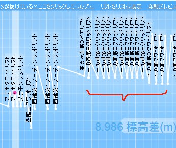

# 幼稚園児にして，すでにサルスキーヤーの素質を見せつつあるわが娘

📅 投稿日時: 2014-03-07 00:42:06

えー．

今回の話題は，

また，わが娘のことで．

なんだか，こーゆー感じで．

最近カービングっぽい滑りを

するようになってきた，わが娘．

あー．なんですね．

去年までは．

一日で，リフト10本も滑れば．

まー，満足してくれてたんですが．

最近．娘も体力がついてきたらしく．

一日滑り続けるようになってきて…

この，枠で囲んだ部分が，娘と滑ったところなんだけど．

…

…10時過ぎから4時過ぎまでで．

リフト30本以上乗ってる気がするんですが…．

まさか，リフトストップ直前まで滑り続けるとは思わなかった…

自分のフリータイムがほとんどなかった…（涙）．

とくに，このあたり．

2時間近く休みなく，ひたすらリフトを回しているという．

…これは．

休むことなく滑り続ける，

「サルスキーヤー」

としての，親譲りの血が現れている気が…

…でも．

こんな感じで．お昼休み以外にも．

休憩をちゃんととっているのが，まだ人間らしいところ．

ふっ．

こんな休憩をとるなんて，

まだまだサルには遠いの～．

## 💬 コメント一覧

### 💬 コメント by (れお)
**タイトル**: 娘さん
**投稿日**: 2014-03-07 06:38:32

うまいし、しかも可愛いじゃないですか♪

ダメですよ、こんな子をサル化させちゃ～。

でもこんなちっちゃい子が、オリンピックコースとか大回りでかっ飛んでいくのもみたいかも…。

今週末は、やっと普通にいいスキーができそうですね。楽しみです～ 。

### 💬 コメント by (KENKEN)
**タイトル**: ターンの切れ味が鋭い
**投稿日**: 2014-03-07 08:00:28

綺麗なターンをしますね。

とても幼児の滑りとは思えないです。

来週北海道でスキーを考えています。

西日本のスキー場では残念ながらパウダーは期待できないので、期待しています。

（まだ飛行機は押さえてないのですが・・・・・）

それで我が家のスキーシーズン終わりの予定です。

Sさんにご指摘されたように、今冬娘の上達度合いは凄まじいものがありました。

少し早いですけど、我が家は夏モードの準備に入ります。

### 💬 コメント by (aqura)
**タイトル**: Unknown
**投稿日**: 2014-03-07 12:22:42

いやいや、かわいいですねぇ~。昔を思い出します。

久しぶりに、娘2号と志賀高原に行きます。今シーズンから、スノーボードに転向してしまいました。まだ、1日しか滑っていませんが・・・。さあ、今晩出発です、。

### 💬 コメント by (aqura)
**タイトル**: Unknown
**投稿日**: 2014-03-07 12:24:16

あっ、スノーボードに転向したのは、娘2号です。娘2号はスクールに、私はどうしようかなぁ～。

### 💬 コメント by (ひろりん)
**タイトル**: Unknown
**投稿日**: 2014-03-07 15:57:05

サル・・・（笑）

しかし綺麗なターンですね。

丸山さんもDVDでそのターンを見せていました。

そろそろ道具を新調してあｇ（ｒｙ

そして・・・

タカマでソフトクリーム！！

私のテリトリーに入りましたね（嘘）

これから気をつけます（何に？）

### 💬 コメント by (Skier_S)
**タイトル**: みなさま，コメントありがとうございます～
**投稿日**: 2014-03-07 23:04:37

＞れおさま

このカービングが連続するようになったら

すごいんですけどね～．

しかし，うちの娘は急斜面が滑れないわけでは

ないけど，いろいろできて遊べる緩斜面が好きな

ようなので，オリンピックコースは…たぶん嫌がるかと（汗）．

今週末はひえひえでいい感じですよ～！！

＞KENKENさま

来週，北海道ですか！

今週だったら，大吹雪で飛行機が飛んだかどうか

微妙なところだったので，来週で正解かも…

今週末はすごい冷え冷えですよ～

でも，もうシーズンおしまいですか．

もったいない！

私の夏モードはまだまだ先です～．

…でも，娘さん，スキー上達しましたか！

子供がうまくなるのは早いですよ～

うかうかしてると抜かれますよ（笑）．

