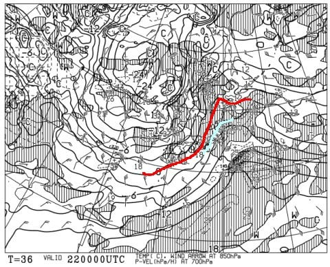
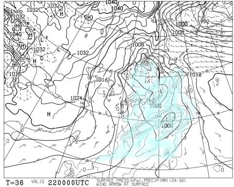
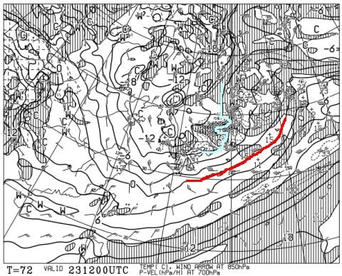
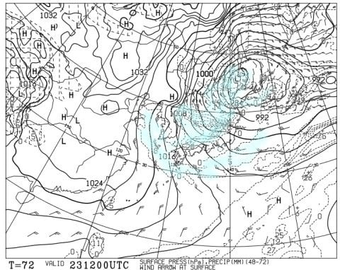

# 志賀高原でも22日朝はみぞれか雨！？…そして23日から志賀高原でも降る．積もる．25日まで降り続ける

📅 投稿日時: 2022-12-21 06:14:19

えー．

ホントは日曜の志賀高原詳細レポートやろうかと

思ったんですが．

今日もいろいろクリティカルで，

気づいたら朝なので（涙）

ざっくりと天気レポートを…

22日の木曜ですが．

朝9時の850hpa気温を見ると．

うげげげげ！？？？

水色の+3℃線が志賀高原より

北まで上がってますよ！？？

そして，地上天気図は…

全国的に降水域がかかってます（涙）

これは…

22日木曜の朝は，これまでの大雪だった

新潟方面を含め．

標高の低いスキー場は軒並み雨

志賀はギリギリ雪になってくれるか…

でも，強い南風が吹き，かなり荒れ気味の

みぞれっぽい天気になりそう…

でも．

22日の昼ごろには一気に冷え込み始め．

23日の夜9時の850hpa図を見ると…

をををを！！！

水色の-9℃線が志賀にかかってる！！

これは，-10℃以下まで冷えます！！

激冷えです！！

そして，地上天気図は…

日本海側に降水域がかかっていて．

雪がまたかなり積もりそうな

天気図ですが…

拡大してみると．

強烈なJPCZがほぼ東に流れて，

東北地方に突き刺さっているので．

これ，志賀高原には雪が降らない，

志賀高原殺しの東風の天気図（涙）

なんですが．

500hpa天気図を見ると．

なぬ？？

大雪の目安の赤い-30℃線どころか．

ドカ雪の目安の水色の-36℃線が志賀に

かかってますよ！！！

…これは．

西風でも，根性のある雪雲が北アルプスを

越えて，志賀高原まで届くパターン！！

つまり．

降る．

積もる．

志賀でも，23日から雪が積もりそうです！！

そして．

23日の地上天気図をもう一度見てみると．

図に赤く印してある59という数字．

…これは，降水量59mm…

降雪量にすれば59cmという強烈な

JPCZなので．

また，秋田や新潟はすごい積雪に

なりそうです…！！

志賀でも，西風に関わらず

20～30cmは積もってくれそう

かな？？？

こんな激烈な冷え＆雪が26日ごろまで

続きそうなので…

志賀高原も23日から26日のクリスマス寒波で，

かなりの積雪になりそう！！！

志賀高原では，22日の雨もそんなに

ひどくなく．

みぞれだったのが，すぐに雪になりそうですし．

大丈夫です．

ご安心ください．

正月休みまでには，志賀高原も

かなりの雪が積もりそうです…！！！

…てなことで．

これからちょっとだけ寝ます…

もう朝6時だよ…(泣)

PS.また，新潟の海沿いや山形などは

すごい積雪になりそうなので．

平地には降らなくていいから，

スキー場を狙って降ってほしいかな…

## 💬 コメント一覧

### 💬 コメント by (西舘)
**タイトル**: Unknown
**投稿日**: 2022-12-21 09:05:38

Sさん、少ない睡眠時間を犠牲にして

嬉しい情報を有難うございます。

我が西舘のオープンは

後回しにされるのが常なので、

26日頃になっちゃうのかな…

今シーズンもよろしくお願いします！

という挨拶を今年残り10日にする。

### 💬 コメント by (レインボー改めブラボー75)
**タイトル**: Unknown
**投稿日**: 2022-12-21 14:24:49

水曜日の志賀高原情報

朝の上林-4℃　蓮池-7℃。晴れ間も見える。いいぞ、今日も！

４ロマ乗って超速仲間は唐松へ。私と隊員はのんびり滑るためサウスへ。これでゆったりまったり滑るはずだったんだけど、あまりに状態が良すぎて、楽しくて、いつの間にか超速仲間になっていました。

特筆すべきは唐松。コロコロなんて過去の夢。気っ持ちいいなんてもんじゃない。

長岡から来る予定の仲間は、小千谷市の道路情報が悪くて断念。ガソリンが売り切れ続出で大変だとか。それに引き換え私たちは！

ダイヤモンドの主によると、開くのは来週らしいとか？ダイヤが動いてくれれば、もっと遅くまで(誰かさんみたいにラスリフまでは当然無理)滑るんだけど、今日も昼前に終了して下界で昼食。

### 💬 コメント by (アリス)
**タイトル**: Unknown
**投稿日**: 2022-12-21 18:28:34

S様

やはり予想通り、本日も積雪はなしですね😅

朝は、車窓の氷解かし時間を加味するのを忘れ四ロマ到着は8時20分😅

前に並んでいたブラボーさんに朝の挨拶✨

やはり、朝一のシマシマは気持ちいい🎵

唐松もサウスもコンディションいいです🎵

今回の宿泊は、旅行支援があり事実上一泊2500円の計算です😅

ブラボーさん曰く、詐欺みたいなスキー泊との指摘😅

レインボー隊の皆さん、とにかく飛ばします🎵

二高降りてから、後ろを付いて見ましたがほとんどターンしてない❗️

唯一、他のスキーヤーを避ける時だけ少しのターン❗️

唐松の最後のバーンもほぼ直です😅

明日もヤケビ滑ります🎵

### 💬 コメント by (Goku)
**タイトル**: スキーはターンを！
**投稿日**: 2022-12-21 19:11:13

Ｓさん、ちょっとコメント欄お借りしますね!

アリスさま

スキー板ってのはターンするために作られています(^_-)-☆

間違ってもYUKIYAMAアプリで最高速を狙おうなんて思ってはいけません(>_<)

あのレインボー隊の皆さんに騙されてはいけませんよｗｗｗ

今シーズンこそご一緒したいですね。

### 💬 コメント by (Skier_S)
**タイトル**: 眠い…
**投稿日**: 2022-12-22 02:56:30

＞西舘さま

24日に積もればオープンできないかなぁ…

25日あたりから，かなり滑れるエリアが広がるんじゃないかと期待！！！

＞ブラボー75さま

唐松のコロコロ，消えたんですか！！

今週末には2ゴンが動いて欲しい…

いや，1ゴンも動いて欲しい…

＞アリスさま

残念ながら強烈な西風のおかげで，雪が降らずじまいです…(涙）

でも，23日の夜から積もる！（はず）

レインボー隊の皆さんはかっ飛ばしますから，ついて行こうと思っちゃ

ダメですよ！！(笑)

＞Gokuさま

そうですよね…

スキーってのは曲がるようにできていて，スキーはターンするのを

楽しむスポーツですよね(笑)

