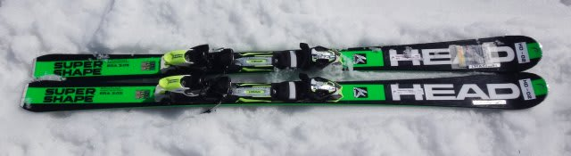
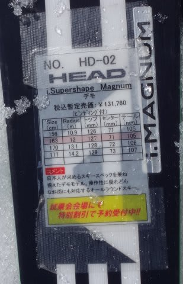
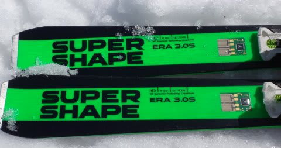
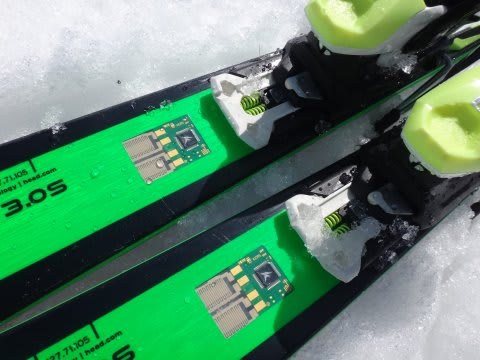
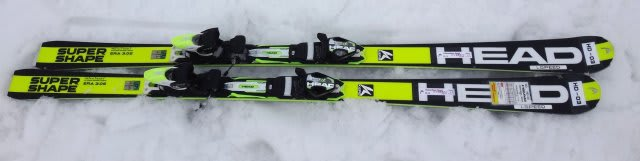
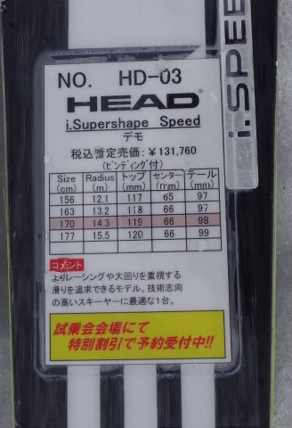
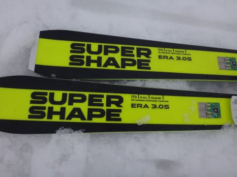

# 2016シーズンモデル，スキー試乗レポート第13回…HEAD編

📅 投稿日時: 2015-04-17 01:46:14

うーん．

なんだか．

こんな，テククラも指導員資格も何も持っておらず，

技術向上のための講習を受けたりすることもなく．

ひたすら自らの快楽のためにだけ滑り続ける，

単なるどシロートのレジャースキーヤーのスキー試乗の

レポートなんて，役に立ってるのかしらん…？？

と，毎回心配になっているSkier_Sです．

といいながら．

本日も，2016シーズンモデルのスキー板試乗インプレッションの続きです．

今日は，ヘッドの2機種．

では，どうぞ～！

○HEAD i.Supershape Magnum 163cm

基礎オールラウンド…なのかな？

基本的な板の造りは，普通にサイドウォールがあるサンドイッチ

（板の上部はわずかにキャップっぽい感じ）の板なんですが．

この，KERSデバイスにより，テールのフレックスを電気的にコントロールする

ってのが売りの，i.Supershapeシリーズ．

その中で，最も汎用性が高そうなのがこのMagnumですが．

履いた感じは，結構軽快に感じますね．

スイングウェイトは軽めかな～．

荷重ポイントは明確にトップ目．

谷回りでトゥピース付近を抑えていくと，

トップからテールまでエッジが長く効いて，

きれいにカービングしていく感じ．

比較的たわませやすく，トップ目荷重をキープすれば

たわみ量でターンをコントロールできます．

フレックスは比較的優し目．

ホントのトップスピードでは，ちょいとたわみすぎるか．

今回乗ったのが，163cmって短めだったのもあり，

スピードを出していくと，ミドル～ショートターンに

なっていきます．

でも，たわみ・返りのバランスはいいし，

グリップも比較的強くいい感じ．

板のばたつきも少な目．

今日みたいな柔らかい雪ではいい感じを受けました．

トップに軽いロッカーが入っているはずだけど，

あまりロッカーっぽく無く，谷回りで明確にトップを

抑えて行ったほうがきれいに回っていきます．

谷回りでトップを抑えて，フォールラインに向けてトップを

抑え続け，切換えでテールに乗っていくと，ポンと切り替わる…

という基本的動作で操作するタイプに感じました．

荷重ポイントキープではなく，板の上での前後動で

ターンを引き出す板ですね．

昔の板の動きに慣れている人には，こーゆー板の方があってるかも．

○HEAD i.Supershape Speed 170cm

基礎オールラウンド．

Magnumと同じ，i.Supershapeシリーズなんですが…

…これは．結構固くて，重めの板です．

スピードを出すと簡単にたわんでいく，比較的楽なMagnumとは全然違います，

結構強い，体力がある人向けの板です…

この板もやはり谷回りでトップ目荷重が求められる板で，

トップから食わせていくと，比較的縦に長い弧で大回りで落ちていけます．

スイングウエイトもわざと重めに作ってある感．

それだけぶん，高速安定性や荒れた斜面での安定感はあり，

Magnumに比べるとかなりの高速安定性があります．

170cmでR=14.3ってことですが．

それよりは大きめの半径に感じるかな．

とはいえ，山回りでテールをかなり抑え気味にたわませていくと，

意外と小さい半径で回れます．

結構しっかり仕掛けていけば，小回りまで行けます．

そこそこハイスピードで飛ばすのが好きな，体力のある人が，

ロングターンベースのオールラウンドとして使うのに向いてる感じかな～．
