# 上信越道から見える，あの妙義山へ登ってみた，ラスト

📅 投稿日時: 2020-10-10 01:25:02

[前回はこちら](edc388bf9f2e70f38f9ba51f88c690b5d.md)

ということで．

妙義山の最大の難関，

奥の院の鎖場を下りでチャレンジする

という修行が終わって．

到着しました，奥の院！

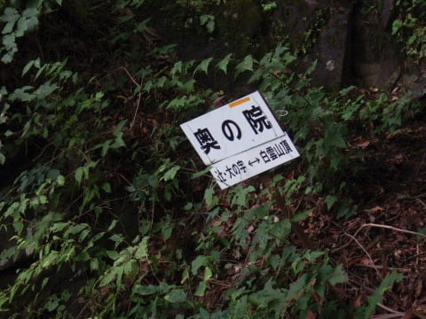

ここから下は，お気楽ルートのはず…！

…と，思いながら．

歩いていくと…

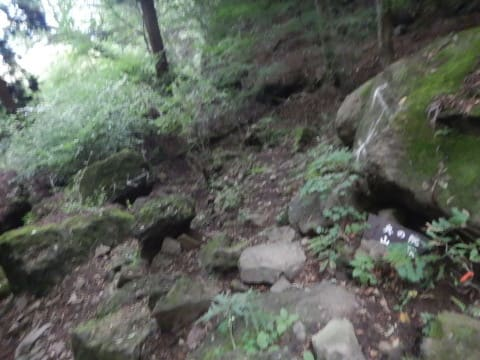

え？

まだ鎖場があるの…？（涙）

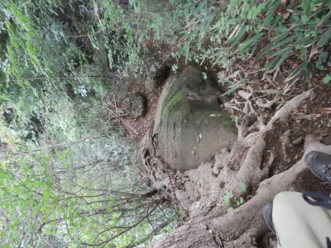

でも．

この程度なら，鎖を使わなくても

降りられるくらいで，鼻歌コース．

後はもう，普通の登山道みたいな感じで．

落ちる危険が無く歩けるなんて，

なんて平和なんでしょう…

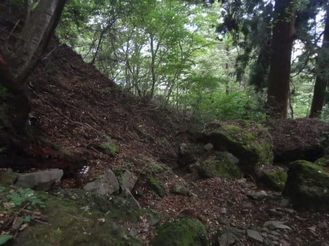

ところどころ，急な下り坂はあるものの…

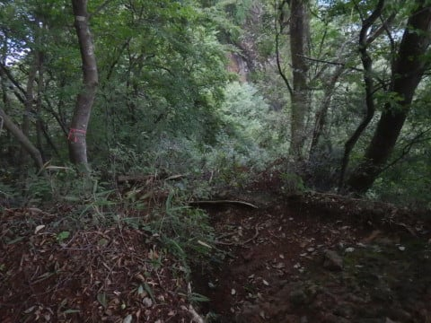

まぁ，平和な登山道を，奥の院から

歩くこと15分程度．

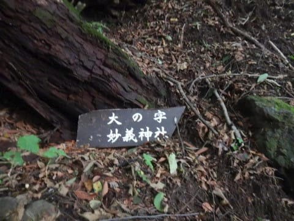

やってきました，大の字へ！

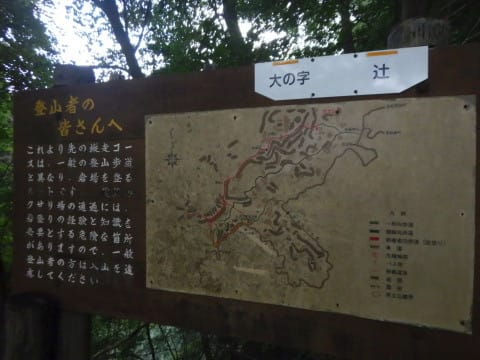

そう．

妙義山と言えば大の字（らしい．私は知らなかった…）．

せっかくだから，大の字を見に行こうかと思ったら．

…

うーむ．

大の字は，この岩の上にあるのね…

この鎖のついた岩を登るのか…

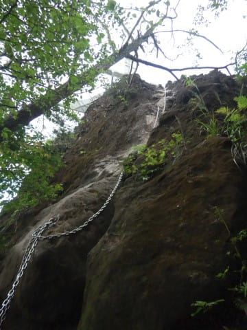

…疲れてるし，わざわざ鎖を登って，

大の字を見に行くかどうしようか…

…

…

と，悩んでいるうちに．

やっぱり登ってしまいました（笑）．

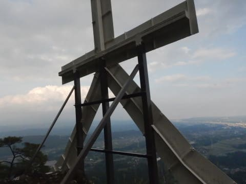

大の字の鎖場は，せいぜい高さ10mあるか

ないかくらいだし．

ご丁寧に，鎖のところにつま先が引っ掛けられる

ステップが切ってあるので，簡単に登れます．

登ったところを上から見ると，こんな程度．

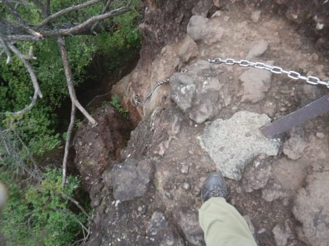

ということで，大の字ですが…

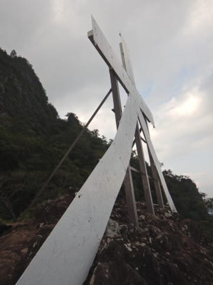

ここは，ようやっとゆっくり座れる広さと，

そして眺望があって．

休憩にはいい感じ…

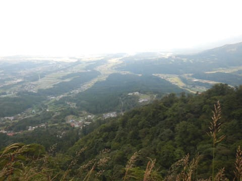

相変わらず目の前は切り立っていて，

落ちると危ないですが（笑）．

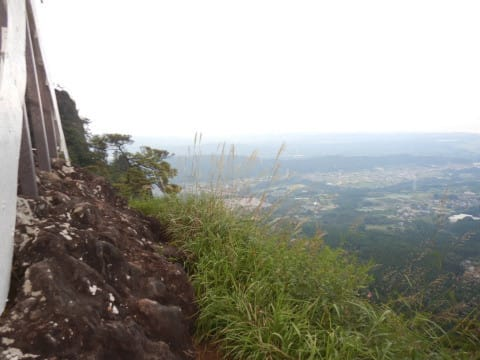

大の字を見たら．

後はもう，なんて事の無い普通の山道．

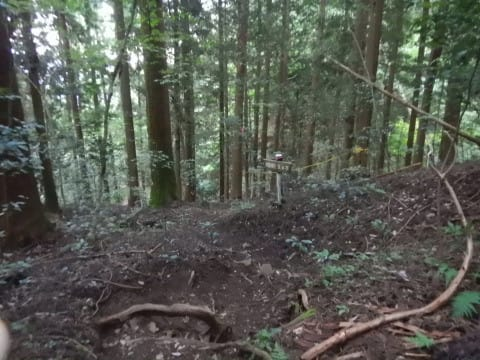

こんなところを30分も，とぼとぼと歩くと…

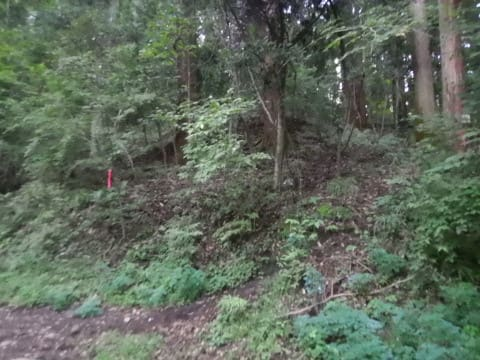

神社の境内へ到着！

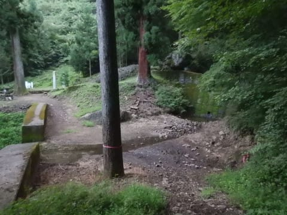

無事，下山しました！

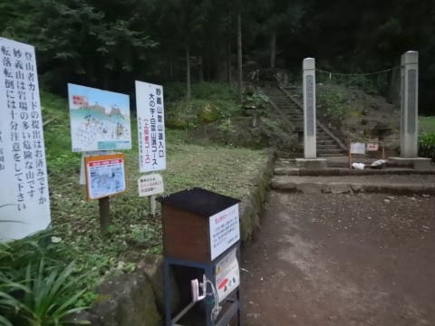

いやーーーー．

疲れた…

すごい疲れる山だった…

…ってか．

大の字から先，体中の筋肉が痛くて，

歩くペースがかなり遅かったので．

普通に歩けば，30分より早く着くかも…

山登りに，これだけ上半身の筋肉を

使うことがあるのか

という，これまでになかった疲労感と．

足も，つま先やらいろんなところにバリバリ

力が入っていたので．

行動時間6時間ちょいの割には，むちゃくちゃ

疲れた山でした…

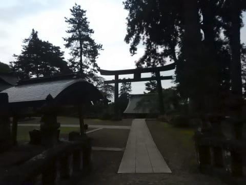

神社の境内で一息ついている時に，

地元の方とお話したんですけど…

やっぱり，毎年滑落したり

怪我する人が何人も出るらしく．

「この間も…」

という，いろいろリアルな話を

きかせてもらいました（恐怖）

いや…怪我なく下山できて，良かった…

ってなことで．

ひと休みすると，逆に身体が固まってしまい．

最後の，神社の階段を下るのがきつかった…

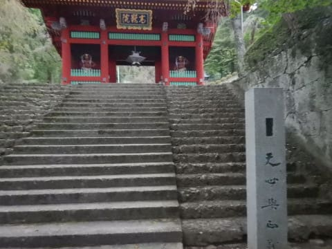

というわけで．

無事，妙義山を一回りしてきたわけですが．

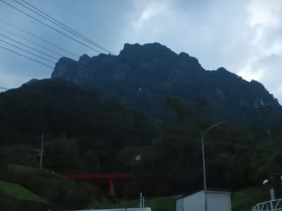

普通の逆の右ルートを行った感想としては．

鎖場が下りメインになり，体力がなくなる

後半に集中するので，あまりお勧めしない

という感じです．

やはり，

元気な前半のうちに鎖場をクリアしちゃって．

そして，上を向いて登れる登りで

鎖場を通過した方が，楽です…

そして，早い段階で難しい鎖場にぶつかれば，

「あ，やめた」

と簡単に引き返せますが．

かなり進んでから，だんだん難易度が上がっていくと，

「ここまで来ちゃったし…」

という感じになります．

妙義山，みんな左回りで行くわけが分かりました．

右回りルートは，同じルートの逆走なのに，

難易度がちょっと上がっている感じがします（笑）．

ただ，登り・下りともにタルワキ沢を使えば，

鎖場1カ所で相馬岳と天狗岳の両方に行って

戻って来られるので．

そのルートなら，タルワキ登りもありかな…

ということで．

わずか標高1100m程度の山ながら，

かなりレベルが高かった妙義山．

登った翌日から数日間，太ももやふくらはぎの

筋肉痛が残るという，これまでで一番

体力を使った登山だったのでした…

…でも，翌日も山に登ってたけど…（笑）

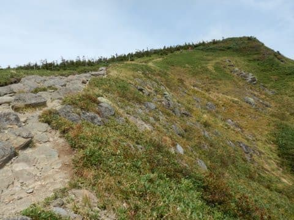

（おしまい）

## 💬 コメント一覧

### 💬 コメント by (mae)
**タイトル**: Unknown
**投稿日**: 2020-10-11 22:01:17

楽しく読ませて頂きました。怪我も無く下山できて良かったですね。

八ヶ岳編（赤岳？）も楽しみにしています。

読んでいて私も同じ感想を持ちました。

鎖場や梯子、浮石など登りよりも下山の方が危険に感じます。

私もいろんな山に登りましたが、何度も怖い経験や不安な思いもしました。

山を舐めてはいけないとつくづく思います。

私の教訓は、いかなるときも平常心で、謙虚であることですが,

ソロでの山登りが大半なのでなおさらですね。

お互いに気を引き締めて行きたいですね。

### 💬 コメント by (Skier_S)
**タイトル**: ＞maeさま
**投稿日**: 2020-10-12 01:35:08

やっぱり鎖場や危険個所は登りの方が怖さが少なく，

それが心の余裕になりますよね…

山を舐めてはいけない．その通りだと思います．

八ヶ岳は，北八ヶ岳なので，北横岳をメインにした日帰りお気楽ルートです．

南八ヶ岳の硫黄岳～赤岳はチャレンジしたいと思ってますが，来年かなぁ…

### 💬 コメント by (アリス)
**タイトル**: 制覇おめでとうございます
**投稿日**: 2020-10-13 08:04:23

Skier_S様

お世話になっております。

妙義山制覇おめでとうございます。

何より無事の帰還何よりです。

想像より険しいチャレンジでしたね。

やはり、登山は厳しいです。

### 💬 コメント by (Skier_S)
**タイトル**: ＞アリスさま
**投稿日**: 2020-10-14 01:12:24

もう，下山した時は，

「生きて帰れて良かった…」

とおもいました（笑）．

ただ，手ごわかった分，達成感はハンパない山でした．

もう，普通の山には登れないかも…（笑）

