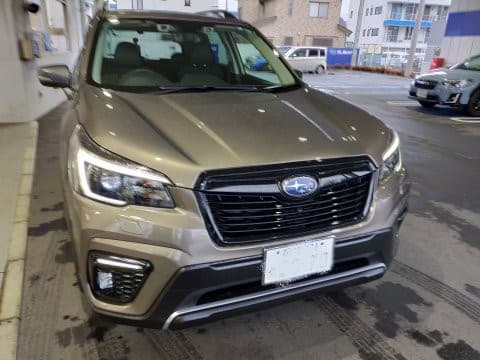
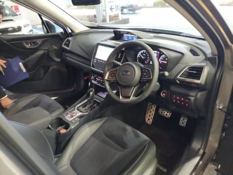
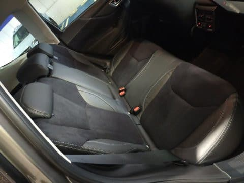
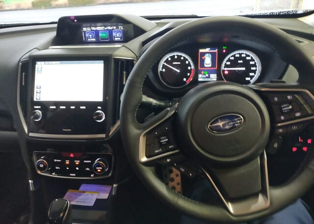

# SUBARU フォレスター SPORT 1.8Lターボ車に試乗してみた

📅 投稿日時: 2021-06-11 01:34:55

🏷️ カテゴリ: [車試乗](c07dec5709d34bd74e1f6cb9c8291061b.md)

ということで．

2日連続スキー板の試乗レポートが続いた

ので．

読者も毎日続くと飽きるだろうと思い…

今日は車の試乗レポートです！←どっちにしろ試乗レポートなんかい！！

かなり前の話になっちゃうんですが…

[LEVORGのフロントストラット交換](eb108d5138d414f76b2fc9cfdf34abf3b.md)に

行ったついでに，新たに1.8Lターボが

追加されたフォレスターの，

1.8Lモデルに試乗してきました！

…というか．

1.8Lターボが追加というよりも

フォレスターは，2.5Lガソリン車が

廃止となり．

e-Boxerの3グレードと，

1.8Lターボを積んだ「Sport」の

4グレード構成になり．

1.8Lはプレミアムグレード扱いで，

e-Boxer車よりもお高くなります．

…まぁ，CB18，ものすごくコスト

掛けてそうなエンジンだしなぁ…

しかし，フォレスターの2.5L，

いい車だったんだけど…

無くなったのが残念．

で．

フォレスターの1.8Lターボ車は，

新型LEVORGとエンジン＆ミッションは同じ．

デフのファイナルも全く同じです．

タイヤ径がわずかにフォレスターが大きいので，

微妙にフォレスターの方がハイギアードだけど

(同一エンジン回転数・同一ミッション変速比で

フォレスターの方が数％速度が速くなる)

ってなことで．

まずは外見ですが…

うむ．デビュー2年目でC型となる今回．

外見はあんまり変わってませんね…

ちなみに，これまでのフォレスターでは

ボンネット上のエアインテークが

ターボ車の印だったのですが．

今回のフォレスター1.8Lターボ．

ボンネット上にインタークーラー用

エアインテークがありません…！！

素直にフロントグリルからダクトで

インタークーラーに空気を引き込んでます．

本来，こっちの方が空力的に望ましいので．

私は好きなのですが…

で．

ボンネットにエアインテークが無いけど．

1.8Lターボ車は排気のテールパイプが

左右2本出しになるので見分けられます！

で．

内装ですが…

運転席周りは，基本的にほとんど

変わってませんね．

ただ，1.8Lターボのグレードはシートが

スエード地になるようで．

リアシートもスエード地ですね…

しかし，フォレスターのリアシートって

改めて見ると，結構広いな…

ってなことで．

いざ，運転席に乗り込んで．

試乗開始！

あれ？

ステアリングが多少重くなった？

以前のフォレスターは，結構ステアリングの

アシストが強く，クルクル回せる感じ

だったけど．

結構反力を出している感じで，

スピードを出して行くとしっかりと

ニュートラルをキープする感…

そして…

A型フォレスターでは，おそらく

オフロードで大きなサスストロークを

使えるよう，バネレートとダンパーが

柔らかめにセットされていたけど…

A型よりサスがちょいと締まった感じ！！

これは…C型でバネレート，ダンピングの

見直しがあったのか．

あるいはSPORTグレードのみ足回りを

締めたのか…

おそらく，SPORTグレードというだけに，

ターボのこのグレードのみ足回りを

硬めにセッティングしてきたのかな？？

オフロードというより，オンロードを

高速で走るのに合わせてきた感．

舗装路でスピードを出して行った時の

フラット感，安定感はこっちの方が

イイのでは…？

…ただ，味わいがヘビーデューティー

オフロードではなく，オンロードカーに

なっちゃった感が多少ありますが…

でも，利用シーン的にはオンロードで

使うことの方が圧倒的に高いので，

こっちの方がいいかも．

あ，ガチガチに硬くなったわけじゃない

ですよ！

A型比で多少引き締まった方向に調整

されてきたかな…という変化です．

あと，A型で試乗したのがX-BREAKで

タイヤサイズが225/60 R17，

今回乗ったのが225/55 R18

と，タイヤの扁平率の違いが効いてる

のかも？

A型も，サスが柔らかいわりにロールが

抑えられていて，左右の切り返しで

揺り戻しが無く，狙ったラインを通り

安い車でしたが．

(BRレガシィの方がロールの揺り戻しが

大きかったかも…)

1.8Lターボは，さらにライントレース性が

上がった感じ…！

背が高いわりに，重心の高さも感じさせず，

かなりハンドリングがいい車ですね…！！

で．

肝心のエンジンですが．

2.5Lから2割トルクアップしている

のもあり，加速感はこれだけあれば

私には十分な感じだし．

登り坂もエンジン回転数が上がること

なく，低い回転数のままグイグイ登って

行きます…

スタート時にはターボラグも感じず，

意外とスタートからトルクは出るし．

パワー感には不満が無いレベル．

ただ，何だろう…

気のせいかもしれないけど．

アクセルに対する反応が，2.5L NAの方が

心持ち素直だった気がする…

トルクは十分なんだけど．

アクセルペダルの加速の動きに対して，

ほんのちょっと．

気にならない程度の応答遅れがあるように

感じるのは，

「この車がターボ車だから，ラグがあるはず」

という私の思い込みかな…？

ただ，普通なら気にならないレベルです．

私のVMG LEVORGのような盛大な

ターボラグ（アクセル一定開度でも

時間が経つと激しく加速度が立ち上がって

いくという，古風なパワーエンジン的ラグ)

とは違って，

言われないと，ターボだと気づかない

レベルですが…

とりあえず．

1.8Lターボになったフォレスター．

トルクも十分，足回りもしっかりしていて．

いい車だな…と思ったけど．

2.5Lと比べてすごく良くなったかな？

と言われると．

燃費もほとんど変わらないし．

微妙な感じ…

2.5Lとお値段が同じなら納得いくけど．

ちょっと値上げになっちゃったのが，

惜しい…
