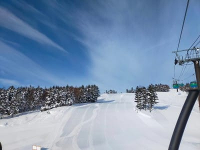

# 今週末も志賀高原で滑ってます～！土曜終日雪降り，日曜と月曜は朝からパフパフパウダーデー！

📅 投稿日時: 2021-12-25 00:20:04

ってなことで．

今日の志賀高原も，良かったみたいですね…

あさイチは晴天だし…

なんだ！！

この最高においしそうなシマシマはっ！！！

…こんな日に滑りたい…

焼額のオリンピックコースも．

奥志賀のエキスパートコースも．

全ておいしそうなバーンですね…

あぁ…晴天シマシマ滑りたい…

とりあえず．

私は今週末も志賀高原へ行くわけですが…

残念ながら，晴天は今日の金曜まで．

今晩から，雪が降り始め…

この週末はひたすら雪が降り続けます．

太陽は拝めなさそうです(涙）

…でも．

いいんだ！

太陽が無くても，パウダーが楽しめるのだ！

特に，26日，27日は激しい降りです！

日，月は朝からすごいパウダーが楽しめそう！

ふははは．

この週末，太板で思う存分楽しむぞ～！←根性の無いスキーヤー

ふるい落とし機能フル発動しそうな週末＆月曜だけど

…ってか，このあと天気図を見る限り．

志賀高原で年内に晴れるチャンスは

29日だけか？？？

あとはひたすらこれから1週間以上，

毎日雪降りの寒い日が続きそうです…

…毎日降らなくていいから，時々晴れてほしい…

ってなことで．

これからあと3時間半後に出発です～！

## 💬 コメント一覧

### 💬 コメント by (レインボー74)
**タイトル**: Unknown
**投稿日**: 2021-12-25 14:30:32

土曜日の志賀高原情報

朝の上林+1℃　蓮池-2℃。道中ガスっていたが、やけびは雲上の楽園。今日も快適な日になりそう。

例によってやけびはどこも申し分ない。ただオリンピックは滑りにくかったようで、人影がどんどん薄くなっていきました。

次は奥志賀だとおもっていたらガスで取りやめ。

今日から開いた三高は、コース幅が半分になってました(残念)。

だんだん寒くなってくるし、根性なしスキーヤーは11時で撤退です。

詳細はナイターまでやろうとしている、ど根性エス様からどうぞ！

### 💬 コメント by (かず)
**タイトル**: Unknown
**投稿日**: 2021-12-25 18:16:03

28日  今日現在やっぱ志賀積もらないですか？野沢分からないですよね…？？？

### 💬 コメント by (なるなる)
**タイトル**: Unknown
**投稿日**: 2021-12-25 19:31:43

志賀高原来ちゃいまして、27日まで滞在なんですが、無事に帰れるんでしょうか?

かなり前の、高速通行止めで帰宅したら朝方の衝撃的な投稿が忘れられず、少し不安になっています。

まぁ、考えても仕方ないので、帰りの事は考えずに楽しみます。

### 💬 コメント by (Skier_S)
**タイトル**: 予想より降雪が弱い…
**投稿日**: 2021-12-26 00:23:35

＞レインボー74さま

ナイターまでやっていたS氏が，ちゃんとレポート書いておきました

＞かずさま

うーん．

膝パフまで行ってくれるか微妙…

野沢の方が積雪が深いことは間違いないです．

＞なるなるさま

あれ！！

志賀に来てらっしゃるのですね…

明日お会いできるといいですね．

今回，高速が通行止めになるほど降らないんじゃないか，と

楽観していますが…

