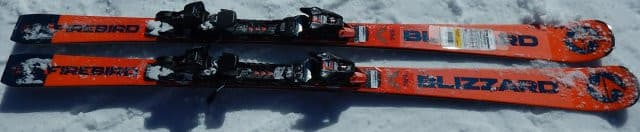
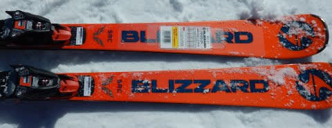
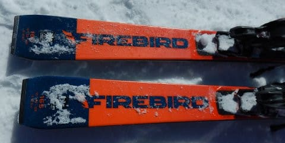
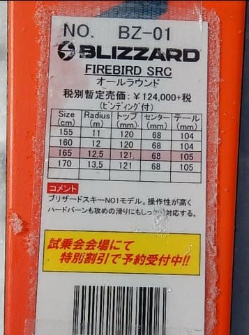
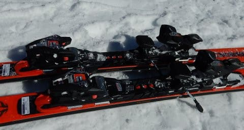

# 2020シーズンモデルのスキー板，試乗レポート…BLIZZARD編その1

📅 投稿日時: 2019-05-17 02:31:54

🏷️ カテゴリ: [スキー板試乗](c0bd8048615710cee890e403a36cc9a2b.md)

うーむ．

どうやら今週末も．

かぐらはテクニカル・ジャイアントとも問題なく

滑れそうだし．

パノラマコースの，第4ロマンスも動くみたいだし．

みつまたまで滑れるみたいだし．

…ファイナルの1週間前と考えると，かなりの

上出来なのではないかな～…

ってなことで．

今日は3日続けての，スキー試乗レポート．

ブリザード編です．

…昨シーズンはブリザード履いてない気がするので，

久しぶりですね…

では，どうぞ～！

○BLIZZARD FIREBIRD SRC +XCELL12 DEMO　165cm

基礎小回り．

説明書きの分類には，オールラウンドって

書いてありますけど…

一応，R=12.5と完全小回りのサイドカーブだし．

ゲレンデ用トップモデルなので．

日本的分類なら，基礎小回りになるかと思う

この板．

ビンディングは，ワンタッチでサイズ調整が

できる，MARKER XCELL12 DEMOビンディングが

着いてるモデルで，Pistonプレート付きの

モデルではありません…

この板は，結構固めのフラット斜面を滑って

見たところ．

これも，結構気持ちがいい板です…

硬い斜面でもしっかり食い込む，強烈な

エッジグリップがありますが，

R=12.5という小さなサイドカーブの割には，

板が過剰に回りすぎることは無く．

抑えないでおけば，ガッツリグリップして

ロングまで引っ張れますし．

しっかりたわませて回していけば，

かなり傾いたガッツリカービング小回りを

決めることもできます．

旋回力やトップがインに入ってくる感じは，

OGASAKAのTC-SSよりは弱いけど．

TC-SSは小回り特化スペシャルマシンという

感じがするのに対し．

板が過剰に回ってこないので，

小回りメインの板だけども，

どんな旋回半径でもイケる幅の広さを

持っています．

NordicaのSLRほどではないけど，

結構張りも強めで，返りにしっかりした

ばね感があり．

サイドカーブというより，この張りと

返りを上手く使って，小回りを作って

行く感じ．

ガッツリカービングが大好きだけど．

小回り特化型板ほど強烈な旋回性能を求めず．

小回りベースだけど，いろんなターンをする

オールラウンドチックな使い方もしたい…

という人にはおススメできる板です．

結構気に入りました．
