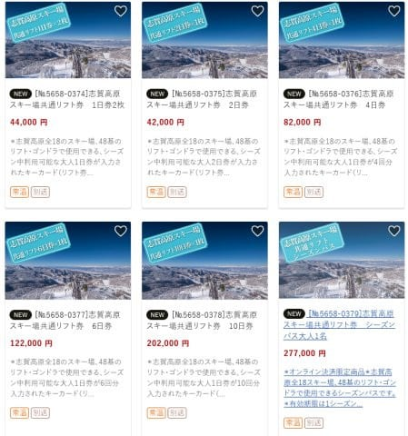
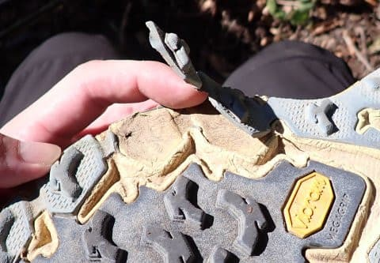

# ソールがはがれたHOKAの山歩き用の靴，購入先に問い合わせてみた

📅 投稿日時: 2022-10-08 04:03:22

えー．

昨日，志賀高原の全山共通リフト券の

値段が出た記事を書きましたが．

リフト券のお値段が無事決まったので，

ふるさと納税の山ノ内町の返礼品リストに

志賀高原リフト券が追加されてました～！！

44,000円納税しても一日券2枚という感じ

ですが，ふるさと納税しようとしている方は

納税先の候補にいいかも！

…ってなことで．

[先週の山歩き](e91cda3f43c16339f6913c78164bf7052.md)で，まだ6回しか履いて

ないのにソールがはがれてしまったという，

ちょっと残念なHoka oneone のSpeedgoat Mid GTX．

まだ，購入一年経っておらず，保証期間内

だったので，ダメもとで購入先に写真を

送ってみたところ…

「写真確認しました．メーカーに確認するので，

　モノを送ってください！」

ということで，メーカー確認に出すことに

なりました…

この靴．

 Super Sports XEBIOさんからAmazon経由で

購入したのですが．

Amazon注文履歴から出店者へメッセージが

送れるので，そこでメッセージを送ったところ．

速攻で回答をもらえて，返送用の伝票と

梱包材を送ってくれました…

いや．予想以上に素晴らしい対応で，

そこまでしてもらって，なんだか逆に

申し訳ない感じ…

とりあえず，販売元のXEBIOさんは快く

不良確認を引き受けてくださいましたが．

メーカーの確認で，

「いや…あなたの使い方が悪いんじゃないでしょうか…」

と言われる可能性もあるわけで．

その場合は，残念ながら私の利用法では

この靴は6回程度の山歩きで寿命が来てしまう

ということになるので．

次は，もう少しソールが頑丈そうな，

La sportivaとかに乗り換えてみようかな…

でも．

他のメーカーの靴に乗り換えても．

もし私が，スキー板だけじゃなく，

山登り用の靴を劣化させる電磁波

を放射しているのだとすると．

また，すぐダメになっちゃうのかも…

という恐怖におののくSkier_Sなのだった…
