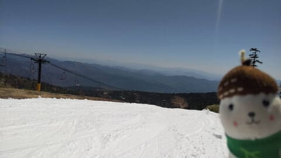
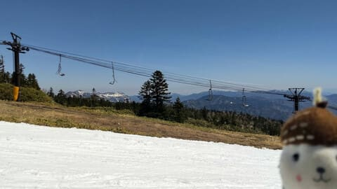
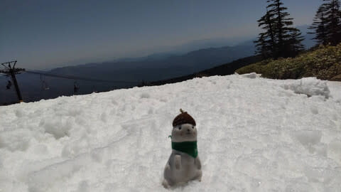
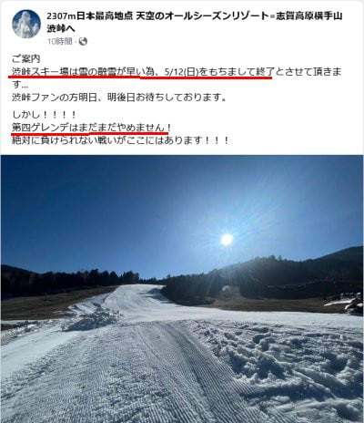
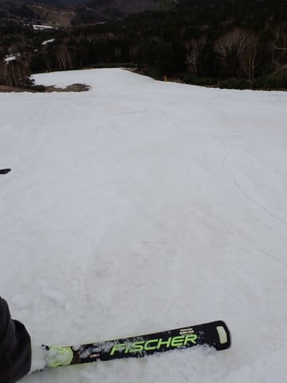
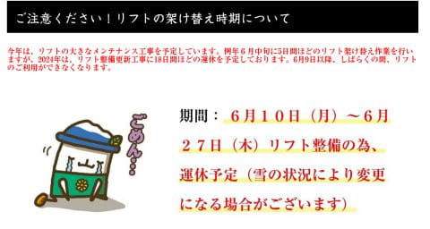

# ええ！？渋峠スキー場も5月12日で営業終了！？でも横手山第4ゲレンデはそれ以降も営業！月山は6/10～17の18日間リフト運休（泣）

📅 投稿日時: 2024-05-11 01:23:27

えー．

本日もおこみん特派員が写真を送って

くださいましたが．

おこみん特派員は今日も渋峠に行っていた

みたいですね！！

雪が降った先日と違って，

今日は朝から晴天！！！

朝はそこそこ冷えて硬さのあるシマシマ雪

だったようで，2時間くらいは雪も緩まず，

そんなに荒れないバーン状況だった

ようですが…

昼間は日差しと気温でやっぱり雪が

緩んだようですね．

ってなことで．

一見特派員写真では雪がまだまだ

あるように見える渋峠ですが．

なんと…

なんということか．

雪が多い年は6月までもつこともある，

志賀で最後まで雪が残る渋峠スキー場が．

どうやら雪がなくなり，

渋峠スキー場は今週末で営業終了

となるようです…（泣）

（[横手山スキー場Facebook](https://www.facebook.com/yokoteyama2307/posts/pfbid0fLsZASGuDkgfv5zq6cowurhKCLpAzyMerCK5KbHnpM8QRYxFrjFqa81zATCCqLwxl)より）

…ただ．

上のFacebookの後半に書いてあるように．

先週末にまだ雪が残っていた，

横手山の海和ゲレンデは，

渋峠が終わっても営業を続ける

みたいです～！！！

（5月6日の写真）

まさか，渋峠が終わった後まで

南向きの海和ゲレンデの雪がもつとは…！！

さすがに11月上旬からの営業を目指し，

必死に人工雪を打っていただけのことは

ある…

とりあえず．

今週末まではかぐら・渋峠が滑れて．

来週以降もリフト営業が続くのは月山と

横手第4リフトになりますか…

でも．

月山は夏スキーの追い込み時期の

6月10日～27日に，18日間という長期に

渡ってリフトが運休になるようなので…

実質は月山も例年より早い6月10日に

営業終了になると思った方が

良さそうですね…（泣）

（歩いて登る特異な人は除く）

（[月山観光開発（株）ホームページ](https://gassankk.co.jp/?fbclid=IwAR2oKxDZy6rKx-GPioUeN362tp4GzJN7BaWDzxhPuGCtdAZHhcpALUL7uhw_aem_AUOOQnkELchtm1NtwlISsJ7yfZ7z_FMnsKmUF3cpo6CAKXvcDj-vVL6fWv4WoRQydHO5T6rpMm6-rs5uXyoNuUT2)より）

うーむ…

焼額が例年通りのGWラストまで営業できた

から安心していたけど．

やっぱり暖冬だった今シーズン．

シーズン終わりは例年より早かったか…（激泣）

私が今シーズン滑るのは，今週日曜日帰り

かぐらと，あとは月山1回くらいで

終わりそう…（泣）

今シーズンもご無体仕事で滑りに

行けなかった週末もあったし，

昨年よりはマシとはいえ，

滑走日数55日ほどと，例年より

10日以上滑走日数が少ない

シーズンになっちゃうよ（泣）

うーーーん．

どうして夏になると雪が解けるのか…

年中冬ならいいのに…っ！！

また，年中滑れる[SSAWSみたいなバブルな建物](ed050e93e6a287b570a1de21038fdc782.md)が

復活してほしい…

と願う，Skier_Sだったのでした．

## 💬 コメント一覧

### 💬 コメント by (ねも)
**タイトル**: Unknown
**投稿日**: 2024-05-11 18:54:33

Ｓさん　お疲れさま。

55日滑っても例年より少ないとは、さすが！　または凄い！

東京オリンピック始まる４連休に月山を歩いてたら、わずかに残っている雪で滑っている方が結構いました✌️

秋田の低山を下山中に右足首を骨折💧　能代で入院しています(ﾟ-ﾟ)

### 💬 コメント by (Skier_S)
**タイトル**: ＞ねもさま
**投稿日**: 2024-05-11 23:35:11

え？骨折で入院ですか！？？

それも能代で…！？？？

来シーズンのシーズンインまでに復活間に合いそうなのでしょうか．

お大事にお過ごしください．

