# 2024年8月，今年も座間味で親子ダイビング！その21…沖縄県立博物館・美術館にちょっと立ち寄ってみた

📅 投稿日時: 2024-09-22 03:10:14

🏷️ カテゴリ: [ダイビング日記](ce3a7a8d424d112fce83ee85c81a0e344.md)

えー．

今回の座間味旅行記の記事を書くにあたっては

基本的に自分が撮った写真を使っているので，

娘が撮った写真は見ていなかったのですが…

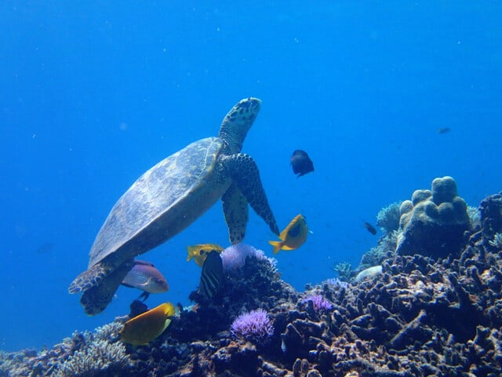

今回，じっくり見返してみると．

私のように外部フラッシュやフィッシュアイ

レンズを着けているわけではない，普通の

Olympusのコンパクトデジカメで撮っている

わりには，面白い写真を撮ってるじゃない

ですか！

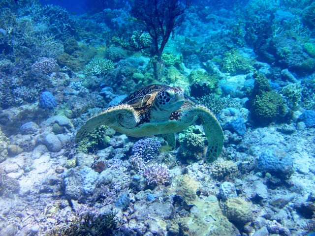

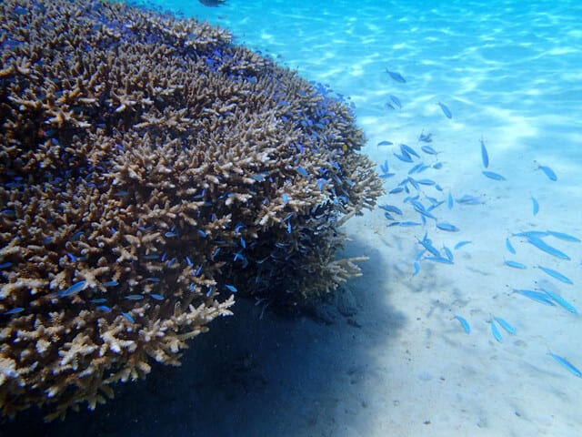

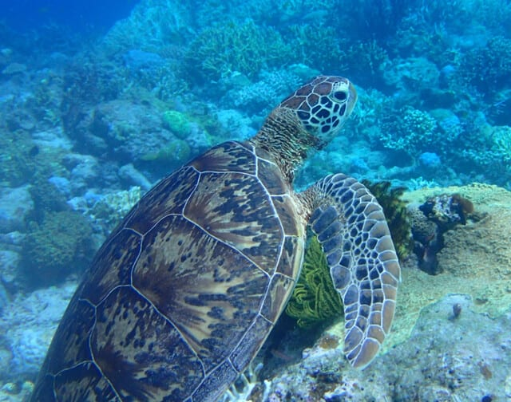

そして．私が気づかないうちに，

たくさん写真を撮られていたようです…

結構な枚数，私が必死に写真を撮っている

ところを激写されてました（笑）

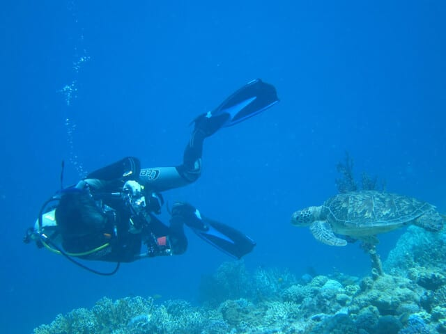

うーん．

なかなか自分が潜っている写真というのは

見る機会がないですが．

このBlogに掲載されていた水中写真は，

こんな感じで撮られていた写真だというのが

よくわかるかと…

うん．我が娘，ナイスシャッターチャンスを

捉えているのかも…（笑）．

ってなことで，本題へ．

もうレポートはダイビングが終わった後の

報告で，水中写真は出てきませんが．

今日も座間味のダイビング旅行記です…！

ーーー

（[前回はこちら](ea36b22791d8ce38fa90e1a9cb8e57a9b.md)）

ということで．

高速船は12時10分に泊港に到着しましたが，

今回，帰りの羽田行きの飛行機の出発時刻は

ちょっと遅めの16時過ぎ．

飛行機の時間まで4時間以上ありますねぇ…

だもんで，港から直接空港に行くのでなく，

ちょっと寄り道していきますか！

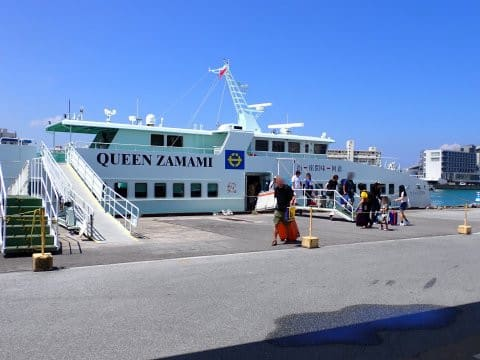

果たしてどこに行くべきか，ちょっと

悩んだけど．

時間がそんなにないので，あまり遠くに

行けないなぁ…ということで．

今回行くのは泊港から徒歩20分ほどの，

沖縄県立美術館・博物館．

泊港からお手軽に歩いて観光に行くのに，

ちょうどいい感じの場所にあります．

ってなことで．

暑い中歩いていくと…

なんだかコンクリートのトーチカみたいな，

不思議な建物が見えてきました．

あれが沖縄県立美術館・博物館か…！！

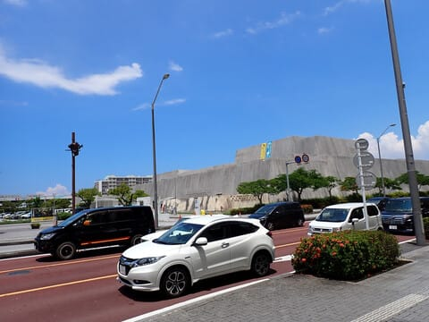

なかなか立派なエントランスですね．

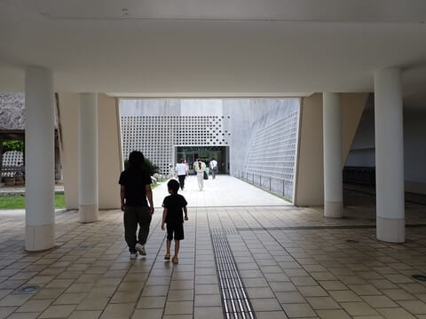

今回は時間が無いので，博物館一本

勝負．美術館はスルーします．

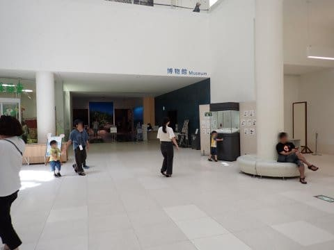

入口のロビーには立派な骨格標本

とかがありますが…

中は基本的に撮影禁止（涙）

沖縄の地理的な成り立ちや，

古代から現代までの生活・文化と

歴史がかなり盛沢山に展示されていて．

私は2時間でも十分見切れなかった…

博物館が大好きな私は，めちゃくちゃ

満足！！

もう少しゆっくり時間をかけてみたかった…

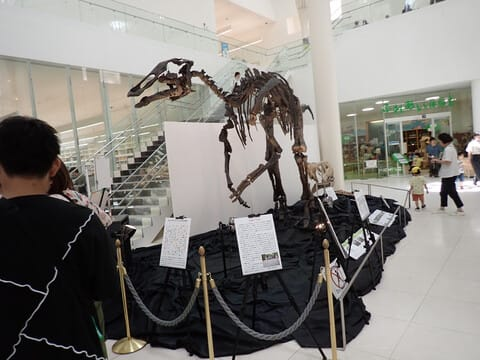

ただ，そこまで博物館が好きじゃない家族は

1時間程度で飽きてきたようなので…

もう少し見ていたかった博物館を

後にして，次は博物館から2ブロック，

200mほど離れたところにあるDFS那覇へ

立ち寄ってみましょうか…

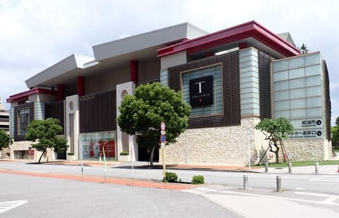

いや．

当然のごとく，私はDFSには全く興味が

ないのですが．

我が家の女性陣が喜ぶかな，と思って…

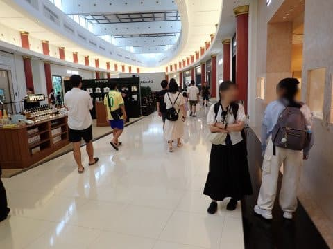

私はひたすら暇をつぶしてましたが．

意外と物価が高かったのか．娘と妻が

小物1－2点買っただけで終了．

まあ，妻も一度来てみたかったとは

行っていた場所だったので．

今回立ち寄れただけで満足かな…

そして．

大変便利なことに．

このDFS，ほぼモノレールのおもろまち駅に

直結しているので．

ここからすぐにモノレールに乗って，

空港へ向かうことができます！

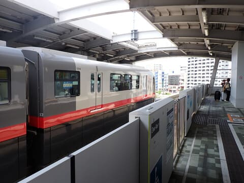

泊港からだと，モノレール安里駅を

使う人が多いと思いますが．

おもろまちから泊港もほぼ距離が

変わらず，途中DFSと博物館に寄れるので．

時間の余裕がある人は，このコースも

おススメ！

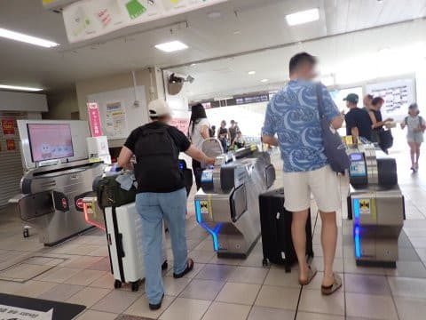

ってなことで．

結構ゆっくり見たつもりだったのに．

3時過ぎには空港へ到着！

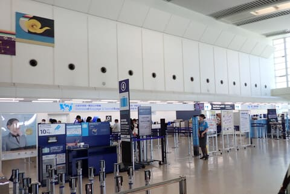

いつもは結構ギリギリに空港に飛び込む

ので，帰りの那覇空港はあんまり

のんびりした思い出はないのですが．

今回は時間があるので，ゆっくり

お土産物屋を見て，ラウンジに寄る

時間がありました…

那覇空港のANAのラウンジ，改装後

初めて寄りましたが，かなり広く

なりましたね…！

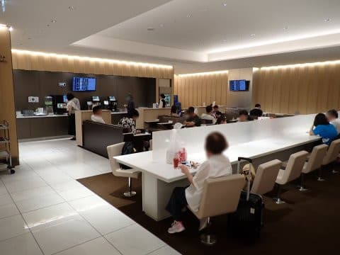

で．

ラウンジでビールを飲んでくつろいだら，

出発時間が迫ってきたので，ゲートに

向かいます．

お盆時期なので，空港はさすがに混んで

ますね…

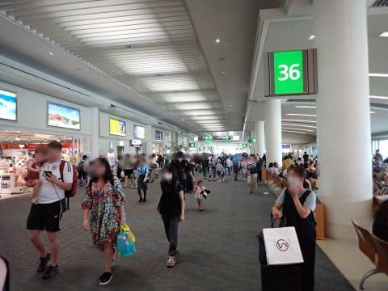

ってな感じで．

帰りの飛行機への搭乗が始まりますが．

定刻からちょい遅れ，10分ディレイでの

搭乗開始です．

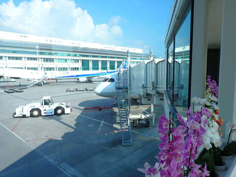

（[続く](e6efedd95cc3144c17ff4406bc052520b.md)）
