# スマートウォッチ，Amazfit GTRをスキーでしばらく使ってみて…GPS精度はどのくらいか？？

📅 投稿日時: 2020-04-23 00:29:58

スマートウォッチ，Amazfit GTRについての記事を，

これまで何回か書いてきましたが．

その1．[購入レポート，](e07b216ec3b426f7a5a1462a3b6fd1c02.md)

その2．[開封＆試してみた感じ，](edd1205f6bd9cd6dadb50e4fc6316b747.md)

その3．[アクティビティーログ](ecd7317c7980728b41dae1a21fe835803.md)

その4．[スマホアプリのインストール＆設定](eb88e9293dae421d12f27fe8b5b363344.md)

その5．[スマホアプリを使ってみた](ecf2d1a51d5012b9edf9fbf5307e586db.md)

番外．[常時点灯機能追加！](e031a6cc94592b655560de20fc58cacf1.md)

番外その２[常時点灯の表示モード追加！](ec221351f854b20de445e565d66acdf55.md)

その6．[GPS精度が低いのが欠点](eef49f5206ed798087941af71eebf0dee.md)

その7．[GPS精度，ちょっと改善したかも](e9f927972612f60570f5a704fb48030f8.md)

その8．[スキーモードを使ってみた](e29f3f0e50c4f1facc44bbff6d4859de6.md)

その9．[スマホアプリでログを見る](e759b2c876cb9c8b604ea08e152e39c20.md)

その10．[Auto pauseを切ったらどうだったのか？](e6095de159b336f431785b0cbbad1f6ab.md)

その11．[スキーでしばらく使ってみて？](e4de6cfa5a1f3cd4b4d3410691b1d2a05.md)

前回は，スキーで使ってみた感想を書きましたが．

今回はその際に

「後で詳しく書くね～！」

と書いた，GPS精度について，ちょっと詳しく

書いてみようかと思います…

また，志賀高原マニアクイズもあるので，

皆さんチャレンジを（笑）．

えー．

前回も書いたように，Amazfit GTRの欠点は，

[GPSの感度がそれほど高くない](e4de6cfa5a1f3cd4b4d3410691b1d2a05.md)こと．

GPS感度改善のためのファームアップが

何度もかかりましたが，

時計本体が金属筐体のため，GPSアンテナの

感度が取れてないんじゃないかなぁ…

屋外でも時々GPS電波を見失ったり，

精度が数10m単位で悪化します（ちょい涙）

まぁ，とはいえ．

この程度の縮尺で見て，

今日はどのあたりを滑ったのかな？

ってのを見る程度であれば，十分

使えるレベルです．

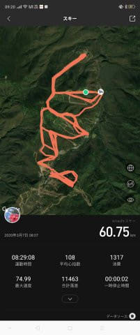

GPS電波を確実に捉えられる場所なら，

もう少し拡大してみても，どのコースを

通ったか…という程度なら十分使えます．

これは一の瀬ファミリースキー場の拡大ですが，

赤いパーフェクターコースを通ったか，

水色のパノラマコースを通ったか…

くらいの判断はできます．

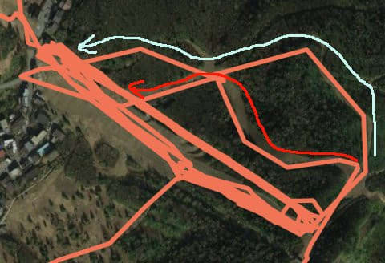

ただ，基本的に精度は10m以上の誤差が

ある感じで，

コース付近をさらに拡大すると…

水色のコースを滑っていても，

軌跡はコース外の森の中の

木々をかき分けながら滑った

ことになっちゃってます（涙）

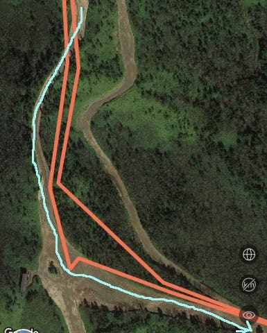

（志賀高原マニアクイズ【その1】：ここは焼額のどこでしょう？？）

そして，10秒くらいの結構広いインターバルで

しかGPS測位していないからか，軌跡がかなり

カクカクした感じになっちゃってますね…

ここなんて，水色のコースを滑っているのに．

軌跡はかなりカクカクした感じで

水色のコースから大きく外れ，

森の中を突っ切った軌跡になってます…

（赤く括ってあるのはゴンドラで登ってる時の軌跡）

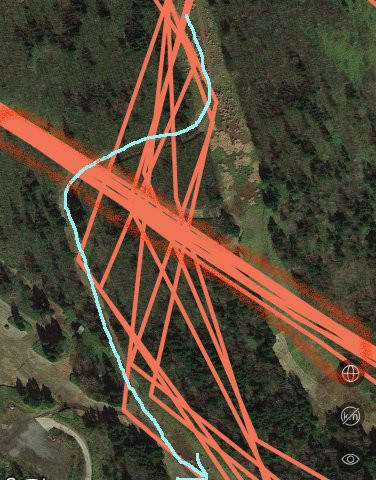

（志賀高原マニアクイズ【その2】：ここはどこ？）

もしホントにこのオレンジ色の軌跡通りに

滑ってたら，森の中に突っ込んで

死んじゃってますね…(笑)．

このカクカク具合だと，GPS測位インターバルは

30秒くらいあるんじゃないかな？？

と思うレベルなんですが…（ちょい涙）

うーん．

電池もちはすごく良くて，1泊2日＆ナイターで

朝から晩までGPS入れててても充電が要らない

くらいなんだけど．

それはGPS測位間隔を犠牲にしてるからかな？？

そして．

GPSアンテナの感度が低いため．

周りに木や建物がある場所は

精度がかなり低くなります…（ちょい涙）

例えば，この部分．

赤い矢印に沿ってリフト乗り場に

滑りこんでいるんですが．

どうもこのリフト乗り場近辺のGPS

電波，建物が障害になって弱くなるのか．

赤い丸で記したように，なぜか

毎回毎回森の中に30mくらい突っ込んでから

リフトに乗ってることになってます（涙）

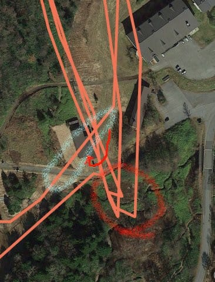

（志賀高原マニアクイズ【その3】：ここは何リフト乗り場？）

…いや．

いくらなんでも，毎回森の中に

突っ込んでからリフトに乗る趣味は

無いですから…

さらには同じ写真，水色の丸で

括った部分のように．

なぜかリフト乗り場の建物の上を

突っ切って滑ってることになってます…

…いくら私でも．

リフト乗り場の屋根を飛び越えるのは無理だし．

リフト乗り場で，リフトに乗ろうと

している人の前を横切って，

さらにリフト乗り場の壁をぶち破って

滑る趣味はありません．

さらにここは焼額1ゴン乗り場ですが．

赤い丸で囲った軌跡は，プリンスホテル

東館の壁をぶち破って滑ってますね…

私には，プリンスホテルに自爆テロを

しなきゃならない理由は無いですし．

生身だとさすがにプリンスホテルの建物に

負けちゃうと思います…

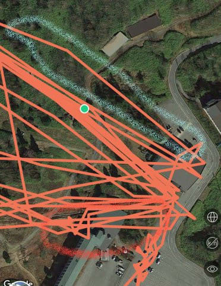

水色の部分も，激しく森の木々を

なぎ倒しながら移動していることに

なってますね…

おそらくこの軌跡通りの移動を

していたら，全身傷だらけですね…

そのほか，高天ヶ原から西館へ移動する橋を

渡った軌跡も，なぜか橋から駐車場へ

飛び降りちゃってますね．

おそらく，ホントにそんなことをしたら，

骨の3-4本は覚悟しないといけませんね(笑)．

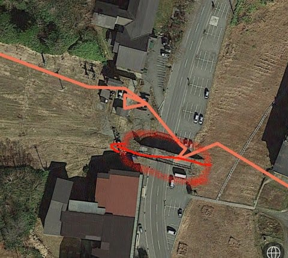

まぁ，このくらいの誤差ならせいぜい

10mちょいだから，まだ許せるか…

でも．

なぜかいつも一の瀬ダイヤモンドは

GPS信号が弱くて．

そのため，一の瀬ダイヤモンドを

滑った記録はちょっとひどい感じに…（涙）

赤丸で記したのは，トラッキングしきれずに

途中で軌跡がちょん切れてる部分．

そのほかにも，坂を上り返したことになってる

軌跡やら，

滑った思い出のない水色の丸の部分にも

軌跡が残ってたり…

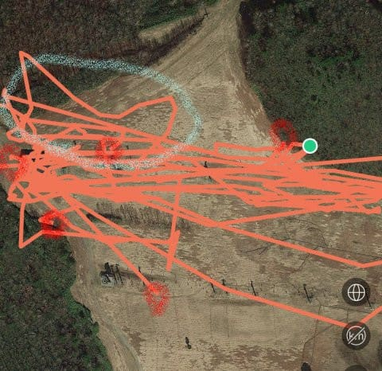

一の瀬ダイヤモンドナイターでは，

3000mほど滑走標高差を滑っても，

Amazfit GTR君は

「500mほどしか滑ってないよ」

とのたまいます…（泣）

ってな感じで．

GPS精度が低めで，さらに記録間隔もちょっと

インターバルが広いため，

標高差や滑走軌跡にすごく細かい精度を求めると

厳しい感じですが…

でも，大体の場所なら，コースから時々

はみ出してることにはなるものの，

こんな感じでどのコースを

滑ったかの判断には十分に使えるし．

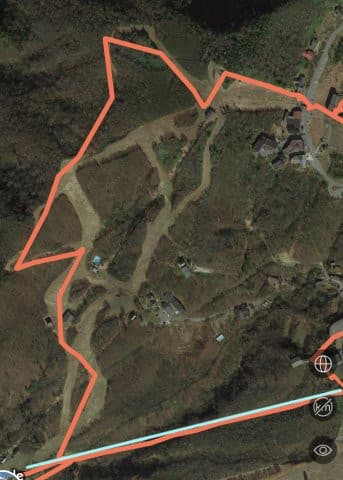

（志賀高原マニアクイズ【その5】：私は何コースを滑ったのか？そして水色は何リフト？）

電波が強い見開かれたコースの真ん中を

滑れば，コースのどのあたりを滑ったかまで

大体分かります．

（水色はリフトに乗った軌跡）

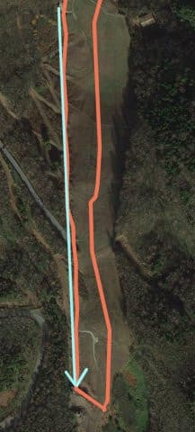

（志賀高原マニアクイズ【その6】：これは何スキー場？）

ってな感じで．

GPSの感度がそれほど高くなく．

電波を遮る木々が多めの林間コース

とか，コース脇とかはちょっと弱い感じが

ありますが．

スマホでいろんなデータが見れたり…

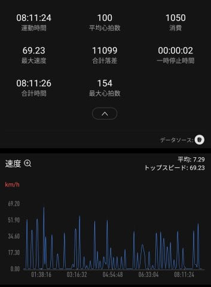

滑ったトップスピードなんかも分かります．

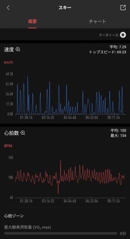

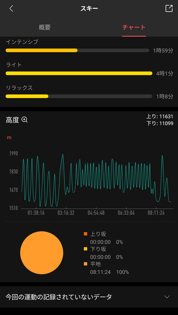

さらに標高差＆心拍数のグラフの

詳細や…

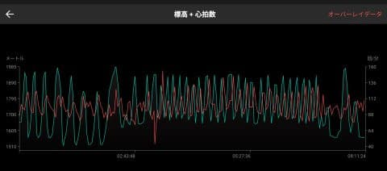

標高差＆速度グラフが見れたりするので．

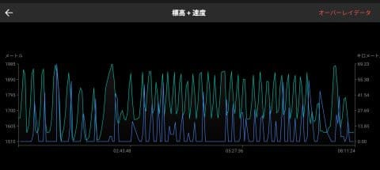

滑走本数も大体分かりますし．

まぁ，滑走距離や標高差の精度を問わず，

大体どこをどのくらい滑ったか…

の目安として使うには十分かな～．

それよりも，メールの着信や，LINEのメッセージを，

滑っている間にスマホを見ずに確認できるのは

すごい便利なので．

まぁ，私としてはこれ無しにスキーができない

身体になってきました(笑)．

結構便利ですよ～！！

## 💬 コメント一覧

### 💬 コメント by (yumi)
**タイトル**: Unknown
**投稿日**: 2020-04-23 07:20:01

Ｓさぁ～ん🤔🙄😁

クイズの その５が ぬけてるよー☺️

我が家は 勿論❗️全問正解⭕️

✨✨✨✨✨の、予定😁✌️

答え合わせが 楽しみ🎵💖🎵

### 💬 コメント by (yumi)
**タイトル**: Unknown
**投稿日**: 2020-04-23 07:23:27

あっ‼️

間違った😅

ぬけてるのは、その４でしたぁ～😅

### 💬 コメント by (Skier_S)
**タイトル**: クイズの答え
**投稿日**: 2020-04-24 00:11:54

マニアクイズその1：焼額の第2ゴンドラ側，パノラマコースと白樺コースの分岐点付近

マニアクイズその2：焼額の第1ゴンドラ側GSコース下部，ショートカットコースと

GSコースう回路の分岐～GSコースのう回路とオリンピック・ミドルコース下部との合流付近

マニアクイズその３：焼額第2高速乗り場

マニアクイズその５：西館初級コースを降りて発哺クワッド

マニアクイズその６：ジャイアントスキー場

### 💬 コメント by (Skier_S)
**タイトル**: ＞yumiさま
**投稿日**: 2020-04-24 00:17:59

あら！ホントだ！

その4が無かったですね…

でも，yumiさんなら間違いなく全問正解でしょう…（笑）．

### 💬 コメント by (西館)
**タイトル**: 先に回答を書かれてしまいました～
**投稿日**: 2020-04-24 01:07:42

本日は始発～終電勤務でたった今帰宅して、お昼ご飯食べながら記事を読んで、職場では回答書けないので、

どーせＳさんは明け方に更新するであろうから、帰宅したら即コメするんだも～ん♪と帰宅したのですが｡｡｡

あ”あ”あ”あ”間に合わなんだぁぁぁぁ

後出しになってしまいましたが、辛うじて全問正解だったもんね(∩´∀｀)∩ﾜｰｲ　

そして、西館掲載して頂いてありがとね！お宿まで写ってるわ<(*¯꒳¯*)>

### 💬 コメント by (Skier_S)
**タイトル**: ＞西館さま
**投稿日**: 2020-04-25 03:04:45

えーー！

この時期に始発から終電ですか…

お疲れ様でした．

で，全問正解おめでとうございます！

定宿も写ってましたか（笑）．

