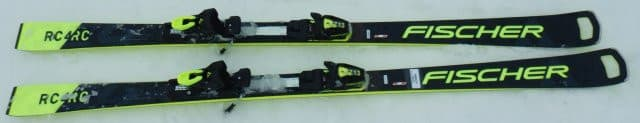
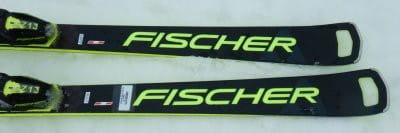
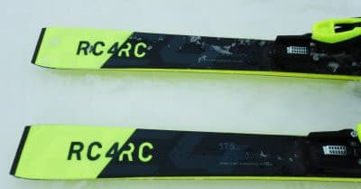
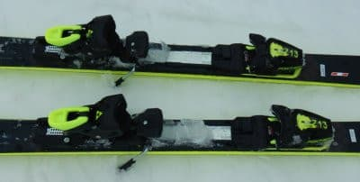

# 2022シーズンモデルのスキー板，試乗レポートその4…FISCHER RC4 Worldcup RC Pro

📅 投稿日時: 2021-06-04 04:14:32

🏷️ カテゴリ: [スキー板試乗](c0bd8048615710cee890e403a36cc9a2b.md)

今やっている仕事が，なかなか香ばしい

危険な香りを発し始めており．

ここ数日，とんでもない更新時間に

なってることが多いですが…

今日もヤバい時間に更新！！

ホントにいつ寝てるんだ？＞自分

このままだと．

志賀もかぐらも終わった今．

スキーに行けないのでストレスが

発散できず，死んでしまう…！！←普通はこの睡眠不足の状態でスキーに行った方が死ぬから

ということで．

状況はヤバいですが．

先週末にちょっと試乗レポートを書きためて

おいたので．

今日も2022シーズンモデルのスキー板の

試乗レポート，更新っ！！

今日はフィッシャー編．

では，どうぞ～！

○FISCHER RC4 WORLDCUP RC Pro　175cm

大回りベース基礎用

この板も，2021シーズンからの

完全キャリーオーバーで，全く変更が

入らないようですね…

FISCHERのRC4の基礎向けシリーズは，

小回り用SCと大回り用のRC，

そして小回りサイドカットながらも

板が強めのCTとがありますが．

こちらはサイドカーブが18mとなる，

大回り用のRC．

SCとRCには，M/Oプレートの着いた「Pro」と

M-trackが着いたノーマルバージョンがありますが．

こちらは，しっかりしたM/Oプレートが着いた

「Pro」の方です．

滑ってみたところ…

ここ数シーズンのFISCHERの特徴である，

すっとたわんで，たわみに乗っていい感じで

回っていき，切り替えに向けてたわんで

溜まった圧がポンと帰ってくる，バネ感が

強い板．

ターン始動時に，たわみ量で回転弧が

コントロールできるので，しっかり

カービングした中でも回転弧を自由に

作れます．

板なりの回転弧でしか曲がれないのでは

なく，乗り手の板への働きかけで自由に

たわみを変化させて弧を作って行ける，

コントロール性の高さを感じます．

そして，マキシマムを超えたあたりから

板がぐっと粘って，しっかりグリップして

板に圧が溜まっていきます．

で，切り替え時にたまった圧が返ってくる

スピードは小回り用のSCほど早くなく，

SCに比べるとゆったりと返ってくるので，

大回りで滑るのにちょうどいい感じ．

R18の大回りの板にしては旋回力が

強く感じ，フルキャンバーのはずなのに，

谷回りでトップを抑えに行かなくても

板がトップから捉えて回り始めるという，

ロッカー板っぽいオートマチックな

ターン始動で，かなり楽にターンに

入れます！

そしてそこから，ターンを縦目に

落としていくこともできるし．

圧をかけてミドルからショートっぽい

ミドルまでもっていくこともできるし．

コントロールの幅が広く，ロングの

板としてはいろいろつぶしが効く

板ですね～．

ずらしとカービングの出し入れも

そこそこコントロールできるので，

かなり汎用性が高そうです．

ただ，この板は，ずらしていくより

ガッツリカービングさせて，カービングの

弧をゆがめて楽しむのが気持ちいい板．

175cmであれば，R=18という回転弧から

感じる印象よりは取り回しやすく，

それでいてガッツリグリップして

ハイスピードクルーズが気持ちいい

板なので．

整地のロングコースを高速で飛ばすのには

かなりおススメ！

ロングベースとしては，かなりいい板だと

思います…

## 💬 コメント一覧

### 💬 コメント by (ikkun)
**タイトル**: Unknown
**投稿日**: 2021-06-04 07:15:48

おはようございます❗ これいいですね❤️野沢ではS乗りましたが おっしゃる通りに乗りやすい板ですね？我がクラブ会長もスキーとブーツがこのメーカーに(笑) しかもなかなか値段が下がらないメーカーって…人気と乗りやすさからですかね  自身乗りたい板ですね🎵

### 💬 コメント by (Skier_S)
**タイトル**: ＞ikkunさま
**投稿日**: 2021-06-05 02:04:12

ここ数年のFISCHERの板はいいですよ！

ここ数年のモデルは，ATOMICよりFISCHERの方が私には楽しく感じます…

何だかロッカー板っぽくてかなりオートマチックなので，すごい楽です．

で，スピード耐性もあるし，良く曲がるし…

今日の試乗記はSCでしたけど，RCもSCもいいですよ！

