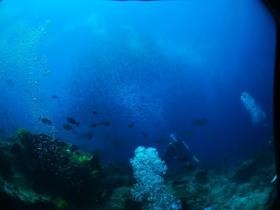
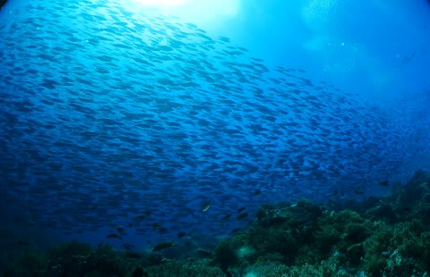
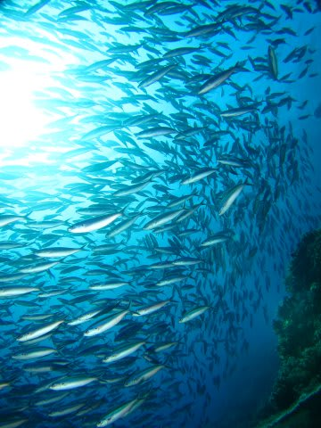
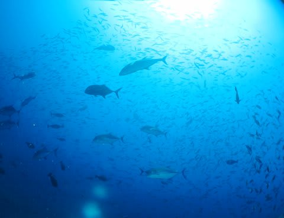

# 子連れコモドダイビングクルーズagain　プロローグ

📅 投稿日時: 2011-08-25 05:16:54

エントリー直後．

ガイドが潜行OKの確認をする間もなく，いきなり何かを指差した．

それは．

潜行していくにつれ．

何万匹もの魚がひとかたまりになった群れだとはっきりしてきた．

その巨大な群れは，それ自体がひとつの生き物であるかのように．

われわれの頭上を覆うように動いたかと思うと．

川のように連なって横へ流れ．

さらには，目の前に果てしない壁のように広がった．

目の前に広がった，と思った次の瞬間．

カスミアジとスマガツオが，群れの向こうからアタック！

パニックに陥ったクマザサハナムロたちは，

ダイバーを気にせず真正面から突っ込んできた！

しばらく，数m離れたガイドも見えないほどの魚の洪水に巻き込まれ．

それからも．

しつこくアタックをかけてくるロウニンアジとカスミアジから逃れようと，

魚の群れは．

何度も，何度も，われわれの間を通り過ぎていった…

…感動のダイビングが終了し．

私　「いやー，すごいダイビングだったねっ！」

と，共感を求めた私に，妻はあっさり言い放った．

妻　「え？…今のダイビングより，その前の1本の方がすごかったけど」

…

…へ？

……なんだと？？？

………その前の1本って…

私は潜ってないぞ．

これよりすごいって，どんな1本だったんだぁーーーーーっ！！！！！！！

-----

って感じで．

昨年に引き続き．

今年も行ってきました，子連れでのダイビングクルーズ．

海は，良かったです．

すごく．

…しかし．

なぜか，最高の1本を逃してしまったらしく．

なぜ，最高の1本を潜れなかったかは，以降のレポートをお楽しみに…

ということで，これからまた，ながーいレポートのはじまり，はじまり～
