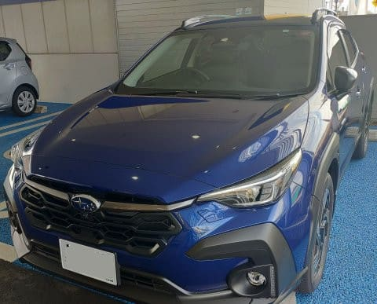
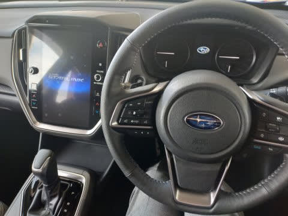
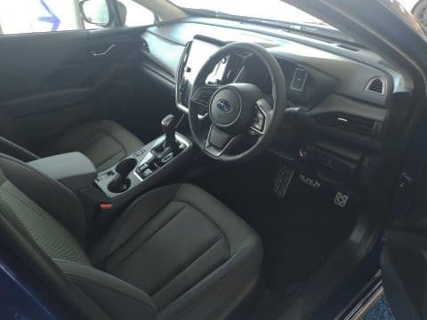

# SUBARU Crosstrekに試乗してみた

📅 投稿日時: 2023-05-27 04:46:34

先日のこと．

車のオイル交換その他でちょっと

ディーラーに立ち寄ったのですが…

その際，新型クロストレックの試乗車が

出てたので，早速試乗してきました～！！

…スキー板の試乗記事に，車の試乗記事が

混ざってますが．

Skier_Sは試乗が好きなんだな

と思ってやってください…

ってなことで．

昨年終盤にフルモデルチェンジして

GT型からGU型に変わった，

XV改めクロストレック．

今回は，インプレッサより先にクロストレックが

発表され，クロストレックが先に設計された

ようですが．

さて．

先代はD型以降の後期型の出来栄えがよくて．

1.6Lは驚くべきコストパフォーマンスを

誇ってましたが．

新しいクロストレックの出来栄えやいかに？？

とりあえず．

今回のクロストレック．

1.6Lモデルは無くなってしまい．

全てが2Lのe-BOXERになっちゃいましたが…

そのかわり，廉価版としてFFモデルが

追加されたけど．

SUVでFFって，どうよ？？

と，ちょっと思ってしまいますが…

今回の試乗車は，2L e-BOXERの4WD．

グレードはTouringとLimitedの2種類あるうち，

上の方のLimitedグレードですね．

…内装は，大型の11.6型ディスプレイがついて，

LEVORGと似た内装になってます…

ドアトリムとシフトノブがあるセンター

クラスタ付近のデザインは違いますが，

インパネ周りは同じデザインですね．

フロントシートは，まぁ今の時代としては

標準的な座り心地．

ただ，本革ステアリングの感触がちょっと

イマイチ私の好みじゃないかな…

LEVORGの高感触革の方がずっといいな．

で．

走り出してみると…

あれ？

e-BOXERって，こんなにモーターアシスト感

弱かったっけ？

って感じの走り出し．

アクセルを踏むと，エンジン回転が

クッと上がるので，エンジンが頑張ってる

感が出て，モーターがアシストしている

感じが弱いです．

トヨタのストロングハイブリッドや

日産のe-Powerに慣れちゃったからかな…？

加速時のアクセルオンで，車の加速より先に

エンジン回転数が上がってしまう感じで，

エンジン回転音から感じるよりスピードが

伸びず，パワーがないエンジンっぽく

感じちゃいます．

もう少しエンジン回転数を抑えて，

トルク感で引っ張ってくれる方が私の

好みなんだけどな～…

でも，アクセルを踏めばかなりの上り坂でも

そこそこの加速度で加速していくので，

エンジン回転数がぐっと上がるものの，

普段使いには十分のパワーですね…

足回りは先代もすごい良かったので，

そこからの圧倒的な進化は感じられな

かったけど…

先代は，いい足ながらもちょいとロールの

出方に重心の高さを感じたけど，

今回は，ロールがさらに抑えられた感じ．

車高が高めのSUVっぽさは無く，

基本的にロールは少なく，そのロールも

インが浮き上がるというより，フロントの

アウトがが沈んでいくような安定感の

高いロールをしてくれるので，

すごい車高の低い車のような，

安定した運転感覚…！

バネレート自体はそこまで高くなさそう

なので，リアのロールセンターを高めに

してロールモーメントを抑えつつ，

ロール軸はかなりフロント下がりに

して，ダイアゴナルロールを強めにしてる

のかな？

フロントは乗り心地重視のある程度の

コンプライアンスもたせてある感じだけど，

反応はそれほどダルではなく，クイックに

向きを変え始めてくれます．

ステアリングフィールもいい感じだけど．

ステアリングの手触りが惜しい…

そして，e-BOXER．

ハイブリッドなので，エンジン停止・始動を

繰り返すんですが…

始動の時に，ちょっと振動が車内に伝わるのが

ちょっと惜しい．

後は，ブレーキフィール．

先代は，回生ブレーキとメカブレーキの繋ぎが

全く分からず，すごい自然なブレーキフィール

だったけど．

今回の新型，ちょっと最後のメカブレーキに

なったところで，ちょっとブレーキが強く効く

感じで，慣れないうちはかなりカックンブレーキに

なりました．

でも，これは慣れの問題で，慣れれば大丈夫かも．

ってなことで．e-BOXERのエンジンオンの振動と，

ブレーキフィールがわずかに惜しいものの．

最低地上高が高いSUVタイプのわりに，

結構しっかり走れるいい足で，

相変わらずコストパフォーマンスは高い車

だと思いました…！

1.6Ｌのお手軽価格4ＷＤが残っていれば，

さらに恐ろしいコストパフォーマンスの車に

なったんだけど…

そこもちと惜しい．

ただ．

先代はかなり一気に進化して，すごい感動

しただけに，今回もそれに匹敵するすごい

進化を期待したけど…

今回も間違いなく進化はしていたものの，

さすがに先代の完成度がとびぬけて高すぎた

だけに，今回はそこまですごい全面的進化は

できなかったか…

というのが，試乗前に期待値を高めすぎた

Skier_Sの正直な感想だったのでした…
