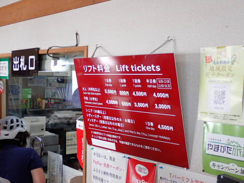
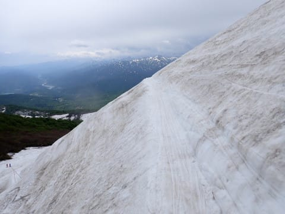
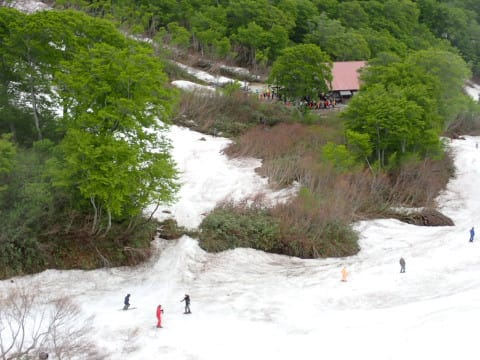

# 今更だけど，2023/6/4(日)の月山スキー場のゲレンデ状況詳細…写真をいっぱい

📅 投稿日時: 2023-06-08 04:55:28

ってなことで．

今日…というか，もう昨日ですが．

布団に入ったのは朝6時でした（涙）

そして，朝9時から夜までびっちり会議が

詰まり．

会議がなかったのは，12時から13時までの会議が

ちょっと早めに終わった12:50～13:00までの

10分間のみ…（泣）

そして，出張先で21:30に最後の会議を終えて，

0時過ぎに帰宅しました…

今，まだ泣きながら仕事してます．

今日も何時に寝ることができるのか…

だもんで．

Blogを書く時間なんぞないのですが．

…それではちょっと寂しいので，

日曜の月山の写真がいっぱいあるのを，

今日はコメント短めで掲載します～！

まず…

この日は天気はそんなに良くない予報だったのに，

朝7:30過ぎで，駐車場はかなり混雑！

ちなみに，駐車料金は1000円に値上がりしてました…

で．

リフト下駅に行く道は大体雪が消えていて，

もう駐車場までは滑ってこれませんね～…

リフト下駅手前のところも，除雪してあります！

で．

朝8時のリフト券売り場は…

すごい列（涙）

発券システムが変わったらしく，

ちょっと時間がかかるようになったのか，

リフト券を買うまでに15分以上並びました…（涙）

ちなみに，リフト券は一日券5500円，

半日券4000円と，こちらもちょっと値上げ…

あと，Paypay払いの特別窓口もできていて，

Paypay払いの人は待たずにリフト券が買えて

ました…

朝イチは，リフト券売り場が詰まっていたので

リフト待ちはそれほどでもなかったけど…

朝9時から10時くらいまでのピーク時は，

20分くらい待ちました…（涙）

すごいところまで列が伸びて折り返して，

すさまじいことになってました…

まぁ，10時を過ぎるとそこまでひどい列じゃ

なくなったので良かったかな．

で．

リフトはまだ冬仕様で，高い位置にかかってますね！

今ちょうど架け替え中なので，今週末は

低い位置に変わってるはず…

そして，リフトに乗って上に上がると…

大斜面が見えてきます！！

いやー．

まだ6月上旬というのもあり，まだ大斜面は

雪が多いですね～！！

山頂付近も，まだたっぷり雪がありそう！

だけど…

リフト降り場にはもう雪がなくて．

リフトを降りてから，向こうに見えるゲレンデまで

板を担いで上がっていかなくてはならず…

最初のうちは木道があるけど，

最後はこんな岩場の上を歩いて行かなくては

いけません…

泥水でブーツやウェアのパンツの裾が

汚れるのでご注意を…

ということで．

やってきました，ゲレンデへ！

まだ，大斜面へのトラバースルート方面の

藪はほとんど出ておらず，まだ雪が

いっぱいあります！

雪質は…

そこまでひどいカリカリスプーンカット

ではなく，意外と滑りいい柔らかさ！

沢コースは…

まだ幅が広いし，コブにはなってません！！

一見滑りにくそうに見えますが…

そこそこの幅が取れるので，カービング

小回りが行けました～！！

いや，5月のかぐらよりいいよ…！！！

少なくとも今週末までは，沢コースは

結構楽しめそう！！

大斜面は…

トラバースルートの藪が立ち始めて

きたものの…

まだまだ雪はたっぷりで，全面真っ白！

トラバースルートを超えると…

目の前に大斜面が広がります！

コブラインはかなり本数が多く，

浅いラインから深いラインまで，レベルに

合わせて選びたい放題！

私は大体6月中旬から月山に来ることが

多いので，6月第1週に来ることは少なく…

こんなにラインがいっぱいある大斜面は

あんまり見たことがないなぁ…

とりあえず，コブラインはいっぱいありました！

ただ…

滑り終わった後，リフト乗り場まで

滑り込めないのが残念…（涙）

リフト乗り場に滑り込める道は，

こんな感じで入り口が途切れていて．

さらに最後は，20mほど，ブーツが埋まる

泥沼を突っ切ってこなくてはならない状態で…

ここを突っ切るのはかなり無理な感じ…

だもんで．

リフト下駅のさらに下から，急斜面を

エンヤコラとよじ登っていく形に

なります…

で．

リフト降り場よりさらに上にあるTバーは，

結構混んでたので，この日は行かなかったですが…

昼前にはガスってくるタイミングもあり，

リフトのコースは見えたけど，

山頂のTバーは完全にガスに隠れる時も

あり．

この日はTバーの営業時間は短縮営業

だったようです…

ってな感じで．

リフトの乗り降りに歩かねばならない

最終形態だったわりには，意外と人は

多かったものの．

コースの雪はまだまだたっぷり楽しめる

レベルで．

5月のかぐらよりずっと楽しいじゃないか…

と思った，Skier_Sだったのでした…

うーん．

精神的余裕があれば，今週末も

行きたいところだけど．

毎晩明るくなるまで仕事している今週は，

ちょっと余裕がなさそう…（涙）

だのに．

なんでこんな時間をかけてこんなに

長い記事を書いているのだ？？

まだ仕事が終わってないのに…

ということで．

記事を読み返す時間もないので，

誤字脱字があったらごめんなさい．

…今日も何時に寝られるんだろう…（涙）
