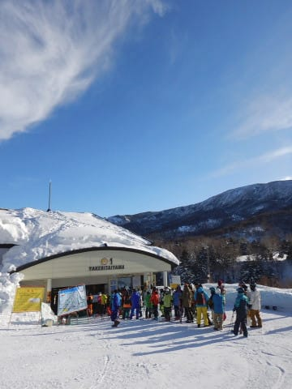
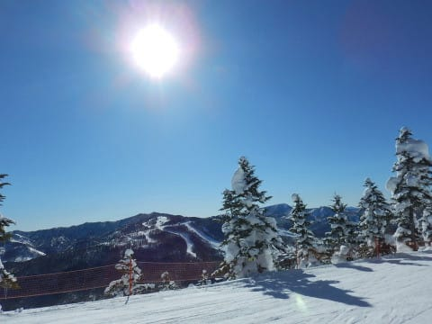
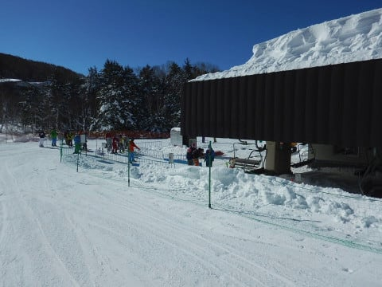
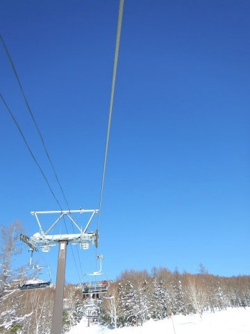

# 2019/2/3(日)の志賀高原スキー場，詳細レポート…朝は晴天シマシマ最高！昼間は気温が上がったけど，雪質良好．でも晴天は続かず，午後は曇り

📅 投稿日時: 2019-02-05 01:42:29

🏷️ カテゴリ: [2019スキー滑走日記](c3e4496fc0fb7f9c17ff21214a35b1ace.md)

えー．

やはり．

大変極めて残念なことに．

日曜夜から月曜朝にかけて．

志賀高原は雨だったようです…（涙）

先週金曜に，

　日曜の深夜から，志賀高原でも雨か雪か微妙なものが

　降りそうです．

　山頂付近は大丈夫そうだけど…

と書いてたけど．

残念ながら，微妙なものではなく．

完全に液体

だったようなので．

…私の予想，外れです(泣）．

そして…

志賀全域，見事なアイスバーンに

なってしまったようです．

あぁ…

日曜までは最高雪質だったのに…（涙）

で．

7日木曜の，朝9時の850hpa気温を見ると…

うーーーむ．

やっぱり，0℃線が志賀より北にある…（涙）

なんだか，今週，いろいろヤバいかも…

8日以降は．

冷えるけどそんなに降らなさそう

なので．

9日からの3連休は．

…アイスバーン祭りかなぁ…（戦慄）

とりあえず．

今週末の天気予想はまた改めてやるとして．

日曜の詳細レポートをば…

まず．

日曜の朝は…

　朝は晴れ！

　朝の気温は-5℃程度と，この時期にしては暖かめ．

という，直前予想通り．

なんとも見事な晴天でスタート！

そして，8時半の通常営業開始とともに，

ゴンドラで山頂に登りましたが…

山頂の気温も-4℃と．

予想の1度ズレで収まってますね～！

すごいぞ，我が天気予想！

いや．

いろんな天気予報サイトでは．

日曜は雨の予想が多かったけど．

朝はすっきり晴天になることを

当てた自分，偉い！！←自画自賛

そして，朝イチのゲレンデは…シマシマっ！！

うひょーーーーっ！！

官能的ですらある，超最高ハイグレード

快楽シマシマバーンですっ！

ふはははははははははははは！！！

これだ！

これだよ！

私が毎週毎週志賀に来るのは．

こういう最高の雪質に出会うため．

滅多に出会えない，こういう最高の

天気の日に最高の雪に巡りあうために，

志賀にやってきてるのだ！！

あぁ…

シアワセ…

今シーズン文句なくピカイチの最高…

まさに，

　朝イチは締まり気味のピカピカ最高圧雪！

と予想した通りで．

日曜朝が最高のコンディションになることを

予想できた自分，偉い！←また自画自賛

午前中は，まさに快晴．

北アルプスもすっきり見えて．

もう絶好のスキー日和です…（感動）

そのうえ．

午前中は雪質もいい感じでキープされてて．

そして，2月の週末と思えないほど

ゲレンデの人も少なく…

天気も良くて．

あぁ…最高…

ただ．

さすがに10時過ぎには，ちょっとゲレンデの

人口密度も上がり．

ゴンドラ待ちも，一瞬ゲートの

外まで伸びたけど…

ここまで列が伸びたのは一回きり．

大体，ゲートの中に納まる混雑で．

さらに，リフトの待ちはほとんど

無かったし．

ゲレンデも，コースとタイミングによっては，

ほとんど人がいない時もあるような感じで．

…いいんですか！？？

こんなに晴天で，いい雪で，

これだけガラガラで…

いいんですか！？？

気温は，

　昼間はぐんぐん気温が上がり，プラス気温まで

　上がるか…

と予想した通り．

昼間の最高気温が，+3℃まで上がっちゃったけど…

でも．

日が当たるところで．ちょっと雪がダマダマに

固まった感じになるところがわずかにあった程度で．

　でも，雪は冷えているのでそれほどひどい

　雪質にはならなさそう．

という予想通り，概ね雪質は

いいコンディションをキープ！

…ただ．

昼近くになると．

人が多いコースは，ちょっと凸凹が

出てきたけど…

でも．

雪はいいし，人もそれほど多くなく．

あぁ…

毎日がこんなコンディションだったら

最高だなぁ…

…

…

と，思っていたところ．

昼になると，いきなり雲が増えていき…

午後1時には，完全曇り空に…（涙）

　昼過ごろから雲が増え始め，午後は曇り空になっていく．

って予想したけど．

…ここまで見事に当たらなくてもいいじゃない（涙）

…あぁ…一日中晴天のスキー場を滑りたかった…（泣）．

曇り空になった午後．

ちょっとゲレンデが凸凹してきた焼額より，

奥志賀の方がコンディションいいかも…

ちょっと覗きに行こうかな～．

と，焼額の呪いを振り切って奥志賀へ

行ってみましたが…

確かに，北斜面の分，日差しの影響を

受けないため．

焼額より雪が緩まず，凸凹が少なかったかな…

奥志賀ゴンドラもガラガラだったけど．

でも，午後になると空が曇ってきただけじゃなく，

ちょっと風も出てきたので…

ゴンドラ搬器も間引き運転になっていて，

さらに5人乗り制限．

奥志賀のリフト側，エキスパートコースも．

午後までフラットで，ガラガラだったけど…

でも，強風で第2，第3ペアが減速運転（涙）

そのうえ，だんだん雲が厚くなり．

バーン状況が見にくくなってきました…（涙）

だもんで．

やっぱり，わがホームゲレンデ，焼額へ戻ります．

いやーー．

やっぱりホームゲレンデが落ち着くなぁ…

夕方になると，もうゴーストタウン化して．

…そして，午後は人が少なかったからか．

意外とそれほどバーンは荒れておらず．

多少凸凹がありながらも，最後まで大回りが

可能なコンディションでした…

が．

リフト営業終了直前の4時頃に．

ありゃりゃ？？

雪が降り出してきました！！

うーむ．

雨じゃないだけ良かったけど．

まさか雪が降るとは…！！

ってな感じで．

この日も最終ゴンドラに飛び乗って，

営業終了まで滑りましたが．

営業終了後に，雪からみぞれっぽく変わり．

下山時には，完全に雨になってました…

いやーーー．

きわどいタイミングだった．

営業中は天気がもってくれて，良かった…

ってな感じで．

営業中は雨に降られず．

いい感じの土日を過ごすことができたわけですが．

これは，水曜の天気予想で

　とりあえず，私がこれから週末にかけて，

　必至に踊り続けておきますので．

　日曜も雨になることなく．

　わりと穏やかな週末になってくれるはず…

と，書いた通り．

私が必死に踊り続けたおかげですので．

この週末，いいコンディションのスキー場で

楽しんだ方は．

私への感謝を忘れないように

くれぐれもよろしくお願いします←違うから．あなたが志賀高原の天気を決めてるわけじゃないから

## 💬 コメント一覧

### 💬 コメント by (Kon Suke)
**タイトル**: 雨降って雪固まる
**投稿日**: 2019-02-05 12:52:22

Ｓさん、こんにちは。

日曜の深夜から朝にかけ、雨音響く降りでしたよ。

朝一のファミリーは、まだ凍ってはいないのではと思っていましたが、思いに反し固まっていました。

正面上部は、こけたら滑り台・・・。

一日ガスで良く見えませんでしたが、斜面が削れなく平らなので安心して滑れました。

やっとファミリーらしい固い斜面になり喜んでいます。

ただ、ジャガイモ畑化も避けられそうにありませんが・・・。

### 💬 コメント by (若杉勲71)
**タイトル**: 志賀高原情報
**投稿日**: 2019-02-05 15:15:35

今日は奥志賀は鶴×2。ヤケビは固いけど楽しめるレベル。一ノ瀬はカチカチという噂。

でもお日様のおかげで充実した１日を過ごせました。

しめ縄ですが、洒落た下手人が不明なところがいいですね。我がレインボーは残念ながら遅い時間には志賀高原に存在できません。

今日から３日間、南館は小学生貸切で4ロマ営業です。

### 💬 コメント by (ま)
**タイトル**: 北の大地
**投稿日**: 2019-02-05 20:02:04

北の方に偵察に行ってましたが、昨日は散々な志賀だったようですが、昨日のカムイスキーリンクスも強風でゴンドラが11時に運転見合わせ、早々に14時に撤退したら、国道12号は凍結したうえにホワイトアウト状態、さらに神居古潭辺りで事故、事故車が道路を塞ぎ、まったく動かなくなりました。

https://matomedane.jp/daisuke/page/22630

レンタカーの延滞や飛行機の乗り遅れなど脳裏をよぎり、引き返して道央道を経由にするか悩みましたが、約2時間後に片側交互通行により難を逃れ帰宅しましたが、後から道央道も滝川から士別が通行止めだったことを知り、あやうく路頭に迷うとこでした。(^^;

富良野も北の峰ゴンドラが二日間とも運休だったし、今回は天候に恵まれませんでした（泣）

### 💬 コメント by (Skier_S)
**タイトル**: Unknown
**投稿日**: 2019-02-06 09:07:40

＞　konSukeさま

コメント回答遅れました。

あの雨で、konSukeさんの好きなアイスバーンになったんだろうなあ…

 と思ってました(笑)

私はそこまで硬いのはつらいので、週末までに降ってくれないかと思ってます…

金曜はかなりの雪になりそうな感じです。

＞若杉さま

あら。注連縄は違う方ですか…

しかし、日曜ラストまで天気がもってくれてよかったです。

今晩はまた雨かな？と思いましたが、

最新の天気図では雨にならずにすみそうです。

金曜から冷えるので、また雪質は回復していきそう…

＞まさま

あら。北の大地は荒れていたんですね…

でも、飛行機が飛ばないとか、間に合わないとかなくて

無事帰れてよかったですね。

今週末から志賀復活ですか？

また週末お会いしましょう！

